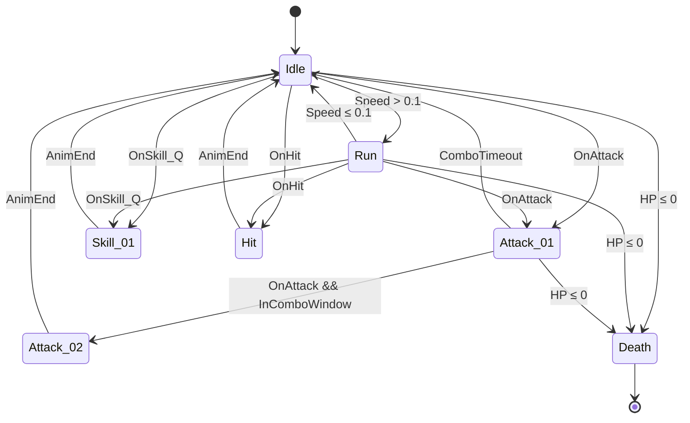
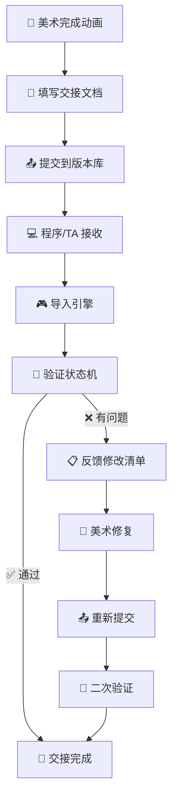

# 🎬 动画状态机交接与导出规范

> **适用阶段**：量产期 | **优先级**：高 | **负责人**：王五
>
> 本文档定义动画状态机文档化标准、FBX 导出设置、引擎导入规范以及美术与程序的动画资产交接 SOP。

---

## 1️⃣ 动画状态机文档化模板

### 📊 1.1 状态机总览表

> **[规范]** 每个角色的动画状态机需填写以下文档。

| 🏷️ 状态名称 | 🆔 状态 ID | 🎞️ 动画片段 | 🔁 循环 | 🎚️ BlendSpace | ⏱️ 混合时间(入) | ⏱️ 混合时间(出) | 📝 备注 |
|:---:|:---:|:---:|:---:|:---:|:---:|:---:|:---:|
| Idle | `ST_Idle` | AN_Luna_Idle_01 | ✅ | — | 0.2s | 0.2s | 默认待机 |
| Run | `ST_Run` | AN_Luna_Run_01 | ✅ | BS_Locomotion | 0.15s | 0.15s | 8 方向混合 |
| Attack_01 | `ST_Atk01` | AN_Luna_Attack01 | ❌ | — | 0.1s | 0.2s | 普攻第 1 段 |
| Attack_02 | `ST_Atk02` | AN_Luna_Attack02 | ❌ | — | 0.05s | 0.2s | 普攻第 2 段 |
| Skill_01 | `ST_Skill01` | AN_Luna_Skill01 | ❌ | — | 0.1s | 0.25s | Q 技能 |
| Hit | `ST_Hit` | AN_Luna_Hit_01 | ❌ | — | 0.05s | 0.2s | 受击 |
| Death | `ST_Death` | AN_Luna_Death_01 | ❌ | — | 0.1s | — | 死亡不出 |

### 🔀 1.2 状态转换条件表

> **[核心]** 状态转换逻辑决定了动画表现的流畅度。

| 📍 当前状态 | 🎯 目标状态 | 📋 转换条件 | 🔢 优先级 | ✂️ 可打断 | 📝 说明 |
|:---:|:---:|:---:|:---:|:---:|:---:|
| Idle | Run | `Speed > 0.1` | 1 | ✅ | 摇杆输入 |
| Run | Idle | `Speed ≤ 0.1` | 1 | ✅ | 松开摇杆 |
| Any | Attack_01 | `OnAttack && ComboIndex==0` | 2 | ❌ | 普攻触发 |
| Attack_01 | Attack_02 | `OnAttack && InComboWindow` | 3 | ❌ | 连击窗口 |
| Any | Skill_01 | `OnSkill_Q && Cooldown==0` | 4 | ✅ | Q 技能 |
| Any | Hit | `OnHit && !SuperArmor` | 5 | ✅ | 受击 |
| Any | Death | `HP ≤ 0` | 10 | ❌ | 最高优先级 |

### 🎚️ 1.3 BlendSpace 参数定义

| 🎚️ BlendSpace | 📐 参数 X | 📐 参数 Y | 📊 维度 | 🎯 动画样本数 |
|:---:|:---:|:---:|:---:|:---:|
| `BS_Locomotion` | Direction (-180~180) | Speed (0~600) | 2D | 9 个采样点 |
| `BS_AimOffset` | Yaw (-90~90) | Pitch (-45~45) | 2D | 9 个采样点 |

### 🗺️ 1.4 状态机流程图



---

## 2️⃣ 命名规范

### 📁 2.1 动画片段命名规则

```
AN_[角色ID]_[动作类型]_[变体]_v[版本号]
```

> **[示范]**：`AN_Luna_Idle_01_v02.fbx` / `AN_Luna_Attack_Heavy_v01.fbx` / `AN_Luna_Skill_Q_v03.fbx`

### 🏷️ 2.2 动作类型前缀

| 🏷️ 前缀 | 📖 含义 | 💡 示例 |
|:---:|:---:|:---:|
| `Idle` | 待机 | `AN_Luna_Idle_01` |
| `Run` | 跑步 | `AN_Luna_Run_Forward` |
| `Walk` | 走路 | `AN_Luna_Walk_Left` |
| `Attack` | 攻击 | `AN_Luna_Attack_01` |
| `Skill` | 技能 | `AN_Luna_Skill_Q` |
| `Hit` | 受击 | `AN_Luna_Hit_Front` |
| `Death` | 死亡 | `AN_Luna_Death_01` |
| `Born` | 出生/出场 | `AN_Luna_Born_01` |
| `Victory` | 胜利 | `AN_Luna_Victory_01` |
| `Stun` | 眩晕 | `AN_Luna_Stun_01` |
| `Interact` | 交互 | `AN_Luna_Interact_Sit` |

### 🔤 2.3 BlendSpace / Montage 命名

| 📦 类型 | 📏 命名规则 | 💡 示例 |
|:---:|:---:|:---:|
| BlendSpace | `BS_[角色]_[功能]` | `BS_Luna_Locomotion` |
| AnimMontage | `AM_[角色]_[动作]` | `AM_Luna_Skill_Q` |
| AnimBlueprint | `ABP_[角色]` | `ABP_Luna` |
| Animator Controller | `AC_[角色]` | `AC_Luna` (Unity) |

---

## 3️⃣ FBX 导出设置标准

### ⚙️ 3.1 通用导出设置

> **[量产必读]** 所有工种通用的 FBX 导出设置。

| 📐 参数 | 📏 标准值 | 📝 说明 |
|:---:|:---:|:---:|
| **FBX 版本** | 2020 | 兼容 UE5 / Unity 2022+ |
| **帧率** | **30 FPS** | 移动端标准；PC 可用 60 FPS |
| **轴向** | Y-Up (Maya) / Z-Up (Max) | 引擎端自动转换 |
| **Scale Factor** | **1.0** | 保持原始比例 |
| **单位** | 厘米 (cm) | UE 默认单位 |

### 🦴 3.2 骨骼导出设置

| 📐 参数 | ⚙️ 设置 |
|:---:|:---:|
| **骨骼层级** | 完整导出，不剥离 |
| **Deformation Bones Only** | ❌ 关闭（保留辅助骨骼） |
| **Smoothing** | Normals and Tangents |
| **Blend Shapes** | 如有面部表情则勾选 |

### 🏃 3.3 Root Motion 设置

> **[核心]** Root Motion 配置不一致是动画偏移的第一大原因。

| 📌 项目 | 📖 说明 |
|:---:|:---:|
| **需要 Root Motion 的动画** | Run / Walk / Dash / Roll |
| **不需要 Root Motion 的动画** | Idle / Attack / Skill / Hit / Death |
| **Root 骨骼要求** | 必须有一根名为 `Root` 或 `root` 的根骨骼 |
| **Root 骨骼位移** | Run/Walk 的位移数据写在 Root 骨骼上 |

### ✅ 3.4 导出前检查清单

- [ ] 删除所有 Helper/Dummy 对象
- [ ] 清除所有无用的关键帧
- [ ] 确认骨骼命名无中文/特殊字符
- [ ] 确认 Root 骨骼在原点
- [ ] 确认起始帧/结束帧正确
- [ ] 确认 Scale = **1.0**（无缩放残留）
- [ ] 确认无翻转的法线

---

## 4️⃣ 引擎导入 Checklist

### 🎮 4.1 Unreal Engine

> **[UE]** 导入 UE 时的逐项检查。

| #️⃣ | 🔍 检查项 | ⚙️ 操作 |
|:---:|:---:|:---:|
| 1 | 导入类型选择 | Skeletal Mesh + Animation |
| 2 | Skeleton 选择 | 选择已有的共享 Skeleton Asset |
| 3 | Root Motion | 勾选 Enable Root Motion（需要的动画） |
| 4 | AnimBlueprint 创建 | 基于导入的 Skeleton 创建 ABP |
| 5 | Retarget | 如需跨骨架复用，设置 IK Retargeter |
| 6 | Notify 添加 | 在关键帧添加 AnimNotify（打击帧/音效帧/特效帧） |
| 7 | 压缩设置 | Animation → Compression → 根据平台选择 |

### 🔷 4.2 Unity

> **[Unity]** 导入 Unity 时的逐项检查。

| #️⃣ | 🔍 检查项 | ⚙️ 操作 |
|:---:|:---:|:---:|
| 1 | Animation Type | Humanoid / Generic |
| 2 | Avatar 配置 | Configure Avatar → 确认骨骼映射 |
| 3 | Root Motion | 勾选 Bake Into Pose（不需要的动画） |
| 4 | Animator Controller | 创建 AC 并配置状态机 |
| 5 | Animation Events | 在关键帧添加 Event（攻击判定/音效/特效） |
| 6 | 压缩设置 | Animation Compression → Optimal |

### 🔄 4.3 UE vs Unity 对照表

> **[速查]** 跨引擎概念对照，方便双端团队沟通。

| 📦 概念 | 🎮 UE 名称 | 🔷 Unity 名称 |
|:---:|:---:|:---:|
| 状态机 | AnimBlueprint (ABP) | Animator Controller (AC) |
| 状态 | State | State |
| 混合空间 | BlendSpace | Blend Tree |
| 动画蒙太奇 | AnimMontage | 手动控制播放 |
| 动画通知 | AnimNotify | Animation Event |
| 骨架 | Skeleton Asset | Avatar |
| 重定向 | IK Retargeter | Humanoid Retarget |

---

## 5️⃣ 美术→程序交接 SOP

### 🔄 5.1 交接流程



### 📦 5.2 交接清单

> **[量产必读]** 每次交付必须包含以下内容。

| #️⃣ | 📦 交付物 | 📄 格式 | ✅ 必须 | 📝 说明 |
|:---:|:---:|:---:|:---:|:---:|
| 1 | 动画 FBX 文件 | `.fbx` | ✅ | 按命名规范 |
| 2 | 状态机文档 | `.md` / `.xlsx` | ✅ | 本文档模板 |
| 3 | 预览视频 | `.mp4` (720p) | ✅ | 每个动画的预览视频 |
| 4 | 关键帧标注 | 文档内嵌 | ✅ | 打击帧/音效帧/特效帧 |
| 5 | 异常动作说明 | 文档备注 | ⚠️ | 已知的穿模/不自然点 |
| 6 | Root Motion 标注 | 文档内嵌 | ⚠️ | 哪些动画有 Root Motion |
| 7 | 骨骼映射表 | `.xlsx` | ⚠️ | 首次交接时必须 |

### 🎯 5.3 关键帧标注模板

> **[示范]** 打击帧/音效帧/特效帧的标注格式。

| 🎞️ 动画片段 | 🔢 总帧数 | 👊 打击帧 | 🔊 音效帧 | ✨ 特效帧 | 🛡️ 无敌帧 | 📝 备注 |
|:---:|:---:|:---:|:---:|:---:|:---:|:---:|
| AN_Luna_Attack01 | 30 | **F12** | F10 | F11 | — | — |
| AN_Luna_Attack02 | 25 | **F8, F18** | F6 | F7, F17 | — | 二段判定 |
| AN_Luna_Skill_Q | 45 | **F20** | F15, F20 | F14 | F0~F10 | 前摇无敌 |

---

## 6️⃣ 常见踩坑案例

> 🚨 **避坑指南**：以下是动画交接中最高频的问题，严重时可导致整个角色重做。

### 🔴 6.1 骨骼不匹配

> **[P0 事故]** 骨骼变更未同步可能导致角色动画全部报废。

| 📌 项目 | 📖 说明 |
|:---:|:---:|
| **现象** | 导入引擎后动画错乱、变形、T-Pose 残留 |
| **原因** | 美术更新了骨骼结构但未同步给程序 |
| **解法** | 骨骼变更必须通知所有相关方；使用版本号管理骨骼 `SK_Humanoid_v03`；引擎中统一使用共享 Skeleton Asset |

> ⚡ **APM 金句**：骨骼一变天下乱，改骨骼前先群发通知。

### 🔴 6.2 动画偏移

> **[高频]** Root Motion 配置不一致是第一大元凶。

| 📌 项目 | 📖 说明 |
|:---:|:---:|
| **现象** | 角色播放动画后位置偏移/不回原点 |
| **原因** | Root Motion 配置不一致 |
| **解法** | 明确标注哪些动画需要 Root Motion；不需要 Root Motion 的动画，Root 骨骼必须在原点不动 |

### 🟡 6.3 状态机死循环

| 📌 项目 | 📖 说明 |
|:---:|:---:|
| **现象** | 两个状态互相跳转，动画抖动 |
| **原因** | 转换条件互斥未处理，A→B 和 B→A 同时满足 |
| **解法** | 添加 cooldown / 最小停留时间；转换条件添加互斥逻辑；使用 `ExitTime` 而非纯条件触发 |

### 🟡 6.4 过渡闪烁

| 📌 项目 | 📖 说明 |
|:---:|:---:|
| **现象** | 状态切换瞬间出现闪烁/抖动 |
| **原因** | 混合时间设置不当 |
| **解法** | 攻击→待机：混合时间 **0.2~0.3s**；受击：混合时间 **0.05s**（快速响应）；避免两个差异极大的 Pose 直接混合 |

### 🟡 6.5 动画裁切

| 📌 项目 | 📖 说明 |
|:---:|:---:|
| **现象** | 动画播到一半被打断，看起来不自然 |
| **原因** | 可打断标记设置有误 |
| **解法** | 攻击动画在 ComboWindow 内才可打断；技能前摇不可打断，后摇可打断；标注清楚每个动画的可打断窗口 |

> ⚡ **APM 金句**：动画交接不是「扔文件」，而是一份「有说明书的交付」。

---

## 7️⃣ 版本管理建议

### 📂 7.1 动画资产目录结构

```
/Animation/
├── CH_Luna/
│   ├── Source/              # Maya/Max 源文件（带版本号）
│   │   ├── AN_Luna_Idle_01_v01.ma
│   │   └── AN_Luna_Idle_01_v02.ma
│   ├── Export/              # FBX（始终最新，无版本号）
│   │   ├── AN_Luna_Idle_01.fbx
│   │   └── AN_Luna_Attack01.fbx
│   └── Preview/             # 预览视频
│       ├── AN_Luna_Idle_01.mp4
│       └── AN_Luna_Attack01.mp4
└── _Doc/
    └── Luna_AnimStateMachine.md
```

### 📝 7.2 增量更新规范

- 修改动画时，Source/ 新建带版本号的文件
- Export/ 覆盖更新（引擎自动检测变化）
- Commit Message 必须说明修改内容

> **[示范]**：`[MOD][动画] AN_Luna_Attack01 调整打击帧从F15→F12，优化受击反馈 TASK-234`

> ⚡ **APM 金句**：Source 留版本，Export 留最新，Preview 留证据。
