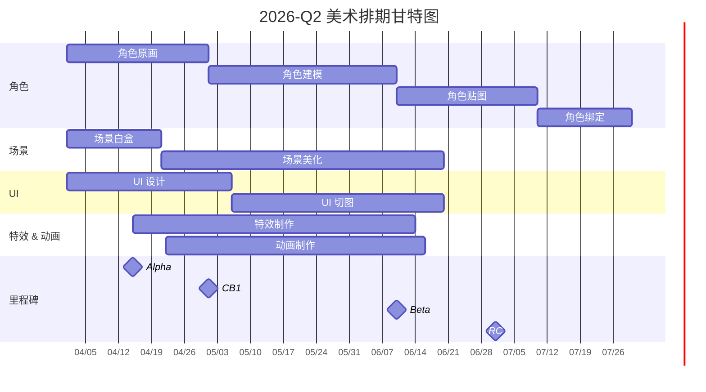
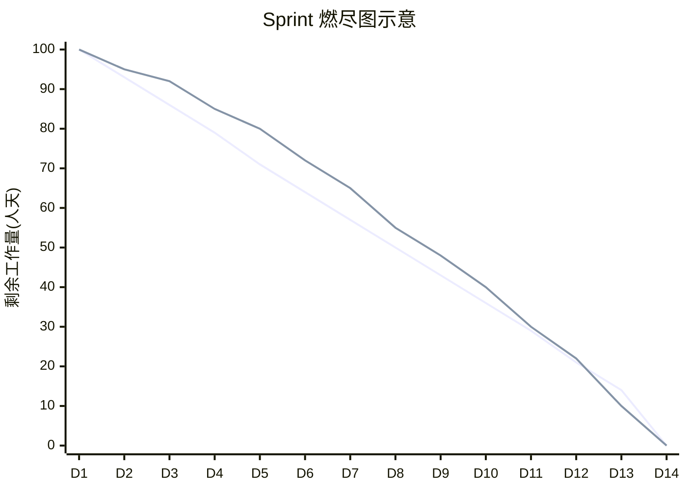
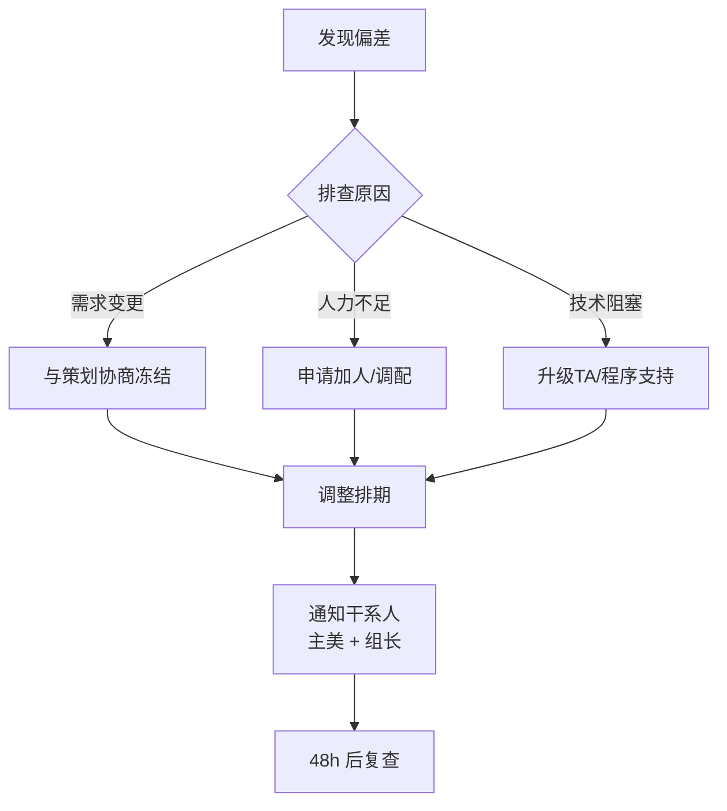
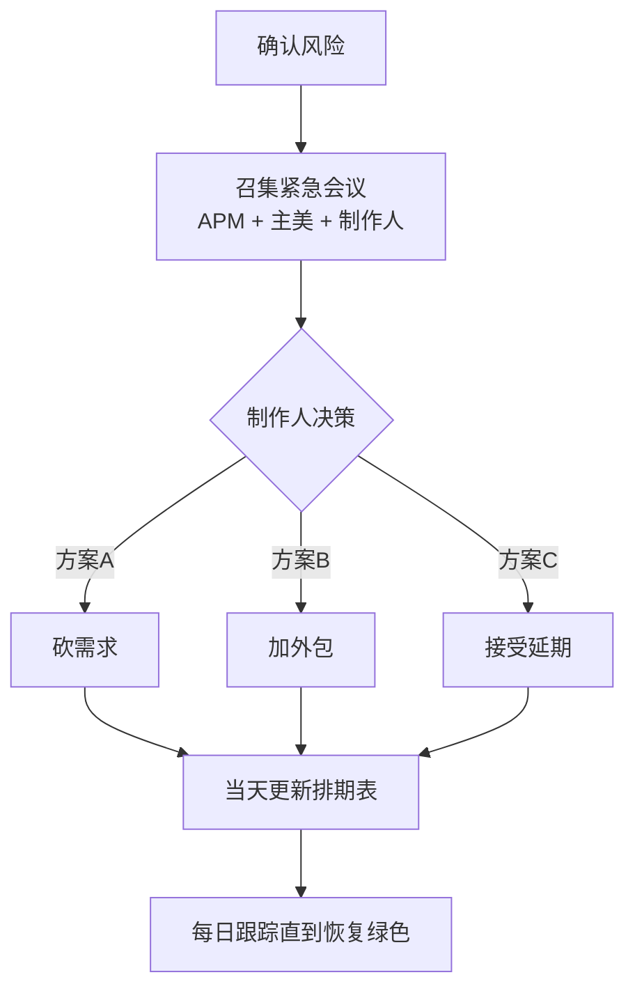

# 美术排期与里程碑管理

> **适用阶段**：全阶段 | **优先级**：高 | **负责人**：周八
>
> 本文档面向美术项目经理（APM），系统阐述美术团队排期的特殊性、Sprint 排期方法、里程碑分解、燃尽图跟踪及风险预警机制。

---

## 1. 美术排期的特殊性

### 1.1 与程序排期的核心差异

| 维度 | 程序排期 | 美术排期 |
|------|---------|---------|
| **任务可量化程度** | 功能点明确，可拆解为函数/模块 | 视觉效果主观性强，"好看"难量化 |
| **迭代特征** | Bug 修复有明确终止条件 | 创意迭代无明确收敛点，存在反复修改 |
| **依赖关系** | 模块间依赖相对清晰 | 强依赖策划需求冻结、引擎支持、参考图确认 |
| **并行度** | 前后端可并行 | 同一角色的原画→建模→贴图→绑定串行依赖 |
| **风险来源** | 技术难题、性能瓶颈 | 需求变更、审美分歧、外包质量波动 |

### 1.2 创意迭代不确定性的管控

> ⚠️ **核心红线**：创意迭代是美术排期中最大的不确定性来源，必须通过以下机制进行管控。

- **前期风格探索期**：预留 **20%~30%** 的探索 Buffer
- **风格锁定会议**：在预研后期必须召开风格定稿会，产出《美术风格确认书》
- **修改次数上限**：原画修改不超过 **3 轮**，超出需走变更流程
- **阶段冻结机制**：Alpha 后原画冻结，Beta 后模型冻结

---

## 2. Sprint 排期模板

### 2.1 Sprint 周期设置

| 团队规模 | 推荐 Sprint 周期 | 说明 |
|---------|-----------------|------|
| < 10 人 | 1 周 | 小团队快速迭代 |
| 10~30 人 | **2 周（推荐）** | 主流选择，平衡规划与灵活性 |
| > 30 人 | 2~3 周 | 大团队需更多协调时间 |

### 2.2 美术任务卡片标准字段

| 字段 | 说明 | 示例 |
|------|------|------|
| **任务 ID** | 唯一编号 | `TASK-058` |
| **标题** | 资产描述 | `CH_Hero_Luna_Model_v2` |
| **类型** | 原画/建模/贴图/绑定/特效/动画/UI | 建模 |
| **优先级** | 🔴P0 / 🟡P1 / 🟢P2 | 🟡P1 |
| **工种** | 所属组 | 角色组 |
| **负责人** | 指定美术 | 张三 |
| **预估人天** | 工期评估 | `5d` |
| **截止日期** | 到期日 | 2026-04-20 |
| **前置依赖** | 上游任务 | `TASK-042`（原画定稿） |
| **关联需求** | 需求编号 | `REQ-108` |
| **复杂度** | S / A / B / C | A |
| **验收人** | 审核人 | 主美-李四 |
| **当前状态** | 流转状态 | 待开始→进行中→待审→完成 |

### 2.3 Sprint 仪式

| 仪式 | 频率 | 参与人 | 产出物 |
|------|------|-------|--------|
| Sprint 规划会 | 每 Sprint 首日 | APM + 各组长 | Sprint Backlog |
| 每日站会 | 每日 15min | 全组 | 阻塞清单 |
| 周中 Review | Sprint 中间 | APM + 主美 | 进度偏差报告 |
| Sprint 评审 | Sprint 末日 | 全团队 + 策划 | 交付物验收 |
| Sprint 回顾 | Sprint 末日 | APM + 组长 | 改进项清单 |

---

## 3. 里程碑分解方法

### 3.1 标准里程碑阶段

### 3.2 各阶段美术交付物清单

| 阶段 | 角色 | 场景 | UI | 特效 | 动画 |
|------|------|------|----|------|------|
| **预研期** | 2~3 个风格稿、1 个完成度 100% 的标杆角色 | 1 个可跑通的白盒关卡 | 主界面线框图 + 风格稿 | 核心技能特效 Demo | 待机/跑步/攻击 基础状态机 |
| **Alpha** | 30% 角色完成（核心英雄） | 1~2 个可玩关卡（灰盒 + 部分美化） | 核心循环 UI 定稿 | 核心战斗特效 50% | 核心角色状态机 100% |
| **Beta** | 80% 角色完成 | 全部关卡一遍 Pass（美术完成度 60%+） | 全 UI 界面首版 | 80% 特效完成 | 80% 动画完成 |
| **RC** | 100% 角色 + 全部优化 | 100% 场景 + LOD + 性能优化 | 全 UI 适配 + 优化 | 100% + 性能优化 | 100% + Bug 修复 |

### 3.3 甘特图示意

---

## 4. 燃尽图跟踪指南

### 4.1 燃尽图解读方法

> 📊 **解读要点**：实际线应紧贴理想线。上方=落后，下方=超前，平坦=停滞。

### 4.2 异常信号识别

| 形态 | 信号 | 诊断 | 行动 |
|------|------|------|------|
| 📈 实际线在理想线**上方** | 进度落后 | 任务预估偏小 / 插入需求 / 阻塞 | 立即排查阻塞，评估是否砍需求 |
| 📉 实际线在理想线**下方** | 进度超前 | 任务预估偏大 / 质量有风险 | 检查质量，可提前拉入下 Sprint 任务 |
| 📊 实际线**平坦不动** | 进度停滞 | 严重阻塞（等策划/等程序/外包延迟） | 升级汇报，启动应急预案 |
| 📊 实际线**中段断崖下跌** | 批量关闭任务 | 可能是虚假进度（批量标完成） | 抽查验收质量 |

---

## 5. 风险预警机制

### 5.1 预警等级定义

| 等级 | 触发条件 | 响应时效 | 升级对象 |
|------|---------|---------|---------|
| 🟢 **正常** | 实际进度偏差 ≤ 10% | — | — |
| 🟡 **黄色预警** | 实际进度偏差 10%~25% | 24h 内制定补救方案 | APM → 主美 |
| 🔴 **红色预警** | 实际进度偏差 > 25% 或里程碑有 miss 风险 | 4h 内升级汇报 | APM → 制作人/总监 |

### 5.2 黄色预警应对 SOP

### 5.3 红色预警应对 SOP

---

## 6. 实战模板：中型手游完整排期示例

### 6.1 项目概况

| 维度 | 信息 |
|------|------|
| **类型** | 二次元卡牌 RPG 手游 |
| **美术团队** | 18 人（角色 6、场景 4、UI 3、特效 2、动画 2、APM 1） |
| **外包比例** | 角色建模 50% 外包 |
| **开发周期** | 6 个月（2026.01 ~ 2026.07） |

### 6.2 资产量预估

| 工种 | 资产类型 | 数量 | 备注 |
|------|---------|------|------|
| 角色 | 可操作角色 | 20 个 | 含皮肤变体 |
| 角色 | NPC | 15 个 | 复用骨骼 |
| 场景 | 主城 | 1 个 | 大型，模块化 |
| 场景 | 战斗关卡 | 8 个 | 中型 |
| UI | 界面 | 40+ 个 | 含弹窗 |
| 特效 | 角色技能 | 60+ 组 | 每角色 3~4 技能 |
| 动画 | 角色动作 | 200+ 条 | 含表情/交互 |

### 6.3 里程碑排期表

| 里程碑 | 日期 | 角色 | 场景 | UI | 特效 | 动画 |
|--------|------|------|------|----|------|------|
| **预研验收** | 2026-01-31 | 3 个标杆角色 | 白盒主城 | 风格稿 | Demo | 基础 |
| **Alpha** | 2026-03-15 | 8/20 完成 | 主城 + 2 关卡 | 核心 UI | 核心技能 | 核心状态机 |
| **CB1 评审** | 2026-04-15 | 14/20 完成 | 5/8 关卡 | 全 UI 首版 | 60% | 60% |
| **Beta** | 2026-05-31 | 18/20 完成 | 8/8 关卡 | 全 UI 优化 | 90% | 90% |
| **RC** | 2026-06-30 | 20/20 + 优化 | 全部优化 | 适配 | 100% | 100% |

---

## 7. 常见问题与避坑指南

### 7.1 排期十大雷区

> 🚨 **避坑指南**：以下是 APM 排期中最常见的 10 个致命错误，每一条都可能导致里程碑 miss。

1. ❌ **不给 Buffer**：预估工期 = 实际排期（应加 **15~20%**）
2. ❌ **忽略串行依赖**：原画没定稿就排建模
3. ❌ **不区分复杂度**：所有角色统一工期
4. ❌ **需求未冻结就排期**：策划还在改需求就开始做
5. ❌ **低估沟通成本**：外包沟通每天额外 **0.5~1h**
6. ❌ **不跟踪中间产出**：只看最终交付，不检查中间节点
7. ❌ **过度乐观**：总觉得"应该能赶上"
8. ❌ **缺少兜底方案**：没有 Plan B
9. ❌ **忽略审核时间**：主美审核 / QA 走查需要时间
10. ❌ **不做复盘**：每个 Sprint 结束不回顾排期准确率

### 7.2 APM 排期黄金法则

> 💡 **排期 = 预估工时 × 1.2（Buffer 系数）+ 审核时间 + 外部依赖等待时间**

---

## 附录：工具推荐

| 工具 | 用途 | 推荐指数 |
|------|------|---------|
| **TAPD** | 任务管理、看板、燃尽图 | ⭐⭐⭐⭐⭐ |
| **Jira + Tempo** | 工时统计、排期规划 | ⭐⭐⭐⭐ |
| **飞书多维表格** | 灵活的排期视图 | ⭐⭐⭐⭐ |
| **Monday.com** | 可视化甘特图 | ⭐⭐⭐ |
| **Excel/WPS** | 万能兜底方案 | ⭐⭐⭐ |
