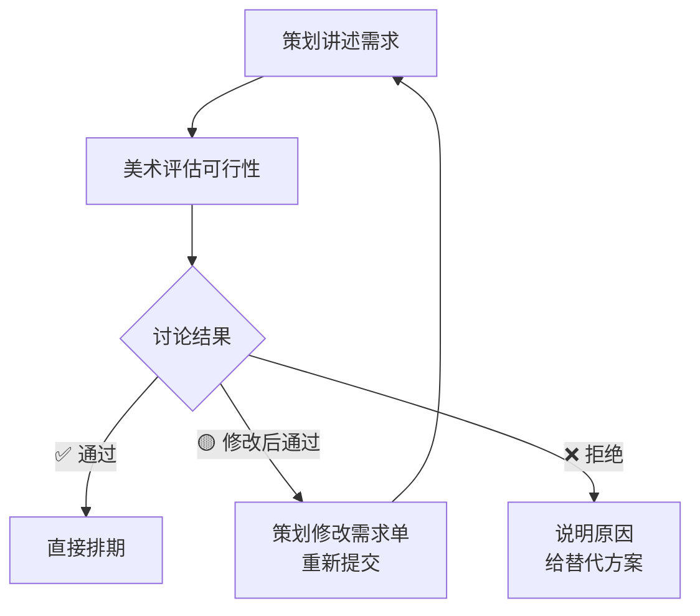
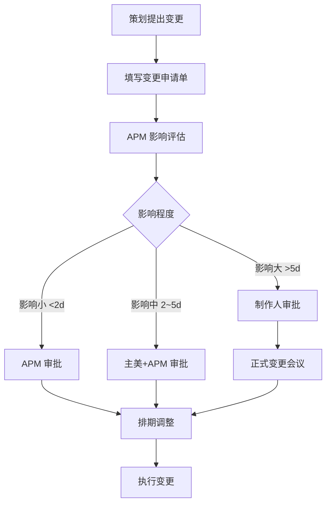

<!-- 左侧目录区域 (固定悬浮) -->

📑 目录导航

- 📋 [**需求对接全流程**](#1-需求对接全流程)
  - [流程全景图](#11-流程全景图)
  - [各阶段标准流转时间](#12-各阶段标准流转时间)
- 📄 [**标准需求单模板**](#2-标准需求单模板)
  - [需求单字段定义](#21-需求单字段定义)
  - [优先级定义](#22-优先级定义)
  - [参考图规格要求](#23-参考图规格要求)
- 🔍 [**评审机制**](#3-评审机制)
  - [评审会设置](#31-评审会设置)
  - [评审决策流程](#32-评审决策流程)
  - [评审检查要点](#33-评审检查要点)
  - [分歧处理规则](#34-分歧处理规则)
- 🔒 [**变更管控**](#4-变更管控)
  - [变更申请流程](#41-变更申请流程)
  - [变更影响评估模板](#42-变更影响评估模板)
  - [变更冻结期规则](#43-变更冻结期规则)
- 🚨 [**常见冲突场景与解法**](#5-常见冲突场景与解法)
- 📅 [**附录：跨部门协作日历**](#附录跨部门协作日历)

<!-- 右侧正文区域 -->

# 📋 需求对接流转规范

> 🏷️ **适用阶段**: 全阶段 | ⚡ **优先级**: 高 | 👤 **负责人**: 周八
>
> 本文档定义美术 vs 策划需求对接全流程，包含需求单模板、评审机制、变更管控与回溯追踪。

---

## 🔄 1. 需求对接全流程

### 🗺️ 1.1 流程全景图

### ⏱️ 1.2 各阶段标准流转时间

| 📌 阶段 | ⏰ 标准时效 | 🚨 超时预警 |
|:---:|:---:|:---:|
| 需求单填写 | 策划提交后 **0.5d** | — |
| 需求评审 | 收到后 **1~2d** | 2d 未评审自动催 |
| APM 排期 | 评审后 **1d** | — |
| 美术制作 | 按排期 | 燃尽图跟踪 |
| 内部验收 | 提交后 **1d** | 超时升级 |
| 策划验收 | 提交后 **2d** | 超时视为通过 |

---

## 📝 2. 标准需求单模板

### 📄 2.1 需求单字段定义

| 🏷️ 字段 | ✅ 必填 | 📝 说明 | 💡 示例 |
|:---:|:---:|:---:|:---:|
| **需求 ID** | ✅ | 唯一编号，APM 分配 | `REQ-2026-0108` |
| **需求标题** | ✅ | 一句话描述 | 新英雄「夜叉」角色设计 |
| **需求类型** | ✅ | 原画/建模/UI/特效/动画/场景 | 角色原画 |
| **优先级** | ✅ | P0/P1/P2/P3 | P1 |
| **关联版本** | ✅ | 目标里程碑 | Alpha |
| **策划负责人** | ✅ | 需求发起人 | 王策划 |
| **美术负责人** | ✅ | APM 指定 | 张美术 |
| **需求描述** | ✅ | 详细的文字描述 | (详见下方) |
| **参考图** | ✅ | 至少 3 张参考图 | 上传至附件 |
| **验收标准** | ✅ | 量化的验收条件 | (详见下方) |
| **预估工期** | ⚠️ | 美术侧评估后填写 | 5d |
| **截止日期** | ✅ | 与里程碑对齐 | 2026-04-20 |
| **备注** | ❌ | 补充说明 | — |

### 🚦 2.2 优先级定义

| 🏷️ 等级 | 📝 定义 | ⏰ 响应时效 | 📅 排期位置 |
|:---:|:---:|:---:|:---:|
| 🔴 **P0 紧急** | 阻塞里程碑 / Boss 要求 | **当天响应** | 插入当前 Sprint |
| 🟡 **P1 高** | 当前版本必须 | **1d 内响应** | 当前/下个 Sprint |
| 🟢 **P2 中** | 重要但不紧急 | **3d 内响应** | 正常排期 |
| ⚪ **P3 低** | 锦上添花 | 下版本处理 | 需求池候选 |

### 🖼️ 2.3 参考图规格要求

| 📌 要求 | 📏 标准 |
|:---:|:---:|
| **数量** | 至少 **3 张**（正面/侧面/细节或风格参考） |
| **分辨率** | ≥ **720p**，清晰可辨别细节 |
| **标注** | 需标注"参考哪里"（颜色/造型/材质/风格） |
| **来源** | 注明原画出处，避免版权风险 |
| **反例** | 可提供"不要的风格"反面参考 |

> 📌 **[场景说明：参考图提交]**
>
> ✅ **正确示范 (Do)**：提交 3 张参考图，分别标注"图1-造型参考""图2-配色参考""图3-材质参考"，附带反面参考说明"不要暖色系"
>
> ❌ **错误示范 (Don't)**：甩一句"参考某游戏的感觉"，不附任何图片；或贴 10 张风格完全不同的图让美术"自行理解"

---

## 🔍 3. 评审机制

### 📅 3.1 评审会设置

| 📌 项目 | 📏 标准 |
|:---:|:---:|
| **频率** | 每周 1~2 次（周一/周四下午） |
| **时长** | 30~60 分钟 |
| **参与人** | APM（主持）、主美、对应工种组长、策划负责人 |
| **输出** | 评审记录表（通过/修改/拒绝/挂起） |

### 🔀 3.2 评审决策流程

### ✅ 3.3 评审检查要点

| 🔍 维度 | ❓ 核心问题 |
|:---:|:---:|
| **需求完整性** | 描述是否清晰？参考图是否充分？ |
| **技术可行性** | 现有管线能否实现？性能预算够吗？ |
| **工期合理性** | 截止日期是否留有 Buffer？ |
| **优先级合理性** | P0/P1 是否真的紧急？是否有挤占风险？ |
| **重复性检查** | 是否与已有需求重复？可否复用？ |

### ⚖️ 3.4 分歧处理规则

> 💡 **核心原则**：用数据说话，用机制裁决，对事不对人。

- ① **美术与策划分歧** → APM 主持协商，给出数据支撑
- ② **无法达成一致** → 升级到主美 + 制作人层面决策
- ③ **技术不可行** → TA 出具技术评估报告
- ④ **工期分歧** → APM 出具历史数据对比

---

## 🔒 4. 变更管控

### 📝 4.1 变更申请流程

### 📊 4.2 变更影响评估模板

| 📌 评估项 | 📝 内容 |
|:---:|:---:|
| **变更描述** | 具体变更了什么？ |
| **影响范围** | 涉及哪些已完成/进行中的资产？ |
| **工期影响** | 额外需要多少人天？ |
| **成本影响** | 额外费用（外包返工/加班）？ |
| **质量影响** | 是否影响其他资产的一致性？ |
| **里程碑影响** | 是否导致里程碑延期？ |
| **风险等级** | 低/中/高 |

### 🚨 4.3 变更冻结期规则

> 🚨 **核心红线**：越接近发版，变更门槛越高。RC 阶段原则上禁止美术变更。

| 📅 阶段 | 🔒 变更权限 |
|:---:|:---:|
| 预研期 | ✅ 自由变更 |
| Alpha 前 2 周 | 🟡 P0 变更需审批 |
| Beta 前 1 月 | 🔴 仅 P0 变更，必须制作人审批 |
| RC 阶段 | 🚫 原则上禁止美术变更，仅修 Bug |

---

## 🤯 5. 常见冲突场景与解法

> 🚨 **避坑指南**：以下是美术-策划协作中最高频的冲突场景。

### 💣 5.1 痛点：需求描述不清

> 🚨 **[问题现象/事故描述]**："做一个好看的角色" "参考某游戏的感觉" — 美术每次听到这种需求都想掀桌
>
> 🔍 **[产生原因]**：
> - **表面**：需求描述模糊、参考图不足（策划责任）
> - **中层**：策划缺乏美术语言，不知道怎么描述（策划 + APM 责任）
> - **深层**：缺少需求单填写指南和培训（流程缺陷）
>
> 🛠️ **[解决方案]**：
> 1. APM 主动出击，要求补充参考图
> 2. 组织 **15min 面对面沟通**，产出一份美术理解确认书
> 3. 提供需求单填写指南培训
>
> 🛡️ **[预防措施]**：建立 **需求单填写培训机制**，新入职策划必须学习后才能提交需求

> ⚡ **APM 金句**："参考图不是找来装饰需求单的，是用来对齐认知的。"

### 💣 5.2 痛点：策划频繁变更

> 🚨 **[问题现象/事故描述]**："原画做到一半改设定，建模快完成改造型" — 美术最痛恨的需求翻烧饼
>
> 🔍 **[产生原因]**：
> - **表面**：原画做到一半改设定，建模快完成改造型（策划责任）
> - **中层**：策划设计未收敛就下需求 / 上级反复审核（策划 + 管理层责任）
> - **深层**：缺乏变更成本可视化机制（流程缺陷）
>
> 🛠️ **[解决方案]**：
> 1. 建立变更流程，所有变更走 TAPD 工单
> 2. 量化变更成本，每次变更明确标注影响人天和费用
> 3. 定期汇报变更次数和代价，形成压力
>
> 🛡️ **[预防措施]**：建立 **变更成本可视化看板**，让决策者在知道代价的前提下做决定

> 📝 **话术参考**："这次变更预计影响 **3d** 工期和 **¥5k** 外包成本，需要您和制作人确认"

> ⚡ **APM 金句**："我不是不让改，我是要让所有人在知道代价的前提下做决定。"

### 💣 5.3 痛点：优先级争议

> 🚨 **[问题现象/事故描述]**："所有需求都标 P0，策划 A 说自己更急" — APM 的排期噩梦
>
> 🔍 **[产生原因]**：
> - **表面**：所有需求都标 P0（策划责任）
> - **中层**：策划之间没有统一的优先级标准（策划主管责任）
> - **深层**：缺乏统一的优先级仲裁机制（流程缺陷）
>
> 🛠️ **[解决方案]**：
> 1. 建立 **优先级矩阵**（紧急×重要）
> 2. 每周制作人会上 **统一排序**
> 3. P0 全项目不超过 **3 个**，由制作人/总监拍板
>
> 🛡️ **[预防措施]**：在需求评审会上强制执行优先级排序，P0 超标自动预警

> ⚡ **APM 金句**："当一切都是 P0 时，什么都不是 P0。"

---

## 📅 附录：跨部门协作日历

| ⏰ 时间 | 📌 事项 | 👥 参与人 |
|:---:|:---:|:---:|
| 每周一 10:00 | 需求评审会 | APM + 策划 + 主美 |
| 每周三 14:00 | 美术内部 Review | APM + 各组长 |
| 每周五 16:00 | 周报同步 | APM → 策划/制作人 |
| Sprint 首日 | Sprint 规划 | 全美术团队 |
| Sprint 末日 | Sprint 评审+回顾 | 全美术团队 + 策划 |

> ⚡ **APM 金句**：「需求对接的核心不是'传话'，而是'翻译+风控'。」

