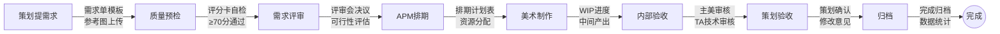
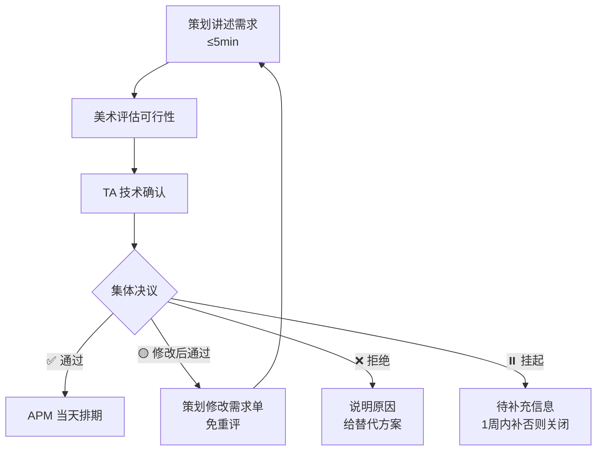
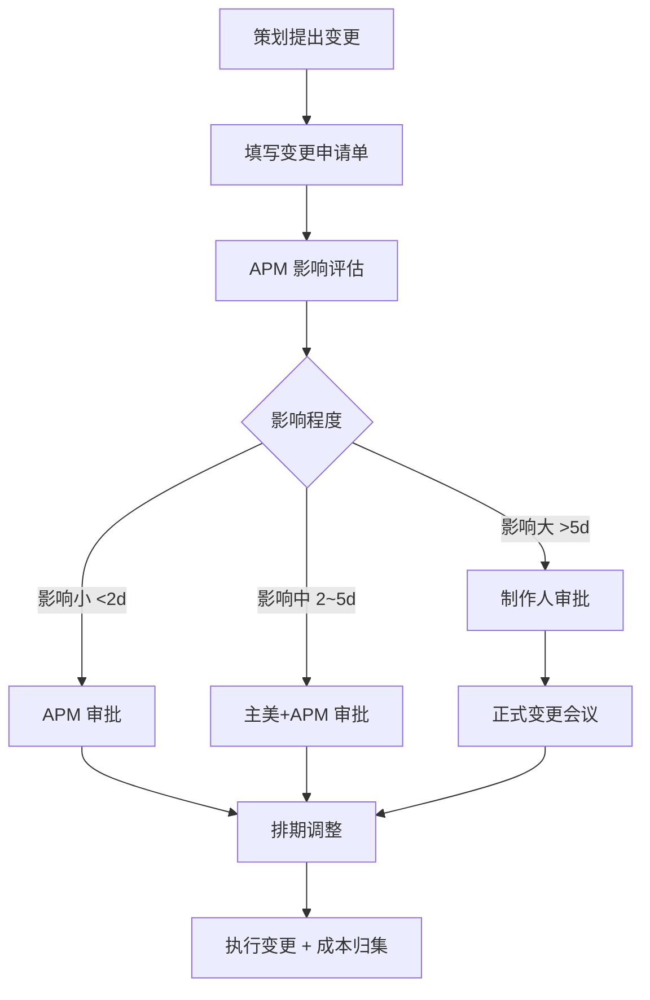

# 📋 需求对接流转规范

> 🏷️ **适用阶段**: 全阶段 | ⚡ **优先级**: 高 | 👤 **负责人**: 周八 | 📅 **版本**: v2.0
>
> 本文档定义美术 vs 策划需求对接全流程，包含需求分类体系、质量评分卡、RACI 责任矩阵、SLA 服务等级协议、评审机制、变更管控、数据度量与工具链集成。

> **📑 目录导航**
>
> 1. [需求对接全流程](#1-需求对接全流程)
>    - [流程全景图](#11-流程全景图)
>    - [各阶段标准流转时间](#12-各阶段标准流转时间)
>    - [需求生命周期状态机](#13-需求生命周期状态机)
> 2. [标准需求单模板](#2-标准需求单模板)
>    - [需求单字段定义](#21-需求单字段定义)
>    - [需求分类体系](#22-需求分类体系)
>    - [优先级定义](#23-优先级定义)
>    - [参考图规格要求](#24-参考图规格要求)
>    - [需求质量评分卡](#25-需求质量评分卡)
> 3. [RACI 责任矩阵](#3-raci-责任矩阵)
> 4. [SLA 服务等级协议](#4-sla-服务等级协议)
>    - [各角色承诺时效](#41-各角色承诺时效)
>    - [超时升级路径](#42-超时升级路径)
> 5. [评审机制](#5-评审机制)
>    - [评审会设置](#51-评审会设置)
>    - [评审决策流程](#52-评审决策流程)
>    - [评审检查要点](#53-评审检查要点)
>    - [分歧处理规则](#54-分歧处理规则)
> 6. [变更管控](#6-变更管控)
>    - [变更申请流程](#61-变更申请流程)
>    - [变更影响评估模板](#62-变更影响评估模板)
>    - [变更冻结期规则](#63-变更冻结期规则)
>    - [变更成本追踪机制](#64-变更成本追踪机制)
> 7. [常见冲突场景与解法](#7-常见冲突场景与解法)
> 8. [数据度量与持续改进](#8-数据度量与持续改进)
>    - [核心度量指标](#81-核心度量指标)
>    - [健康度评分模型](#82-健康度评分模型)
>    - [持续改进闭环](#83-持续改进闭环)
> 9. [工具链集成与自动化](#9-工具链集成与自动化)
> 10. [附录：跨部门协作日历](#附录跨部门协作日历)

---

## 🔄 1. 需求对接全流程

### 🗺️ 1.1 流程全景图



> 💡 **v2.0 新增「质量预检」环节**：需求单提交后系统自动校验评分卡得分 ≥ 70 分方可进入评审，低于 70 分退回补充。

### ⏱️ 1.2 各阶段标准流转时间

| 📌 阶段 | ⏰ 标准时效 | 🚨 超时预警 | 📈 超时升级 |
|:---:|:---:|:---:|:---:|
| 需求单填写 | 策划提交后 **0.5d** | — | — |
| 质量预检 | 提交后 **即时**（自动） | 不通过即退回 | — |
| 需求评审 | 收到后 **1~2d** | 2d 未评审自动催 | 3d → 升级主美 |
| APM 排期 | 评审后 **1d** | 1d 未排期自动催 | 2d → 升级制作人 |
| 美术制作 | 按排期 | 燃尽图跟踪 | 超期 20% → 预警 |
| 内部验收 | 提交后 **1d** | 超时升级 | 2d → 升级主美 |
| 策划验收 | 提交后 **2d** | 超时视为通过 | 3d → 自动通过 |

### 🔁 1.3 需求生命周期状态机

每个需求在系统中有且仅有一个当前状态，状态流转严格按以下路径：

```
📝草稿 → 🔍待评审 → ✅已排期 → 🎨制作中 → 🔬验收中 → 📦已归档
                ↘ 🚫已退回 → 📝草稿（退回后修改重新提交）
```

| 状态 | 触发条件 | 负责角色 | 系统动作 |
|:---:|:---:|:---:|:---:|
| **草稿** | 策划创建需求单 | 策划 | 生成需求 ID |
| **待评审** | 质量预检通过（≥70 分） | APM | 通知评审人、启动 SLA 计时 |
| **已退回** | 评审不通过 / 预检不达标 | 策划 | 标注退回原因、暂停 SLA |
| **已排期** | 评审通过，APM 分配资源 | APM | 写入排期表、通知美术 |
| **制作中** | 美术开始制作 | 美术 | 启动工时记录 |
| **验收中** | 美术提交成果 | 主美 → 策划 | 通知验收人、启动验收 SLA |
| **已归档** | 策划验收通过 | 系统 | 归档资产、更新统计 |

---

## 📝 2. 标准需求单模板

### 📄 2.1 需求单字段定义

| 🏷️ 字段 | ✅ 必填 | 📝 说明 | 💡 示例 |
|:---:|:---:|:---:|:---:|
| **需求 ID** | ✅ | 唯一编号，APM 分配 | `REQ-2026-0108` |
| **需求标题** | ✅ | 一句话描述，≤20 字 | 新英雄「夜叉」角色设计 |
| **需求类型** | ✅ | 见 2.2 分类体系 | 角色原画 |
| **需求子类** | ✅ | 二级细分类别 | 写实/Q版/半身/全身 |
| **优先级** | ✅ | P0/P1/P2/P3 | P1 |
| **关联版本** | ✅ | 目标里程碑 | Alpha 1.2 |
| **关联需求 ID** | ⚠️ | 前置/关联需求 | `REQ-2026-0095` |
| **策划负责人** | ✅ | 需求发起人 | 王策划 |
| **美术负责人** | ✅ | APM 指定 | 张美术 |
| **需求描述** | ✅ | 结构化描述（背景/目标/约束） | (详见模板) |
| **参考图** | ✅ | 至少 3 张，含标注 | 上传至附件 |
| **验收标准** | ✅ | 量化验收条件 Checklist | (详见模板) |
| **技术约束** | ⚠️ | 面数/贴图尺寸/动画帧数等 | ≤15K 面, 1024px 贴图 |
| **预估工期** | ⚠️ | 美术侧评估后填写 | 5d |
| **截止日期** | ✅ | 与里程碑对齐 | 2026-04-20 |
| **备注** | ❌ | 补充说明 | — |

### 🏷️ 2.2 需求分类体系

需求按「工种维度」和「复杂度维度」进行二维分类，不同类别对应不同的评审流程和 SLA 标准：

| 一级分类（工种） | 二级分类（子类） | 复杂度参考 | 标准工期参考 |
|:---:|:---:|:---:|:---:|
| 🎨 **原画** | 角色原画（全身） | 高 | 5~10d |
| | 角色原画（半身/头像） | 中 | 2~5d |
| | 场景概念图 | 高 | 5~8d |
| | 道具/图标设计 | 低 | 0.5~2d |
| 🧊 **建模** | 角色模型（高模+低模） | 高 | 10~20d |
| | 场景模型 | 中~高 | 5~15d |
| | 道具/武器模型 | 低~中 | 2~5d |
| 🎬 **动画** | 角色动作（整套） | 高 | 10~15d |
| | 单个动作/表情 | 低~中 | 1~3d |
| ✨ **特效** | 技能特效 | 中~高 | 3~8d |
| | 环境/UI 特效 | 低~中 | 1~3d |
| 🖥️ **UI** | 系统界面设计 | 中 | 3~7d |
| | 图标/Banner | 低 | 0.5~2d |
| 🌄 **场景** | 大场景搭建 | 高 | 15~30d |
| | 局部场景/关卡 | 中 | 5~10d |

> ⚠️ **分类规则**：策划提交时必须选择到二级分类；复杂度由 APM 在评审时最终确认；跨工种需求（如"角色原画+建模"）需拆分为多张独立需求单。

### 🚦 2.3 优先级定义

| 🏷️ 等级 | 📝 定义 | ⏰ 响应时效 | 📅 排期位置 | 🔢 全项目上限 |
|:---:|:---:|:---:|:---:|:---:|
| 🔴 **P0 紧急** | 阻塞里程碑 / Boss 要求 | **当天响应** | 插入当前 Sprint | ≤ 3 个 |
| 🟡 **P1 高** | 当前版本必须 | **1d 内响应** | 当前/下个 Sprint | ≤ 总量 30% |
| 🟢 **P2 中** | 重要但不紧急 | **3d 内响应** | 正常排期 | — |
| ⚪ **P3 低** | 锦上添花 | 下版本处理 | 需求池候选 | — |

> 🚨 **P0 超标自动预警**：当全项目 P0 需求 > 3 个时，系统自动通知制作人进行优先级仲裁。

### 🖼️ 2.4 参考图规格要求

| 📌 要求 | 📏 标准 | 📊 评分权重 |
|:---:|:---:|:---:|
| **数量** | 至少 **3 张**（正面/侧面/细节或风格参考） | 20% |
| **分辨率** | ≥ **720p**，清晰可辨别细节 | 10% |
| **标注** | 需标注"参考哪里"（颜色/造型/材质/风格） | 30% |
| **来源** | 注明原画出处，避免版权风险 | 10% |
| **反例** | 可提供"不要的风格"反面参考 | 15% |
| **一致性** | 多张参考图风格方向一致，不矛盾 | 15% |

> 📌 **场景说明**：参考图提交规范
>
> ✅ **Do (正确示范)**：提交 3 张参考图，分别标注"图1-造型参考""图2-配色参考""图3-材质参考"，附带反面参考说明"不要暖色系"。所有参考图风格一致（偏日系赛璐珞）。
>
> ❌ **Don't (错误示范)**：甩一句"参考某游戏的感觉"，不附任何图片；或贴 10 张风格完全不同的图让美术"自行理解"；参考图分辨率低于 480p 看不清细节。

### 📊 2.5 需求质量评分卡

需求单提交后系统自动评分，**≥ 70 分**方可进入评审池，低于 70 分退回修改：

| 评分维度 | 权重 | 满分标准 | 扣分规则 |
|:---:|:---:|:---:|:---:|
| **字段完整性** | 25% | 所有必填字段均已填写 | 每缺1个必填字段 -5 分 |
| **描述清晰度** | 20% | 需求描述含背景/目标/约束三要素 | 缺一要素 -7 分 |
| **参考图质量** | 25% | ≥3张 + 有标注 + 风格一致 | 按 2.4 参考图规格逐项评 |
| **验收标准** | 15% | 含 ≥3 条可量化验收条件 | 每少1条 -5 分 |
| **技术约束** | 15% | 明确面数/尺寸/帧数等技术限制 | 未填写技术约束 -10 分 |

> 💡 **评分示例**：一份需求单所有字段填满(25) + 三要素齐全(20) + 3张参考图有标注(22) + 4条验收标准(15) + 明确技术约束(15) = **97分** ✅ 通过

---

## 👥 3. RACI 责任矩阵

明确每个环节"谁执行、谁审批、谁咨询、谁知会"，杜绝推诿和遗漏：

| 环节 | 策划 | APM | 主美 | 美术执行 | TA | 制作人 |
|:---:|:---:|:---:|:---:|:---:|:---:|:---:|
| **提交需求单** | **R** 执行 | **A** 审批 | C 咨询 | I 知会 | I 知会 | I 知会 |
| **需求评审** | C 咨询 | **R** 执行 | **A** 审批 | C 咨询 | C 咨询 | I 知会 |
| **排期分配** | I 知会 | **R** 执行 | **A** 审批 | I 知会 | I 知会 | I 知会 |
| **美术制作** | I 知会 | C 咨询 | **A** 审批 | **R** 执行 | C 咨询 | I 知会 |
| **内部验收** | I 知会 | C 咨询 | **R** 执行 | I 知会 | **R** 执行 | I 知会 |
| **策划验收** | **R** 执行 | C 咨询 | I 知会 | I 知会 | I 知会 | I 知会 |
| **变更审批（大）** | **R** 执行 | C 咨询 | **A** 审批 | I 知会 | C 咨询 | **A** 审批 |
| **优先级仲裁** | C 咨询 | C 咨询 | C 咨询 | I 知会 | I 知会 | **R** 执行 |

> 💡 **RACI 说明**：R = Responsible（执行者），A = Accountable（审批者/最终负责），C = Consulted（事前咨询），I = Informed（事后知会）。每个环节有且仅有一个 A。

---

## ⏱️ 4. SLA 服务等级协议

### 📋 4.1 各角色承诺时效

以下 SLA 为各角色对需求响应的承诺时效，超时将触发升级机制：

| 角色 | 承诺事项 | P0 时效 | P1 时效 | P2/P3 时效 |
|:---:|:---:|:---:|:---:|:---:|
| **策划** | 提交完整需求单 | 即时 | 0.5d | 1d |
| **APM** | 完成评审 + 排期 | 当天 | 2d | 3d |
| **主美** | 参与评审决策 | 当天 | 1d | 2d |
| **美术** | 确认接单 + 开始制作 | 当天 | 1d | 排期日起 |
| **策划** | 完成验收反馈 | 0.5d | 1d | 2d |
| **TA** | 技术可行性评估 | 当天 | 1d | 3d |

### 🚨 4.2 超时升级路径（Escalation Path）

> 🚨 **升级原则**：超时不是为了惩罚，而是确保问题被关注到正确层级并快速解决。

| 升级层级 | 触发条件 | 升级对象 | 处理时效 | 系统动作 |
|:---:|:---:|:---:|:---:|:---:|
| **L1 提醒** | 超时 50% | 当事人 | — | 飞书/企微自动提醒 |
| **L2 警告** | 超时 100% | 直属上级（组长/主美） | 0.5d | 邮件 + 飞书群通知 |
| **L3 升级** | 超时 200% | 制作人/总监 | 当天 | 升级邮件 + 周报标红 |

> ✅ **Do — 正确响应超时**：收到 L1 提醒后，若确实无法按时完成，**主动回复预计完成时间**并说明原因。APM 据此调整排期或重新分配。
>
> ❌ **Don't — 错误应对**：无视提醒消息；私下口头说"我忙不过来"但不在系统中更新状态；等到 L3 才解释原因。

---

## 🔍 5. 评审机制

### 📅 5.1 评审会设置

| 📌 项目 | 📏 标准 |
|:---:|:---:|
| **频率** | 每周 1~2 次（周一/周四下午） |
| **时长** | 30~60 分钟 |
| **参与人** | APM（主持）、主美、对应工种组长、策划负责人 |
| **输出** | 评审记录表（通过/修改/拒绝/挂起 + 原因 + Action Item） |
| **前置条件** | 所有需求单质量预检 ≥ 70 分；参考图已上传至共享空间 |
| **会议纪律** | 每个需求 ≤ 10min 讲解 + 讨论；超时的需求排下次或单独沟通 |

### 🔀 5.2 评审决策流程



| 决议类型 | 定义 | 后续动作 | SLA |
|:---:|:---:|:---:|:---:|
| ✅ **通过** | 需求明确、可执行 | APM 当天排期 | 1d 内完成排期 |
| 🟡 **修改后通过** | 方向可以但细节需完善 | 策划修改后免重评 | 策划 1d 内修改完 |
| ❌ **拒绝** | 不可行 / 不合理 | 给出原因 + 替代方案 | — |
| ⏸️ **挂起** | 信息不足，待补充 | 策划补充后下次评审 | 1 周内补充否则关闭 |

### ✅ 5.3 评审检查要点

| 🔍 维度 | ❓ 核心问题 | 📊 决策依据 |
|:---:|:---:|:---:|
| **需求完整性** | 描述是否清晰？参考图是否充分？ | 质量评分卡 ≥ 70 分 |
| **技术可行性** | 现有管线能否实现？性能预算够吗？ | TA 技术评估报告 |
| **工期合理性** | 截止日期是否留有 Buffer？ | 历史同类需求工期数据 |
| **优先级合理性** | P0/P1 是否真的紧急？是否有挤占风险？ | 版本里程碑紧迫度 |
| **重复性检查** | 是否与已有需求重复？可否复用？ | 需求池 / 资产库检索 |
| **依赖关系** | 是否有前置依赖？依赖是否已就绪？ | 关联需求 ID 状态 |

### ⚖️ 5.4 分歧处理规则

> 💡 **核心原则**：用数据说话，用机制裁决，对事不对人。30 分钟内无法达成一致的议题必须升级。

| 分歧类型 | 处理机制 | 仲裁人 | 时限 |
|:---:|:---:|:---:|:---:|
| 美术与策划分歧 | APM 主持协商，给出数据支撑 | APM | 当场 |
| 工期评估分歧 | APM 出具历史数据对比 + 类似需求耗时 | 主美 | 1d |
| 技术可行性分歧 | TA 出具技术评估报告（含 Demo 验证） | TA Lead | 2d |
| 优先级争议 | 制作人根据版本目标统一排序 | 制作人 | 当周 |
| 无法达成一致 | 升级到制作人/总监层面，邮件留档 | 制作人/总监 | 2d |

---

## 🔒 6. 变更管控

### 📝 6.1 变更申请流程



### 📊 6.2 变更影响评估模板

| 📌 评估项 | 📝 内容 | 📏 量化标准 |
|:---:|:---:|:---:|
| **变更描述** | 具体变更了什么？ | 前后对比说明 |
| **影响范围** | 涉及哪些已完成/进行中的资产？ | 受影响资产数量 |
| **工期影响** | 额外需要多少人天？ | 精确到 0.5d |
| **成本影响** | 额外费用（外包返工/加班）？ | 金额估算 |
| **质量影响** | 是否影响其他资产的一致性？ | 关联资产清单 |
| **里程碑影响** | 是否导致里程碑延期？ | 延期天数预估 |
| **风险等级** | 综合评估 | 低(绿)/中(黄)/高(红) |
| **替代方案** | 是否存在低成本替代方案？ | 至少给出 1 个备选 |

### 🚨 6.3 变更冻结期规则

> 🚨 **核心红线**：越接近发版，变更门槛越高。RC 阶段原则上禁止美术变更。

| 📅 阶段 | 🔒 变更权限 | 📋 审批流程 | 💰 变更代价系数 |
|:---:|:---:|:---:|:---:|
| 预研期 | ✅ 自由变更 | APM 备案即可 | ×1.0 |
| Alpha 前 2 周 | 🟡 P0 变更需审批 | APM + 主美 | ×1.5 |
| Beta 前 1 月 | 🔴 仅 P0 变更，必须制作人审批 | 制作人审批 | ×2.0 |
| RC 阶段 | 🚫 原则上禁止美术变更，仅修 Bug | 仅修 Bug，总监特批 | ×3.0 |

> ⚠️ **变更代价系数**：用于成本核算，在周/月报中体现。例如 RC 阶段一个 2d 的变更，实际计为 6d（2×3.0）成本，倒逼前期需求收敛。

### 📈 6.4 变更成本追踪机制

所有变更的成本数据自动汇入度量看板：

| 追踪维度 | 统计口径 | 展示方式 |
|:---:|:---:|:---:|
| 单次变更成本 | 额外人天 × 代价系数 | 变更单详情页 |
| 策划维度变更率 | 某策划变更次数 / 该策划总需求数 | 策划维度排行榜 |
| 版本维度变更率 | 版本变更总次数 / 版本总需求数 | 版本健康度报告 |
| 累计变更成本 | 所有变更的加权人天总和 | 月度成本报表 |

---

## 🤯 7. 常见冲突场景与解法

> 🚨 **避坑指南**：以下是美术-策划协作中最高频的冲突场景。

> 🚨 **案例 1：需求描述不清**
>
> 🔴 **[高频]** "做一个好看的角色" "参考某游戏的感觉" — 美术每次听到这种需求都想掀桌。
>
> 🎬 **典型场景还原**
> - 策划："这个角色要有一种…帅气但又不失温柔的感觉"
> - 美术："你说的帅气是什么风格？日系？欧美？参考图呢？"
> - 策划："就…你看着办吧"
>
> 🔍 **问题根因拆解（5 Whys）**
> - **① 表面**：需求描述模糊、参考图不足（策划执行问题）
> - **② 中层**：策划缺乏美术语言，不知道怎么描述（能力缺失）
> - **③ 深层**：缺少需求单填写指南和培训（流程缺陷）
> - **④ 系统层**：没有质量门禁阻止低质量需求进入评审（机制缺失）
>
> 💡 **系统性解决方案**
> 1. **质量评分卡门禁**（v2.0 新增）：< 70 分自动退回
> 2. APM 主动出击，要求补充参考图
> 3. 组织 **15min 面对面沟通**，产出美术理解确认书
> 4. 建立 **需求单填写培训机制**，新入职策划必须学习后才能提交需求
> 5. 维护 **优秀需求单示例库**，策划可直接参考填写
>
> 📊 **预期效果**：退回率从 40% 降至 15% 以下；首次通过率从 30% 提升至 65%。

> 🚨 **案例 2：策划频繁变更**
>
> 🔴 **[高频]** "原画做到一半改设定，建模快完成改造型" — 美术最痛恨的需求翻烧饼。
>
> 🎬 **典型场景还原**
> - 策划：Alpha 阶段冻结设定后又改了角色背景故事
> - 美术：原画已经画了 80%，因设定修改需重画 50%
> - APM：统计本月第 5 次变更，累计影响 12 人天
>
> 🔍 **问题根因拆解（5 Whys）**
> - **① 表面**：原画做到一半改设定（结果）
> - **② 中层**：策划设计未收敛就下需求 / 上级反复审核（流程前置不足）
> - **③ 深层**：缺乏变更成本可视化机制，变更"零成本感"（机制缺失）
> - **④ 系统层**：绩效不关联变更率，无负反馈（激励失当）
>
> 💡 **系统性解决方案**
> 1. 所有变更走 **TAPD 工单**，留痕追踪
> 2. **量化变更成本**，每次变更标注影响人天 × 代价系数
> 3. 建立 **变更成本可视化看板**，让决策者在知道代价的前提下做决定
> 4. 定期汇报变更次数和代价，形成压力
> 5. 将变更率纳入策划侧 **过程质量考核** 参考指标
>
> 📊 **预期效果**：月变更率从 25% 降至 10% 以下；变更引发的返工人天减少 60%。

> 🚨 **案例 3：优先级争议**
>
> 🔴 **[高频]** "所有需求都标 P0，策划 A 说自己更急" — APM 的排期噩梦。
>
> 🎬 **典型场景还原**
> - 策划 A：我的角色是主线剧情必须的，P0！
> - 策划 B：我的活动下周就上线了，更 P0！
> - APM：手上 8 个需求全标 P0，排不动
>
> 🔍 **问题根因拆解（5 Whys）**
> - **① 表面**：所有需求都标 P0（滥用）
> - **② 中层**：策划之间没有统一的优先级标准（共识缺失）
> - **③ 深层**：缺乏统一的优先级仲裁机制 + 数量上限（规则缺失）
> - **④ 系统层**：P0 无上限约束，"通货膨胀"无代价（系统缺陷）
>
> 💡 **系统性解决方案**
> 1. **P0 全项目上限 3 个**，超标自动预警制作人仲裁
> 2. 建立 **优先级矩阵**（紧急×重要×里程碑关联度）
> 3. 每周制作人会上 **统一排序 + 公示**
> 4. 在需求评审会上强制执行 P0 上限
> 5. P1 不超过总需求量 30%，超标触发复审
>
> 📊 **预期效果**：P0 需求数稳定控制在 3 个以内；排期冲突减少 70%。

> ⚠️ **案例 4：验收标准不一致**
>
> 🟡 **[中频]** 美术按需求单做完，策划验收时说"和我想的不一样"。
>
> 💡 **解决方案**
> 1. 需求单必须包含 **≥3 条可量化验收标准**
> 2. 制作前产出 **美术理解确认书**，策划签字认可
> 3. 制作中期（50% 进度）做 **WIP Review**，策划确认方向正确
> 4. 验收时对照 Checklist 逐条打分，非主观感受

> ⚠️ **案例 5：跨工种需求协调困难**
>
> 🟡 **[中频]** 一个角色需要原画→建模→动画→特效四个工种串联，信息不同步。
>
> 💡 **解决方案**
> 1. 跨工种需求必须建立 **需求链**（Parent-Child 关联）
> 2. APM 指定一个 **需求链 Owner** 负责全链路协调
> 3. 上游工种完成后 **自动触发下游启动通知**
> 4. 任何一环变更 **自动通知全链路相关人**

---

## 📊 8. 数据度量与持续改进

### 📈 8.1 核心度量指标（KPI Dashboard）

| 指标 | 目标值 | 说明 | 数据来源 |
|:---:|:---:|:---:|:---:|
| **需求首次通过率** | ≥ 65% | 需求评审一次性通过比例 | 评审记录 |
| **平均流转周期** | ≤ 3d | 从提交到排期的平均耗时 | 状态时间戳 |
| **月变更率** | ≤ 10% | 变更需求数/总需求数 | 变更工单 |
| **SLA 达标率** | ≥ 90% | 各环节未超时比例 | 超时记录 |
| **需求退回率** | ≤ 15% | 因质量不达标退回比例 | 评审记录 |
| **验收一次通过率** | ≥ 80% | 策划验收无返修比例 | 验收记录 |

### 🏥 8.2 需求健康度评分模型

按版本/Sprint 周期，综合以下维度计算需求流转健康度（满分 100）：

| 评分维度 | 权重 | 满分标准 | 数据来源 |
|:---:|:---:|:---:|:---:|
| **需求质量** | 20% | 首次通过率 ≥ 65% | 评审记录 |
| **流转效率** | 25% | 平均流转周期 ≤ 3d | 状态流转时间戳 |
| **变更可控** | 20% | 月变更率 ≤ 10% | 变更工单统计 |
| **SLA 履约** | 20% | SLA 达标率 ≥ 90% | 超时记录 |
| **协作满意度** | 15% | 双方满意度 ≥ 4/5 | 季度匿名调研 |

> 💡 **健康度等级**：≥ 85 优秀（绿色）| 70~84 良好（黄色）| < 70 需改进（红色，触发专项复盘）

### 🔄 8.3 持续改进闭环（PDCA）

| 改进节奏 | 内容 | 参与人 | 输出物 |
|:---:|:---:|:---:|:---:|
| **每周** | Review 本周 SLA 达标情况 + 异常分析 | APM | 周报异常项 |
| **每 Sprint** | Sprint 回顾中的需求流转议题 | 全美术 + 策划代表 | 改进 Action List |
| **每月** | 月度健康度报告 + 趋势分析 | APM + 主美 | 月度报告 |
| **每季度** | 流程大复盘 + 规则迭代 | 制作人 + 全团队 | 规范版本更新 |

---

## 🔧 9. 工具链集成与自动化

需求流转规范的落地依赖工具链支撑，以下是各工具的职责分工与自动化规则：

| 工具 | 职责 | 自动化规则 |
|:---:|:---:|:---:|
| **TAPD** | 需求单管理、状态流转、变更工单 | 状态变更自动触发通知；超时自动升级；质量评分自动计算 |
| **飞书/企微** | 即时通知、评审日程、提醒 | L1/L2/L3 超时分级通知；评审会前 1h 自动提醒 |
| **Perforce/SVN** | 美术资产版本管理 | 资产提交自动关联需求 ID；验收通过自动打 Tag |
| **共享网盘** | 参考图、交付物存储 | 按需求 ID 自动建文件夹；命名规范校验 |
| **数据看板** | KPI 展示、趋势分析 | 每日自动同步 TAPD 数据；阈值超标自动告警 |

**自动化触发规则清单**：

| 触发事件 | 自动动作 | 通知对象 |
|:---:|:---:|:---:|
| 需求单提交 | 自动评分 + 字段校验 | 策划（不达标时退回提示） |
| 评分 ≥ 70 分 | 进入评审池 + 通知 APM | APM + 主美 |
| 评审通过 | 生成排期任务 + 启动 SLA | 美术负责人 |
| SLA 超时 50% | L1 提醒 | 当事人 |
| SLA 超时 100% | L2 警告 + 标黄 | 当事人 + 组长 |
| SLA 超时 200% | L3 升级 + 标红 | 制作人/总监 |
| 美术提交资产 | 自动关联需求 ID + 触发验收 | 主美 + 策划 |
| 策划验收超时 3d | 自动通过 + 归档 | 策划（通知已自动通过） |
| 变更申请提交 | 自动计算影响范围 + 代价系数 | APM + 审批人 |
| P0 数量 > 3 | 自动预警 | 制作人 |
| 月变更率 > 10% | 触发变更专项复盘 | APM + 策划主管 |

**资产命名与存储规范**：

| 场景 | 命名格式 | 示例 |
|:---:|:---:|:---:|
| 参考图文件夹 | `/Ref/[需求ID]/` | `/Ref/REQ-2026-0108/` |
| WIP 交付 | `[需求ID]_[资产名]_WIP[版本].[格式]` | `REQ-2026-0108_Yasha_WIP02.psd` |
| 最终交付 | `[需求ID]_[资产名]_Final.[格式]` | `REQ-2026-0108_Yasha_Final.psd` |
| 变更记录 | `[需求ID]_CR[序号]_[日期]` | `REQ-2026-0108_CR01_20260415` |

---

## 📅 附录：跨部门协作日历

| ⏰ 时间 | 📌 事项 | 👥 参与人 | 📄 输出物 |
|:---:|:---:|:---:|:---:|
| 每周一 10:00 | 需求评审会 | APM + 策划 + 主美 | 评审记录表 |
| 每周三 14:00 | 美术内部 Review | APM + 各组长 | WIP 进度表 |
| 每周四 15:00 | 变更审批会（如有） | APM + 主美 + 制作人 | 变更决议 |
| 每周五 16:00 | 周报同步 | APM → 策划/制作人 | 周报 + SLA 数据 |
| Sprint 首日 | Sprint 规划 | 全美术团队 | Sprint Backlog |
| Sprint 末日 | Sprint 评审+回顾 | 全美术团队 + 策划 | 回顾 Action List |
| 每月最后一周 | 月度健康度复盘 | APM + 主美 + 制作人 | 月度报告 |
| 每季度末 | 流程大复盘 | 全团队 | 规范版本更新 |

> ⚡ **APM 金句**：「需求对接的核心不是'传话'，而是'翻译+风控'。好的流程让所有人聚焦在创作本身，而不是扯皮和返工。」
