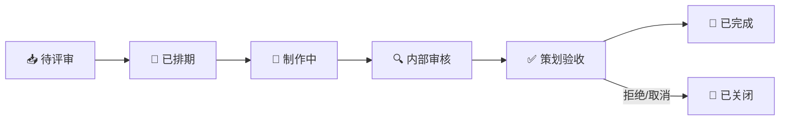

<!-- 左侧目录区域 (固定悬浮) -->

📑 目录导航

- 🎨 [**原画需求单模板**](#1-原画需求单模板)
  - [基础信息](#11-基础信息)
  - [详细描述](#12-详细描述)
  - [参考与交付](#13-参考与交付)
  - [填写示例](#14-填写示例)
- 🖥️ [**UI 需求单模板**](#2-ui-需求单模板)
  - [基础信息](#21-基础信息)
  - [功能描述](#22-功能描述)
  - [设计要求](#23-设计要求)
  - [填写示例](#24-填写示例)
- 🔖 [**图标需求批量模板**](#3-图标需求批量模板)
  - [图标批量需求表](#31-图标批量需求表)
  - [图标设计规范速查](#32-图标设计规范速查)
- ✅ [**验收标准模板**](#4-验收标准模板)
  - [原画验收标准](#41-原画验收标准)
  - [UI 验收标准](#42-ui-验收标准)
- 📈 [**需求追踪与度量**](#5-需求追踪与度量)

<!-- 右侧正文区域 -->

# 📝 UI / 原画需求模板

> 🏷️ **[模板] [高频使用]** 适用阶段：全阶段 | ⚡ 优先级：高 | 👤 负责人：周八
>
> 本文档提供标准化的 **UI 需求单** 与 **原画需求单** 模板，帮助策划与美术团队高效对接，杜绝"需求不清 → 白做返工"的恶性循环。

---

## 🎨 1. 原画需求单模板

### 📋 1.1 基础信息

| 🏷️ 字段 | ✏️ 填写内容 |
|:---:|:---:|
| **需求编号** | `REQ-ART-____` |
| **日期** | `____-__-__` |
| **需求类型** | ☐角色原画  ☐场景概念  ☐道具设计  ☐宣传图 |
| **优先级** | ☐P0(紧急) ☐P1(高) ☐P2(中) ☐P3(低) |
| **策划负责人** | ________ |
| **美术负责人** | ________ |
| **关联版本** | ________ |
| **截止日期** | ________ |

### 🖌️ 1.2 详细描述

| 🏷️ 字段 | 📝 填写说明 |
|:---:|:---:|
| **角色定位** | 在游戏中的角色定位、性格设定 |
| **设计关键词** | 3~5个关键词，如：冷酷、机械、暗黑、东方 |
| **体型/年龄** | 少年/青年/中年/老年，偏瘦/标准/壮硕 |
| **服饰风格** | 时代、地域、职业、材质倾向 |
| **武器/道具** | 具体描述 |
| **色调倾向** | 主色调/辅助色/禁止使用的颜色 |

### 📦 1.3 参考与交付

| 🏷️ 字段 | 📝 填写说明 |
|:---:|:---:|
| **参考图** | 附件，至少 **3 张**，标注参考哪方面 |
| **反面参考** | 不要的风格方向 |
| **交付物** | ☐概念草图  ☐正面定稿  ☐三视图  ☐表情设计  ☐皮肤变体  ☐武器设计稿  ☐色彩方案 |
| **修改轮次** | 最多 ___ 轮（超出需走变更流程） |
| **验收标准** | 具体的验收条件 |

### ✅ 1.4 填写示例

> 📌 **[场景说明：原画需求单填写]**
>
> ✅ **正确示范 (Do)**：
>
> | 🏷️ 字段 | 📝 内容 |
> |:---:|:---:|
> | **需求编号** | `REQ-ART-2026-0042` |
> | **需求类型** | 角色原画 |
> | **优先级** | P1（高） |
> | **角色定位** | 可操作英雄，定位刺客，性格冷酷内敛 |
> | **设计关键词** | 暗影、忍者、东方风、紫黑色系、轻甲 |
> | **体型/年龄** | 青年男性，偏瘦矫健 |
> | **服饰风格** | 日式忍者变体，融合机械元素，轻甲为主 |
> | **武器** | 双持短刀，刀身有能量纹路 |
> | **色调倾向** | 主色暗紫/黑，辅助色幽蓝荧光，**禁止** 大面积暖色 |
> | **参考图** | 图1-造型参考，图2-配色参考，图3-材质参考 |
> | **交付物** | 概念草图 × 3 → 正面定稿 → 三视图 → 表情设计 |
> | **修改轮次** | 最多 **3 轮** |
> | **验收标准** | 风格与 Moodboard 一致；三视图可直接用于建模 |
>
> ❌ **错误示范 (Don't)**：需求描述只写"做一个暗黑风角色"，不附参考图，不写设计关键词，不标注色调倾向

---

## 🖥️ 2. UI 需求单模板

### 📋 2.1 基础信息

| 🏷️ 字段 | ✏️ 填写内容 |
|:---:|:---:|
| **需求编号** | `REQ-UI-____` |
| **日期** | `____-__-__` |
| **界面类型** | ☐主界面 ☐二级页面 ☐弹窗 ☐HUD ☐图标 |
| **优先级** | ☐P0  ☐P1  ☐P2  ☐P3 |
| **策划负责人** | ________ |
| **UI设计师** | ________ |
| **关联版本** | ________ |
| **截止日期** | ________ |

### 📐 2.2 功能描述

| 🏷️ 字段 | 📝 填写说明 |
|:---:|:---:|
| **界面功能** | 这个界面是做什么的 |
| **用户行为** | 用户在这个界面上做什么操作 |
| **信息层级** | 哪些信息最重要，需要突出显示 |
| **交互流程** | 用户操作路径描述 |

### 🎨 2.3 设计要求

| 🏷️ 字段 | 📝 填写说明 |
|:---:|:---:|
| **线框图** | ☐已提供(附件)  ☐需UI侧绘制 |
| **参考图** | 附件，标注参考的具体方面 |
| **适配要求** | ☐16:9  ☐18:9  ☐刘海屏  ☐iPad |
| **动效需求** | ☐无  ☐简单过渡  ☐复杂动效(需单独设计) |
| **交付物** | ☐设计稿(PSD/Figma)  ☐切图  ☐标注文档  ☐动效Demo  ☐图标设计 |
| **验收标准** | 具体条件 |

### ✅ 2.4 填写示例

> 📌 **[场景说明：UI 需求单填写]**
>
> ✅ **正确示范 (Do)**：
>
> | 🏷️ 字段 | 📝 内容 |
> |:---:|:---:|
> | **需求编号** | `REQ-UI-2026-0015` |
> | **界面类型** | 二级页面 |
> | **优先级** | P1 |
> | **界面功能** | 英雄详情页，展示角色立绘/属性/技能/装备/皮肤 |
> | **用户行为** | 查看角色信息、切换标签页、更换装备、预览皮肤 |
> | **信息层级** | 1.角色立绘（核心视觉）2.属性数值 3.技能图标 4.装备栏 |
> | **交互流程** | 主界面→英雄列表→点击角色→英雄详情页→Tab切换 |
> | **线框图** | 已提供（见附件） |
> | **适配要求** | 16:9 + 18:9 + 刘海屏安全区 |
> | **动效需求** | Tab 切换过渡动效，角色立绘入场动效 |
> | **交付物** | Figma 设计稿 + 切图 + 标注文档 |
> | **验收标准** | 1.设计稿与线框图功能一致 2.适配无遮挡 3.图标 ≥ **48×48px** |
>
> ❌ **错误示范 (Don't)**：只写"做一个英雄详情页"，不附线框图，不描述信息层级和交互流程

---

## 🔖 3. 图标需求批量模板

### 📊 3.1 图标批量需求表

> **[批量]** 当需要一次性提交多个图标需求时，使用此表格统一管理：

| 🔢 序号 | 🏷️ 图标名称 | 📂 类型 | 📏 尺寸 | 🔄 状态数 | 📝 参考/描述 | 📦 交付格式 |
|:---:|:---:|:---:|:---:|:---:|:---:|:---:|
| 1 | 攻击力图标 | 属性图标 | 64×64 | 1 | 剑/刀形状，红色系 | PNG (透明底) |
| 2 | 防御力图标 | 属性图标 | 64×64 | 1 | 盾牌形状，蓝色系 | PNG |
| 3 | 技能-火球术 | 技能图标 | 96×96 | 3 (正常/CD/锁定) | 火焰元素，圆形底 | PNG |
| 4 | 道具-回血药 | 道具图标 | 80×80 | 1 | 红色药瓶 | PNG |
| ... | ... | ... | ... | ... | ... | ... |

### 📏 3.2 图标设计规范速查

| 📐 维度 | 📌 标准 |
|:---:|:---:|
| **最小尺寸** | ≥ **48×48px**（可辨识） |
| **视觉权重** | 图标内容占画面 **75%~85%** |
| **描边** | 统一 **2px** 描边或无描边 |
| **圆角** | 统一圆角半径（**8px** / **12px**） |
| **配色** | 每种类型使用统一色系 |
| **状态变化** | 正常/禁用(灰化)/选中(高亮)/CD(暗化+扫光) |

---

## ✅ 4. 验收标准模板

### 🎨 4.1 原画验收标准

| # | 🔍 验收项 | 📌 标准 | ☐ |
|:---:|:---:|:---:|:---:|
| 1 | 风格一致性 | 与项目风格板 Moodboard 一致 | ☐ |
| 2 | 设计还原度 | 与需求描述/参考图方向吻合 | ☐ |
| 3 | 三视图完整性 | 正/侧/背三视图齐全，无矛盾 | ☐ |
| 4 | 色彩方案 | 主色/辅色比例合理，可区分同类角色 | ☐ |
| 5 | 建模可行性 | 结构清晰可建模，无模糊/不确定区域 | ☐ |
| 6 | 文件规格 | PSD 分层清晰，≥ **3000px** 长边 | ☐ |

### 🖥️ 4.2 UI 验收标准

| # | 🔍 验收项 | 📌 标准 | ☐ |
|:---:|:---:|:---:|:---:|
| 1 | 功能完整性 | 所有功能点均有对应设计 | ☐ |
| 2 | 信息层级 | 主次分明，视觉焦点正确 | ☐ |
| 3 | 交互合理性 | 操作路径清晰，无死胡同 | ☐ |
| 4 | 适配测试 | 各目标分辨率下无遮挡/变形 | ☐ |
| 5 | 切图规范 | 命名正确，尺寸符合规范 | ☐ |
| 6 | 标注文档 | 字号/颜色/间距标注完整 | ☐ |

---

## 📈 5. 需求追踪与度量

### 🔄 5.1 需求看板状态

### 📊 5.2 月度度量指标

| 📐 指标 | 🧮 计算方法 | 🎯 目标 |
|:---:|:---:|:---:|
| **需求吞吐量** | 本月完成的需求数 | 趋势向上 |
| **平均交付周期** | 从评审通过到验收完成的天数 | ≤ 预估工期×1.2 |
| **一次通过率** | 首次提交即通过验收的比例 | ≥ **70%** |
| **变更率** | 有变更的需求占比 | ≤ **20%** |
| **P0 占比** | P0 需求占总需求的比例 | ≤ **10%**（健康值） |

> ⚡ **APM 金句**："模板不是束缚创意的枷锁，而是让创意准确落地的轨道。"

