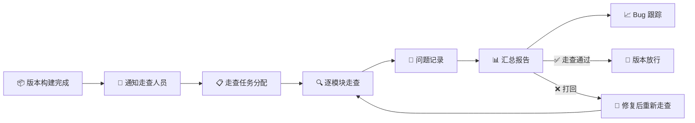

# ✅ 版本走查验收清单

> **[P0]** **[里程碑必做]** 适用阶段：测试期 | 优先级：高 | 负责人：周八
>
> 本文档定义美术版本走查标准流程，包含**逐场景/逐角色检查项**、**设备适配验证**与**截图归档**要求。

> 💡 **核心原则**：走查以**中端机为基准**进行视觉与性能验证，所有检查项以红线标准为合格线。

---

## 🔄 1. 走查流程概览



### 👥 1.1 走查参与角色

| 👤 角色 | 📝 职责 |
|:---:|:---:|
| **APM** | 主持走查、分配任务、汇总报告 |
| **主美** | 视觉质量把控、风格一致性审核 |
| **各工种组长** | 检查本工种资产质量 |
| **QA** | 适配测试、性能测试 |
| **TA** | 技术规格验证 |

### 📅 1.2 走查时间安排

| ⏰ 时间节点 | 🔍 走查范围 | 👥 参与人 |
|:---:|:---:|:---:|
| 每 Sprint 末 | 本 Sprint 新增/修改资产 | APM + 组长 |
| Alpha/Beta 前 | 全量走查 | 全团队 |
| RC 前 | 重点模块 + 历史 Bug 回归 | 全团队 + QA |

---

## 🧑‍🎨 2. 角色走查清单

### 🔷 2.1 模型质量

> **[3D角色]** 模型基础质量检查

| # | 🔍 检查项 | 📌 标准 | ☐ |
|:---:|:---:|:---:|:---:|
| 1 | 整体比例 | 与原画一致，无变形 | ☐ |
| 2 | 面数 | ≤ 红线值 (中端基准) | ☐ |
| 3 | 模型完整性 | 无破面、漏洞、内翻法线 | ☐ |
| 4 | 拓扑质量 | 布线合理，变形区域加密 | ☐ |
| 5 | 材质球数 | ≤ 规定数量 | ☐ |

### 🎨 2.2 贴图质量

> **[贴图]** 贴图清晰度与规格检查

| # | 🔍 检查项 | 📌 标准 | ☐ |
|:---:|:---:|:---:|:---:|
| 1 | 贴图清晰度 | 近景查看不模糊 | ☐ |
| 2 | UV 利用率 | ≥ 75% | ☐ |
| 3 | 贴图尺寸 | 符合红线标准 | ☐ |
| 4 | 色差检查 | 与原画色彩一致（引擎内对比） | ☐ |
| 5 | 接缝处理 | 身体部件接缝不可见 | ☐ |
| 6 | sRGB 设置 | Normal/Mask 未开 sRGB | ☐ |

### 🏃 2.3 动画质量

> **[动画]** 动作流畅性与穿模检查

| # | 🔍 检查项 | 📌 标准 | ☐ |
|:---:|:---:|:---:|:---:|
| 1 | 待机动画 | 自然循环，无抖动 | ☐ |
| 2 | 移动动画 | 无滑步，Root Motion 正确 | ☐ |
| 3 | 攻击动画 | 打击感明确，帧率流畅 | ☐ |
| 4 | 技能动画 | 特效同步，无穿模 | ☐ |
| 5 | 过渡自然度 | 状态切换无闪烁/抖动 | ☐ |
| 6 | 穿模检查 | 全动画检查无部件穿插 | ☐ |
| 7 | 死亡/受击 | 表现明确，不影响游戏 | ☐ |

### ✨ 2.4 特效质量

> **[特效]** 技能特效播放与性能检查

| # | 🔍 检查项 | 📌 标准 | ☐ |
|:---:|:---:|:---:|:---:|
| 1 | 技能特效 | 播放正常，无残留 | ☐ |
| 2 | 命中特效 | 位置正确，时机对 | ☐ |
| 3 | Buff 特效 | 显示/消失正确 | ☐ |
| 4 | 性能 | Drawcall / 粒子数达标 | ☐ |

---

## 🏔️ 3. 场景走查清单

### 🌅 3.1 视觉质量

> **[场景美术]** 光影、接缝与整体风格检查

| # | 🔍 检查项 | 📌 标准 | ☐ |
|:---:|:---:|:---:|:---:|
| 1 | 整体光影 | 光照方向一致，无异常阴影 | ☐ |
| 2 | 模型接缝 | 模块化拼接无可见缝隙 | ☐ |
| 3 | 贴图精度 | 主要视角下贴图清晰 | ☐ |
| 4 | 天空/远景 | 天空盒完整，远景过渡自然 | ☐ |
| 5 | 环境特效 | 雨雪/落叶/雾气表现正常 | ☐ |
| 6 | 色调统一 | 场景整体色调风格一致 | ☐ |

### ⚙️ 3.2 功能性检查

> **[碰撞/交互]** 碰撞体、导航网格与交互物检查

| # | 🔍 检查项 | 📌 标准 | ☐ |
|:---:|:---:|:---:|:---:|
| 1 | 碰撞体 | 角色不穿墙，不卡在模型中 | ☐ |
| 2 | 可行走区域 | 导航网格完整，无空洞 | ☐ |
| 3 | 传送点/出入口 | 功能正常 | ☐ |
| 4 | 交互物件 | 可交互物体高亮/反馈正常 | ☐ |
| 5 | LOD 切换 | 切换平滑，无闪烁 | ☐ |

### 📈 3.3 性能检查

> **[性能]** 帧率、面数与内存达标性检查

| # | 🔍 检查项 | 📌 标准 | ☐ |
|:---:|:---:|:---:|:---:|
| 1 | 帧率 | 中端机 ≥ 30 FPS | ☐ |
| 2 | 同屏面数 | ≤ 红线 | ☐ |
| 3 | Drawcall | ≤ 红线 | ☐ |
| 4 | 遮挡剔除 | 不可见物体已剔除 | ☐ |
| 5 | 内存 | 场景加载后内存正常 | ☐ |

---

## 🖥️ 4. UI 走查清单

### 🎨 4.1 视觉检查

> **[UI设计]** 还原度与设计规范检查

| # | 🔍 检查项 | 📌 标准 | ☐ |
|:---:|:---:|:---:|:---:|
| 1 | 设计还原度 | 与设计稿一致 | ☐ |
| 2 | 字体/字号 | 符合规范，可读 | ☐ |
| 3 | 间距/对齐 | 元素对齐，间距一致 | ☐ |
| 4 | 图标清晰度 | 不模糊，无锯齿 | ☐ |
| 5 | 动效表现 | 过渡自然，不卡顿 | ☐ |

### 📱 4.2 适配检查

> **[多设备]** 各比例屏幕适配验证

| # | 🔍 检查项 | 📐 16:9 | 📐 18:9 | 📐 20:9 | 📱 刘海屏 | 📱 iPad |
|:---:|:---:|:---:|:---:|:---:|:---:|:---:|
| 1 | 主界面 | ☐ | ☐ | ☐ | ☐ | ☐ |
| 2 | 战斗 HUD | ☐ | ☐ | ☐ | ☐ | ☐ |
| 3 | 商城 | ☐ | ☐ | ☐ | ☐ | ☐ |
| 4 | 设置 | ☐ | ☐ | ☐ | ☐ | ☐ |
| 5 | 弹窗 | ☐ | ☐ | ☐ | ☐ | ☐ |

---

## 📱 5. 设备适配验证

### 📋 5.1 必测设备清单

| 📊 档位 | 📱 设备 | 📐 分辨率 | 🖥️ 屏幕比例 |
|:---:|:---:|:---:|:---:|
| 🔴 高端 | iPhone 15 Pro | 2556×1179 | 19.5:9 |
| 🔴 高端 | Samsung S24 Ultra | 3120×1440 | 19.5:9 |
| 🟡 中端 | iPhone 13 | 2532×1170 | 19.5:9 |
| 🟡 中端 | 小米 13 | 2400×1080 | 20:9 |
| 🟢 低端 | iPhone 11 | 1792×828 | 19.5:9 |
| 🟢 低端 | Redmi Note 12 | 2400×1080 | 20:9 |
| 🔵 平板 | iPad Air | 2360×1640 | ~3:2 |

> ⚠️ **避坑指南**：刘海屏和药丸屏的安全区域各厂商标准不同，务必使用 **SafeArea API** 适配，不要硬编码偏移值。

### 🎯 5.2 适配重点区域

| 📍 区域 | 🔍 检查要点 |
|:---:|:---:|
| **安全区** | 刘海/挖孔/药丸区域无遮挡 |
| **底部** | 全面屏手势区域无按钮遮挡 |
| **顶部状态栏** | 不与系统状态栏重叠 |
| **宽屏适配** | iPad 不拉伸变形 |

---

## 📸 6. 截图归档规范

### 🏷️ 6.1 截图命名规则

```
[版本号]_[模块]_[设备]_[日期]_[序号].png

示例:
v0.8.2_Character_Luna_iPhone13_20260407_001.png
v0.8.2_Scene_MainCity_iPad_20260407_001.png
v0.8.2_UI_Shop_iPhone15Pro_20260407_001.png
```

### 📂 6.2 归档目录结构

```
/QA_Screenshots/
├── v0.8.2/
│   ├── Character/
│   ├── Scene/
│   ├── UI/
│   ├── VFX/
│   └── Report/
│       └── WalkThrough_Report_v0.8.2.xlsx
└── v0.9.0/
```

### 📊 6.3 走查报告模板

| 📦 版本 | 📅 走查日期 | 👤 走查人 | 🐛 总Bug数 | 🔴 S | 🟠 A | 🟡 B | 🟢 C | 📈 通过率 | 🏁 结论 |
|:---:|:---:|:---:|:---:|:---:|:---:|:---:|:---:|:---:|:---:|
| v0.8.2 | 2026-04-07 | 全组 | 23 | 0 | 3 | 15 | 5 | 87% | 🟡 有条件通过 |

---

## 📎 附录：走查效率优化建议

| 💡 建议 | 📝 说明 |
|:---:|:---:|
| **分工走查** | 角色组查角色、场景组查场景，不交叉 |
| **工具辅助** | 使用自动化脚本检查面数/命名等 |
| **录屏+截图** | 走查时全程录屏，发现问题截图标注 |
| **预设路径** | 定义标准走查路径（场景逐区域、角色逐部位） |
| **限时走查** | 单模块限时 30 分钟，避免过度消耗 |

> ⚡ **APM 金句**："走查不是挑毛病，而是在玩家之前替他们把体验打磨到位。"
