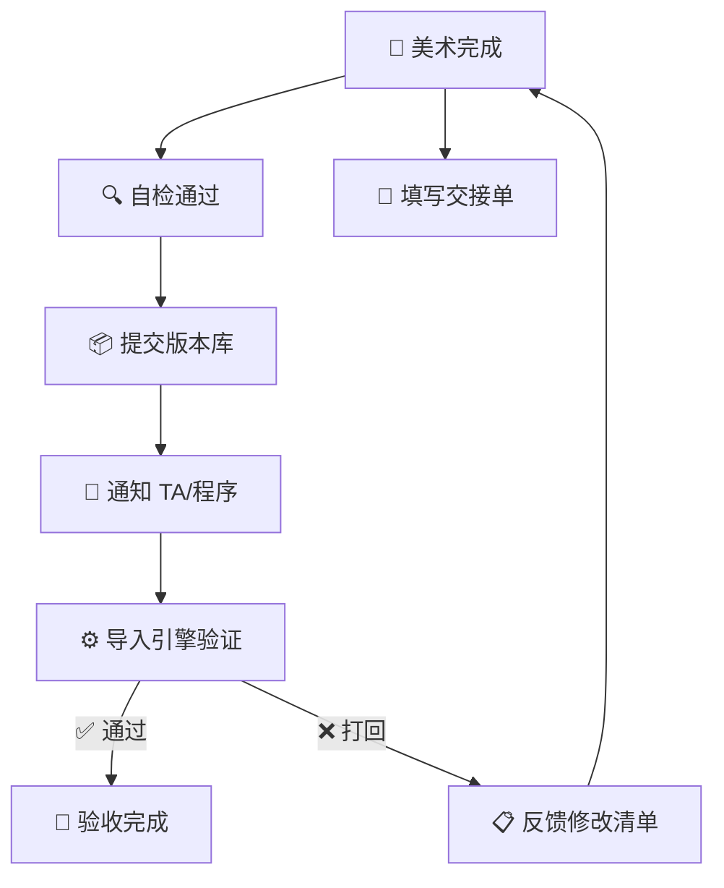

<div style="display: flex; align-items: flex-start; gap: 24px;">

<div style="flex: 0 0 260px; position: sticky; top: 24px; padding: 16px; background-color: rgba(255,255,255,0.03); border-radius: 8px; border: 1px solid rgba(255,255,255,0.08); font-size: 14px;">

<div style="font-weight: bold; margin-bottom: 12px; font-size: 16px;">📑 目录导航</div>

**📏 [文件命名规则](#-1-文件命名规则)**
&emsp;├ 统一命名公式
&emsp;├ 资产类型前缀
&emsp;├ 贴图通道后缀
&emsp;└ 命名禁止事项

**📂 [引擎目录结构](#-2-引擎目录结构)**
&emsp;├ UE 标准目录
&emsp;└ Unity 标准目录

**✅ [引擎导入 Checklist](#-3-引擎导入-checklist)**
&emsp;├ 模型导入 (FBX)
&emsp;├ 贴图导入
&emsp;└ 动画导入

**🔄 [资产交接 SOP](#-4-资产交接-sop)**
&emsp;├ 交接流程
&emsp;├ 交接单模板
&emsp;└ 常见交接问题速查

**🤝 [跨部门交接边界](#-5-跨部门交接边界)**
&emsp;└ 职责矩阵 (RACI)

**🚨 [典型问题](#典型问题)**

**📌 [Do / Don't 示例](#dodont-示例)**

**📎 [附录：快速参考卡](#-附录快速参考卡)**

</div>

<div style="flex: 1; min-width: 0;">

# 📁 引擎导入与命名规范

> **[规范]** **[量产必读]** 适用阶段：量产期 | 优先级：高 | 负责人：孙七
>
> 本文档定义美术与程序/TA 的**资产交接标准**，包含文件命名规则、目录结构、引擎导入 Checklist。

---

## 🏷️ 1. 文件命名规则

### 📐 1.1 统一命名公式

```
[资产类型前缀]_[归属模块]_[描述名]_[后缀标识].[扩展名]
```

### 📋 1.2 资产类型前缀一览

| 🔖 前缀 | 📦 资产类型 | 💡 示例 |
|:---:|:---:|:---:|
| `SM_` | Static Mesh 静态网格 | `SM_Scene_Rock_A.fbx` |
| `SK_` | Skeletal Mesh 骨骼网格 | `SK_Hero_Luna.fbx` |
| `AN_` | Animation 动画 | `AN_Luna_Idle_01.fbx` |
| `T_` | Texture 贴图 | `T_Luna_Body_D.tga` |
| `M_` | Material 材质 | `M_Skin_Common` |
| `MI_` | Material Instance 材质实例 | `MI_Luna_Skin` |
| `BP_` | Blueprint 蓝图 | `BP_Hero_Luna` |
| `WBP_` | Widget Blueprint UI 蓝图 | `WBP_HUD_HpBar` |
| `VFX_` | Visual Effect 特效 | `VFX_Skill_FireBall` |
| `SND_` | Sound 音效 | `SND_Hit_Sword_01` |
| `ABP_` | AnimBlueprint 动画蓝图 | `ABP_Luna` |
| `BS_` | BlendSpace 混合空间 | `BS_Luna_Locomotion` |
| `PHY_` | Physics Asset 物理资产 | `PHY_Luna` |
| `RIG_` | Control Rig | `RIG_Humanoid_Male` |

### 🎨 1.3 贴图通道后缀

| 🔖 后缀 | 📦 PBR 通道 | 📝 说明 |
|:---:|:---:|:---:|
| `_D` | Diffuse/Albedo/BaseColor | 基础颜色 |
| `_N` | Normal | 法线贴图 |
| `_MRA` | Metallic+Roughness+AO | 三合一 (R=M, G=R, B=AO) |
| `_M` | Metallic | 金属度（单独） |
| `_R` | Roughness | 粗糙度（单独） |
| `_AO` | Ambient Occlusion | 环境光遮蔽 |
| `_E` | Emissive | 自发光 |
| `_Mask` | Custom Mask | 自定义遮罩 |
| `_Op` | Opacity | 透明度 |
| `_H` | Height/Displacement | 高度图 |

> 💡 **黄金法则**：命名统一使用 **英文 + 下划线**，严禁出现中文、空格、括号、连字符。

### 🚫 1.4 命名禁止事项

| ❌ 禁止 | ✅ 正确 | 📝 原因 |
|:---:|:---:|:---:|
| `新角色_最终版.fbx` | `SK_Hero_Luna.fbx` | 禁用中文 |
| `model (1).fbx` | `SM_Prop_Barrel_A.fbx` | 禁止括号/空格 |
| `test.fbx` | `SM_Scene_Rock_Test.fbx` | 禁止无意义名 |
| `FINAL_FINAL_V3.fbx` | `SK_Hero_Luna.fbx` | Export 不带版本号 |
| `my-model.fbx` | `SM_Scene_Bridge.fbx` | 用下划线不用连字符 |

---

## 📂 2. 引擎目录结构

### 🎮 2.1 UE 标准目录

```
/Game/
├── Art/
│   ├── Characters/
│   │   ├── Hero/
│   │   │   ├── Luna/
│   │   │   │   ├── Mesh/          # SK_Luna.uasset
│   │   │   │   ├── Textures/      # T_Luna_Body_D.uasset ...
│   │   │   │   ├── Materials/     # M_Luna_Skin.uasset
│   │   │   │   ├── Animations/    # AN_Luna_*.uasset
│   │   │   │   └── VFX/           # VFX_Luna_*.uasset
│   │   │   └── Kaito/
│   │   ├── NPC/
│   │   └── Monster/
│   ├── Environments/
│   │   ├── MainCity/
│   │   └── BattleStage/
│   ├── UI/
│   │   ├── Atlas/
│   │   ├── Icons/
│   │   └── Widgets/
│   ├── VFX/
│   │   ├── Common/
│   │   └── Character/
│   └── _Shared/               # 共享资源
│       ├── Materials/
│       ├── Textures/
│       └── Skeletons/
├── Blueprints/
└── Maps/
```

### 🔷 2.2 Unity 标准目录

```
Assets/
├── Art/
│   ├── Characters/
│   │   ├── Hero/
│   │   │   └── Luna/
│   │   │       ├── Models/
│   │   │       ├── Textures/
│   │   │       ├── Materials/
│   │   │       ├── Animations/
│   │   │       └── Prefabs/
│   ├── Environments/
│   ├── UI/
│   │   ├── Atlas/
│   │   ├── Sprites/
│   │   └── Prefabs/
│   └── VFX/
├── Resources/
└── Scenes/
```

---

## ✅ 3. 引擎导入 Checklist

### 🔷 3.1 模型导入 (FBX)

> **[模型]** FBX 导入关键设置对照表

| # | 🔍 检查项 | 🎮 UE 设置 | 🔷 Unity 设置 |
|:---:|:---:|:---:|:---:|
| 1 | FBX 版本 | **2020+** | **2019+** |
| 2 | Scale | **1.0 (cm)** | **0.01 (m→cm)** |
| 3 | 坐标轴 | Z-Up 自动 | Y-Up 自动 |
| 4 | Normals | **Import Normals** | **Import** |
| 5 | Tangents | Import | Calculate |
| 6 | LOD | 勾选 Import LODs | 手动设置 |
| 7 | Material | **不导入**（手动指定） | **不导入** |
| 8 | Collision | **不导入**（手动设置） | **不导入** |

### 🎨 3.2 贴图导入

> **[贴图]** 贴图导入关键设置

| # | 🔍 检查项 | ⚙️ 设置 |
|:---:|:---:|:---:|
| 1 | sRGB | Albedo/Diffuse: ✅; Normal/Mask/AO: ❌ |
| 2 | 压缩格式 | Android: ASTC; iOS: ASTC; PC: BC7/DXT |
| 3 | Max Size | 根据目标平台设置（移动端通常 1024） |
| 4 | Mipmap | 3D 资产: ✅; UI: ❌ |
| 5 | Filter | Bilinear (默认); 像素风: Point |

### 🏃 3.3 动画导入

> **[动画]** 动画导入关键设置

| # | 🔍 检查项 | 📝 说明 |
|:---:|:---:|:---:|
| 1 | Skeleton 映射 | 选择已有的共享 Skeleton |
| 2 | Root Motion | 移动动画: ✅; 其他: ❌ |
| 3 | 帧率 | 确认 30FPS |
| 4 | Animation Compression | 移动端开启压缩 |
| 5 | Additive Animation | 标注是否为叠加动画 |

---

## 🔄 4. 资产交接 SOP

### 📐 4.1 交接流程



> ⚠️ **核心红线**：交接前必须完成自检 + 填写交接单，未通过自检的资产**严禁直接提交版本库**。

### 📋 4.2 交接单模板

| 🏷️ 字段 | 📝 内容 |
|:---:|:---:|
| **资产名称** | SK_Hero_Luna |
| **版本库路径** | /ArtAssets/Character/Hero/CH_Luna/Export/ |
| **变更类型** | 新增 / 更新 / 删除 |
| **文件清单** | SK_Luna.fbx, T_Luna_Body_D.tga, T_Luna_Body_N.tga, T_Luna_Body_MRA.tga |
| **规格参数** | Tris: 12,500; Bones: 55; Materials: 2; LOD: 3级 |
| **特殊说明** | Root Motion 在 Run/Walk 动画上; Face 使用 BlendShape |
| **验证方式** | 导入 UE 后挂载 ABP_Luna 查看待机动画是否正常 |

### 🐛 4.3 常见交接问题速查

| 💥 问题 | 🔍 原因 | 💡 解法 |
|:---:|:---:|:---:|
| 导入后模型破面 | 法线翻转/三角面退化 | DCC 中检查法线方向 |
| 贴图颜色偏差 | sRGB 设置错误 | Normal/Mask 关闭 sRGB |
| 模型穿地/悬空 | 原点位置不对 | 确认脚底在原点 |
| 动画滑步 | Root Motion 未开启 | 引擎端启用 Root Motion |
| 骨骼权重丢失 | FBX 导出设置错误 | 勾选 Deformations |

---

## 🤝 5. 跨部门交接边界

### 📊 5.1 职责矩阵 (RACI)

> **[RACI]** R=负责执行, A=审批, C=咨询, I=知会

| 📋 工作项 | 🎨 美术 | 🔧 TA | 💻 程序 | 📊 APM |
|:---:|:---:|:---:|:---:|:---:|
| DCC 制作 | **R** | C | — | I |
| FBX 导出 | **R** | C | — | — |
| 引擎导入 | I | **R** | C | — |
| 材质配置 | C | **R** | — | — |
| 性能优化 | C | **R** | C | I |
| Bug 修复 | **R** | C | C | I |
| 命名检查 | **R** | A | — | I |

---

## 典型问题

### 🚨 问题一：中文/特殊字符文件名导致引擎导入失败

> 🚨 **问题现象**
> 美术提交的 FBX 文件使用中文命名（如 `新角色_最终版.fbx`），引擎导入时出现**路径解析失败**或**资源引用丢失**。

> 🔍 **产生原因**
> - UE / Unity 引擎底层依赖 **ASCII 路径解析**，中文字符在不同系统编码下容易产生乱码
> - 空格和括号会导致命令行工具（如 `fbx2gltf`、`ResourceAuditor`）参数解析出错
> - 团队成员缺乏统一的命名意识，DCC 默认保存名直接提交

> 🛠️ **解决方案**
> 1. 推广统一命名公式：`[前缀]_[模块]_[描述]_[后缀].[扩展名]`
> 2. 在 SVN/P4 的 **Pre-Commit Hook** 中加入命名校验脚本，自动拦截非法命名
> 3. 已提交的非法文件由 TA 批量重命名并修复引擎引用

> 🛡️ **预防措施**
> - 新人入职首日必读《引擎导入与命名规范》
> - 每月抽查一次版本库，输出命名合规率报告
> - 将命名检查集成到**自动化提交流水线**中

---

### 🚨 问题二：FBX 导入后模型破面/法线翻转

> 🚨 **问题现象**
> 资产导入引擎后出现**模型表面破裂、法线方向反转**（黑面），在 DCC 中预览正常但引擎中异常。

> 🔍 **产生原因**
> - DCC 中存在**退化三角面**（面积趋近于 0）未被清理
> - 模型部分面的法线方向在 DCC 中"双面显示"而被忽视
> - FBX 导出时未统一法线方向或 **Smoothing Group** 设置不正确

> 🛠️ **解决方案**
> 1. 在 DCC 中使用 **Mesh Cleanup**（Maya）/ **STL Check**（3ds Max）检查退化面
> 2. 导出前统一法线方向：Maya `Normals > Conform` / Max `Reset XForm`
> 3. 引擎导入时选择 `Import Normals`（非 Calculate）

> 🛡️ **预防措施**
> - 在**自检 Checklist** 中增加"法线方向检查"为必选项
> - 建立 TA 导入后**引擎端截图对比**环节，确保 DCC 与引擎一致
> - 定期 TA 培训：FBX 导出最佳实践

---

## Do/Don't 示例

### 📌 场景说明：资产文件命名

> 美术同学在 DCC 中完成制作后导出 FBX，需要按规范命名后提交版本库。

### ✅ 正确示范 Do

```
SK_Hero_Luna.fbx
T_Luna_Body_D.tga
T_Luna_Body_N.tga
AN_Luna_Idle_01.fbx
VFX_Skill_FireBall.prefab
SM_Scene_Rock_A.fbx
```

- 使用**标准前缀** + **下划线分隔** + **语义化英文描述**
- 前缀与资产类型严格对应（`SK_` = Skeletal Mesh, `T_` = Texture, `AN_` = Animation）
- 无版本号、无中文、无空格、无特殊字符

### ❌ 错误示范 Don't

```
新角色最终版.fbx
Luna_FINAL_V3_FIXED.fbx
model (1).fbx
test.fbx
my-hero.tga
```

- ❌ 含中文字符 → 引擎解析失败
- ❌ 含版本号 `FINAL_V3_FIXED` → 版本管理应交给 SVN/P4
- ❌ 含括号/空格 → 命令行工具参数解析出错
- ❌ 无意义命名 `test` → 无法识别资产归属
- ❌ 使用连字符 `-` → 应使用下划线 `_`

---

## 📎 附录：快速参考卡

### 🔖 常用前缀速查

| 🎯 你在做... | 🔖 文件前缀 | 💡 示例 |
|:---:|:---:|:---:|
| 角色模型 | `SK_` | `SK_Hero_Luna.fbx` |
| 场景模型 | `SM_` | `SM_Scene_Rock_A.fbx` |
| UI 图标 | `T_UI_` | `T_UI_Icon_Attack.png` |
| 特效贴图 | `T_VFX_` | `T_VFX_Noise_01.tga` |
| 角色贴图 | `T_[角色]_` | `T_Luna_Body_D.tga` |
| 角色动画 | `AN_` | `AN_Luna_Attack01.fbx` |
| 技能特效 | `VFX_Skill_` | `VFX_Skill_FireBall.prefab` |

> ⚡ **APM 金句**："命名规范不是在为难你，而是在为未来 6 个月后、接手你资产的那个人铺路。"

</div>
</div>
