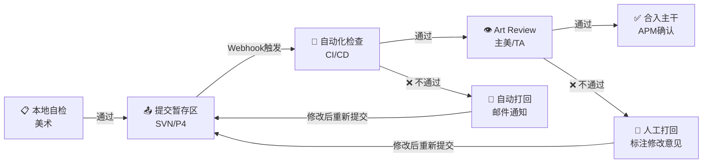
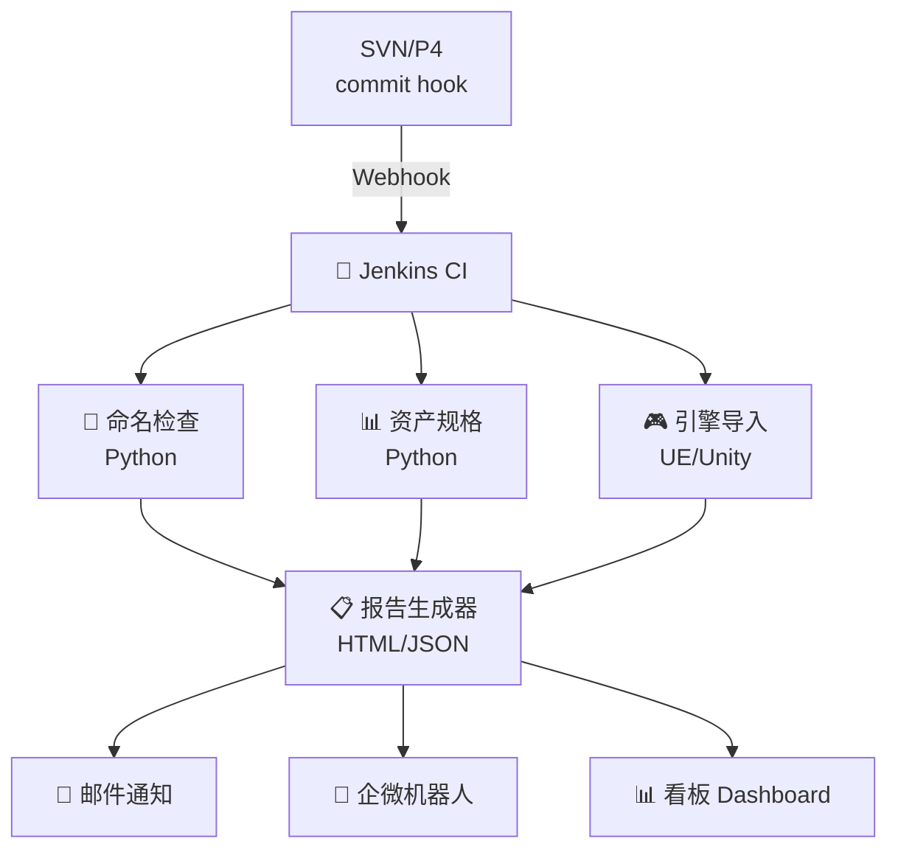

# 📦 资产提交与审核工作流

> 🏷️ **适用阶段**: 量产期 | 👤 **负责人**: 孙七 | ⚡ **优先级**: 高
>
> 本文档定义美术资产从本地自检到合入主干的全流程标准，涵盖自动化审核流水线设计与 Art Review 机制。

> **📑 目录导航**
>
> 1. [资产提交前自检 Checklist](#1️⃣-资产提交前自检-checklist)
>    - [通用自检项](#11-通用自检项)
>    - [角色资产专项](#12-角色资产专项)
>    - [UI 资产专项](#13-ui-资产专项)
>    - [特效资产专项](#14-特效资产专项)
> 2. [提交流程标准化](#2️⃣-提交流程标准化)
>    - [流程全景图](#21-流程全景图)
>    - [详细步骤](#22-详细步骤)
> 3. [自动化审核流水线设计](#3️⃣-自动化审核流水线设计)
>    - [架构概览](#31-架构概览)
>    - [命名检查脚本示例](#32-命名检查脚本示例-python)
>    - [资产规格检查要点](#33-资产规格检查要点)
> 4. [Art Review 机制](#4️⃣-art-review-机制)
>    - [审核角色与职责](#41-审核角色与职责)
>    - [审核标准](#42-审核标准)
>    - [反馈模板](#43-反馈模板)
> 5. [常见提交事故与预防](#5️⃣-常见提交事故与预防)
> 6. [与引擎导入的衔接规范](#6️⃣-与引擎导入的衔接规范)
> 7. [附录：审核流程时效要求](#附录审核流程时效要求)

---

## 1️⃣ 资产提交前自检 Checklist

### 📋 1.1 通用自检项

> **[量产必读]** 每次提交前必须完成以下自检项，CI 将自动验证前 5 项。

| #️⃣ | 🔍 检查项 | 📏 标准 | 🛠️ 自检方式 |
|:---:|:---:|:---:|:---:|
| 1 | **文件命名** | 符合 `[前缀]_[模块]_[描述]` 命名规约 | 正则匹配 |
| 2 | **目录位置** | 文件在正确的 Source/Export 目录下 | 目测确认 |
| 3 | **无冗余文件** | 不包含 `.bak`、`Thumbs.db`、`.DS_Store` | 过滤脚本 |
| 4 | **文件格式** | 使用规定的格式（FBX/TGA/PNG/PSD） | 扩展名检查 |
| 5 | **Commit Message** | 符合 `[类型][工种] 描述` 格式 | 代码 Hook |

### 🧑‍🎨 1.2 角色资产专项

> **[3D角色]** 移动端角色的硬性指标红线。

| #️⃣ | 🔍 检查项 | 📏 标准 |
|:---:|:---:|:---:|
| 1 | 面数 | 移动端角色 ≤ **15,000 Tris** |
| 2 | 贴图尺寸 | Body: **1024×1024**, Face: **512×512** |
| 3 | 贴图格式 | TGA/PNG (Source), ASTC (引擎) |
| 4 | 骨骼数量 | ≤ **60** 骨骼（不含面部） |
| 5 | 材质球数 | ≤ **3** 个（Body/Face/Weapon） |
| 6 | UV 布局 | 第 1 套 UV 无重叠，利用率 ≥ **75%** |

### 🖼️ 1.3 UI 资产专项

> **[UI]** 切图与命名的硬性规范。

| #️⃣ | 🔍 检查项 | 📏 标准 |
|:---:|:---:|:---:|
| 1 | 切图尺寸 | 2 的幂次方（或符合图集规范） |
| 2 | 9-Slice 标记 | 可拉伸元素已标注 9-Slice 区域 |
| 3 | 透明通道 | 确认 Alpha 通道正确，无杂边 |
| 4 | 命名规范 | `UI_[功能]_[状态]_[尺寸].png` |

### ✨ 1.4 特效资产专项

> **[VFX]** 特效性能指标红线。

| #️⃣ | 🔍 检查项 | 📏 标准 |
|:---:|:---:|:---:|
| 1 | Drawcall | 单个特效 ≤ **8** Drawcall |
| 2 | 粒子数 | 同屏粒子 ≤ **200** |
| 3 | 贴图尺寸 | 特效贴图 ≤ **256×256** |
| 4 | Overdraw | ≤ **4x** |

---

## 2️⃣ 提交流程标准化

### 🗺️ 2.1 流程全景图



### 📝 2.2 详细步骤

> **[高频]** 每一笔提交都需要走完下面 5 个步骤。

| 🔢 步骤 | 👤 执行人 | ⚙️ 操作 | 📄 产出 |
|:---:|:---:|:---:|:---:|
| ① 本地自检 | 美术 | 运行本地检查脚本，确认无报错 | 自检报告截图 |
| ② 提交到暂存区 | 美术 | `svn commit` / `p4 submit` 到 dev 分支 | 变更集 CL |
| ③ 自动化检查 | CI 系统 | 自动触发命名/尺寸/面数等检查 | 检查报告 |
| ④ Art Review | 主美/TA | 视觉效果审核、技术标准审核 | 审核结论（通过/打回） |
| ⑤ 合入主干 | APM | 确认无阻塞后 merge 到 main | 合并记录 |

---

## 3️⃣ 自动化审核流水线设计

### 🏗️ 3.1 架构概览



### 🐍 3.2 命名检查脚本示例 (Python)

```python
import re
import os
import sys

# 命名规则库
NAMING_RULES = {
    'Character': r'^CH_[A-Z][a-zA-Z]+_[A-Za-z0-9]+(_v\d{2})?\.(?:fbx|tga|png|psd|max|ma)$',
    'Scene':     r'^SC_[A-Z][a-zA-Z]+_[A-Za-z0-9]+(_v\d{2})?\.(?:fbx|tga|png|max|ma)$',
    'UI':        r'^UI_[A-Z][a-zA-Z]+_[A-Za-z0-9]+\.(?:png|psd)$',
    'VFX':       r'^VFX_[A-Z][a-zA-Z]+_[A-Za-z0-9]+(_\d{2})?\.(?:prefab|mat|tga|png)$',
    'Animation': r'^AN_[A-Z][a-zA-Z]+_[A-Za-z0-9]+(_v\d{2})?\.(?:fbx|anim)$',
    'Texture':   r'^TEX_[A-Z][a-zA-Z]+_[A-Za-z0-9]+_[DNMRAE](O)?\.(?:tga|png|exr)$',
}

def check_naming(file_path):
    filename = os.path.basename(file_path)
    for category, pattern in NAMING_RULES.items():
        if filename.startswith(category[:2].upper() + '_'):
            if re.match(pattern, filename):
                return True, f"✅ {filename} — 符合 {category} 命名规范"
            else:
                return False, f"❌ {filename} — 不符合 {category} 命名规范，期望模式: {pattern}"
    return False, f"⚠️ {filename} — 未识别的命名前缀"

# 扫描目录
def scan_directory(root_dir):
    errors = []
    passed = 0
    for dirpath, _, filenames in os.walk(root_dir):
        for f in filenames:
            ok, msg = check_naming(os.path.join(dirpath, f))
            if ok:
                passed += 1
            else:
                errors.append(msg)
    return passed, errors

if __name__ == '__main__':
    target = sys.argv[1] if len(sys.argv) > 1 else '.'
    passed, errors = scan_directory(target)
    print(f"\n📊 检查完成: {passed} 通过, {len(errors)} 违规\n")
    for e in errors:
        print(f"  {e}")
    sys.exit(1 if errors else 0)
```

### 📊 3.3 资产规格检查要点

| 🔍 检查维度 | 🛠️ 工具 | ⚡ 自动化可行性 |
|:---:|:---:|:---:|
| FBX 面数统计 | FBX SDK / Assimp | ✅ 完全自动 |
| 贴图尺寸/格式 | Pillow / ImageMagick | ✅ 完全自动 |
| UV 布局利用率 | 自研脚本 / xNormal | ⚠️ 半自动 |
| 骨骼数量 | FBX SDK | ✅ 完全自动 |
| 材质球数量 | FBX SDK | ✅ 完全自动 |
| 视觉效果 | 人工审核 | ❌ 需人工 |

---

## 4️⃣ Art Review 机制

### 👥 4.1 审核角色与职责

> **[P0]** 审核角色分工明确，缺一不可。

| 👤 角色 | 📋 职责 | 🔍 审核维度 |
|:---:|:---:|:---:|
| **主美** | 视觉质量审核 | 风格一致性、表现力、设计还原度 |
| **TA** | 技术标准审核 | 面数、贴图规格、性能指标、引擎兼容 |
| **APM** | 流程合规审核 | 命名、目录、Commit Message、关联需求 |

### 🏷️ 4.2 审核标准

| 🎯 等级 | 📖 说明 | ⚙️ 处理 |
|:---:|:---:|:---:|
| ✅ **Approved** | 完全符合标准 | 直接合入 |
| 🟡 **Approved with Comments** | 小问题，可后续修复 | 合入并创建修复 Task |
| ❌ **Request Changes** | 不符合标准 | 打回修改，标注具体问题 |
| 🔴 **Rejected** | 严重问题（方向错误） | 打回重做，需重新评审 |

### 📝 4.3 反馈模板

> **[示范]** 以下为 Art Review 打回时的标准反馈格式。

```markdown
## Art Review 反馈
- **提交者**: 张三
- **变更集**: CL-2048
- **资产**: CH_Luna_Body_v03.fbx

### 审核结论: ❌ Request Changes

### 问题清单:
1. 🔴 [面数] 当前 18,200 Tris，超出红线 15,000
2. 🟡 [贴图] Body 贴图建议使用 MRA 合并通道，减少采样次数
3. 🟡 [命名] 缺少 Export/ 目录下的贴图文件

### 修改建议:
- 减面集中在裙摆背面和鞋底等不可见区域
- 参考 CH_Kaito 的通道合并方案
```

---

## 5️⃣ 常见提交事故与预防

> 🚨 **避坑指南**：以下是资产提交中最常见的四类事故，请务必在提交前逐项检查。

> 🚨 **案例 1：覆盖他人文件**
>
> 🔴 **[高频]** A 提交覆盖了 B 的修改，导致 B 数天工作白费。
>
> 🎬 **典型场景还原**
> - 美术 A：周一 checkout 了角色贴图文件
> - 美术 B：周二修改并提交了同一文件
> - 美术 A：周三未 update 直接提交，覆盖了 B 的修改
>
> 🔍 **问题根因拆解**
> - 未使用文件锁定
> - 提交前未执行 Update 拉取最新版本
>
> 💡 **APM 破局思路 / 解决方案**
> 1. PSD/MAX 等二进制文件强制使用 `exclusive lock`
> 2. 提交前必须先 `svn update` / `p4 sync`
> 3. 配置版本管理工具的 **锁定策略**，二进制文件必须锁定后才能编辑

> 🚨 **案例 2：遗漏关联资产**
>
> 🟡 **[中频]** 提交了模型 FBX 但遗漏了贴图，引擎导入后白模。
>
> 🔍 **问题根因拆解**
> - 手动选择文件提交，容易遗漏依赖文件
>
> 💡 **APM 破局思路 / 解决方案**
> 1. CI 脚本检查 FBX 引用的贴图是否同步提交
> 2. 建立 **关联资产依赖检查** 机制，自动扫描 FBX 的贴图引用

> 🚨 **案例 3：引用路径断裂**
>
> 🟡 **[中频]** 引擎中资产引用找不到文件，界面/场景大面积丢失。
>
> 🔍 **问题根因拆解**
> - 本地 rename 后重新 add，而非使用 `svn move` / `p4 move`
>
> 💡 **APM 破局思路 / 解决方案**
> 1. 使用版本管理工具的 move 命令保留历史
> 2. CI 检查路径引用完整性
> 3. 培训团队使用正确的重命名方式，配置 pre-commit hook 检查路径变更

> 🚨 **案例 4：误提交大文件**
>
> 🟢 **[低频但影响大]** 提交了 2GB 的视频参考文件，仓库暴涨，团队 checkout 变慢。
>
> 🔍 **问题根因拆解**
> - `_Reference` 目录权限未限制，任何人都能提交任意大小文件
>
> 💡 **APM 破局思路 / 解决方案**
> 1. Pre-commit Hook 限制单文件大小（如 ≤ **200MB**）
> 2. 配置 `.svnignore` / `.p4ignore` 排除参考文件目录

---

## 6️⃣ 与引擎导入的衔接规范

### 🎮 6.1 UE (Unreal Engine)

> **[UE]** 导入到虚幻引擎时必须遵循以下标准。

| 📌 项目 | 📏 标准 |
|:---:|:---:|
| FBX 版本 | **2020** 或以上 |
| 坐标系 | Z-Up, 厘米 |
| Scale Factor | **1.0** |
| 骨骼命名 | 不含中文和特殊字符 |
| 动画 | 勾选 Root Motion（如需） |
| 导入路径 | `/Game/Art/[工种]/[模块]/` |

### 🔷 6.2 Unity

> **[Unity]** 导入到 Unity 引擎时必须遵循以下标准。

| 📌 项目 | 📏 标准 |
|:---:|:---:|
| FBX 版本 | **2019** 或以上 |
| Scale Factor | **0.01**（Maya/Max → Unity） |
| 动画类型 | Humanoid / Generic |
| 贴图 Max Size | 根据平台设置（Android: ASTC, iOS: ASTC） |
| 导入路径 | `Assets/Art/[工种]/[模块]/` |

---

## 📎 附录：审核流程时效要求

| 🚦 资产优先级 | ⏱️ 审核时效 | 📖 说明 |
|:---:|:---:|:---:|
| 🔴 P0（紧急） | **4 小时内** | 阻塞里程碑 |
| 🟡 P1（高） | **24 小时内** | 当前 Sprint 任务 |
| 🟢 P2（普通） | **48 小时内** | 非紧急任务 |

> ⚡ **APM 金句**：资产提交不是「扔过墙」，而是一次有质量承诺的交付。
