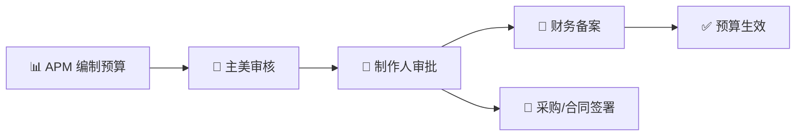
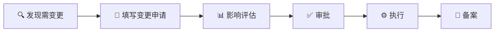

# 💰 外包预算申请与结算流转

> **适用阶段**：量产期 | **优先级**：高 | **负责人**：周八
>
> 本文档定义外包预算立项审批、阶段性结算对账、成本超支预警与变更签核 SOP。

> **📑 目录导航**
>
> 1. [📋 外包预算立项流程](#1️⃣-外包预算立项流程)
>    - [立项审批流](#-11-立项审批流)
>    - [预算编制模板](#-12-预算编制模板)
>    - [审批权限矩阵](#-13-审批权限矩阵)
> 2. [💳 阶段性结算流程](#2️⃣-阶段性结算流程)
>    - [结算节点](#-21-结算节点)
>    - [结算对账单](#-22-结算对账单模板)
> 3. [🚦 成本超支预警机制](#3️⃣-成本超支预警机制)
> 4. [🔄 变更签核 SOP](#4️⃣-变更签核-sop)
> 5. [🚨 典型问题](#典型问题)
> 6. [📌 Do / Don't 示例](#dodont-示例)
> 7. [📎 附录：年度外包预算规划模板](#-附录年度外包预算规划模板)

---

## 1️⃣ 外包预算立项流程

### 📋 1.1 立项审批流

### 📝 1.2 预算编制模板

> **[示范]** 以下为标准预算编制表头信息。

| 📌 项目 | 📖 内容 |
|:---:|:---:|
| **项目名称** | XX 手游角色外包-第一批 |
| **预算编号** | BDG-2026-ART-001 |
| **申请人** | 周八 (APM) |
| **预算周期** | 2026.04 ~ 2026.06 (3个月) |
| **总预算** | ¥350,000 |

#### 💰 预算明细表

| 🔢 序号 | 📦 资产类型 | 📊 数量 | 💲 单价(¥) | 🎯 复杂度 | 💰 小计(¥) |
|:---:|:---:|:---:|:---:|:---:|:---:|
| 1 | 角色原画 (A级) | 5 | 12,000 | A | 60,000 |
| 2 | 角色建模 (A级) | 5 | 35,000 | A | 175,000 |
| 3 | 角色建模 (B级) | 5 | 18,000 | B | 90,000 |
| 4 | 修改预留 (10%) | — | — | — | 32,500 |
| | **合计** | | | | **¥357,500** |

### 🔐 1.3 审批权限矩阵

> **[P0]** 不同金额的审批权限不同，超额审批无效。

| 💰 预算金额 | 👤 审批人 | ⏱️ 审批时效 |
|:---:|:---:|:---:|
| **≤ ¥50,000** | APM + 主美 | **1 个工作日** |
| **¥50,001 ~ ¥200,000** | + 制作人 | **3 个工作日** |
| **¥200,001 ~ ¥500,000** | + 总监 | **5 个工作日** |
| **> ¥500,000** | + VP/管理层 | **7 个工作日** |

---

## 2️⃣ 阶段性结算流程

### 💳 2.1 结算节点

> **[核心]** 四段式结算节点确保风险可控。

| 📍 节点 | 🎯 触发条件 | 💰 结算比例 | 📝 说明 |
|:---:|:---:|:---:|:---:|
| **首付款** | 合同签署 + 需求确认 | 30% | 启动资金 |
| **中期付款** | 中间交付验收通过 (50%+资产) | 40% | 大部分资产验收 |
| **尾款** | 全部资产终验通过 | 25% | 尾款 |
| **质保金** | 上线后 30 天无问题 | 5% | 质量保证 |

### 📊 2.2 结算对账单模板

> **[示范]** 以下为标准结算对账单格式。

| 🔢 序号 | 📦 资产名称 | 💲 合同单价 | 🎯 实际复杂度 | 💰 调整后金额 | ✅ 验收状态 | 💳 结算状态 |
|:---:|:---:|:---:|:---:|:---:|:---:|:---:|
| 1 | CH_Luna 原画 | ¥12,000 | A | ¥12,000 | ✅ 通过 | 已结 |
| 2 | CH_Luna 建模 | ¥35,000 | A | ¥35,000 | ✅ 通过 | 待结 |
| 3 | CH_Kaito 原画 | ¥12,000 | S (升级) | ¥15,000 | ✅ 通过 | 待结 |
| 4 | CH_Ninja 建模 | ¥35,000 | A | ¥35,000 | 🔴 打回 | 暂停 |

---

## 3️⃣ 成本超支预警机制

### 🚦 3.1 预警等级

> **[P0]** 超支后冻结外包是硬性规定。

| 📊 消耗比 | 🚦 等级 | 📢 预警内容 | ⚙️ 响应 |
|:---:|:---:|:---:|:---:|
| ≤ 70% | 🟢 正常 | — | 正常推进 |
| 70%~85% | 🟡 关注 | 预算即将用完 | APM 复审剩余需求 |
| 85%~100% | 🟠 预警 | 预算紧张 | 暂停非必要外包 |
| > 100% | 🔴 超支 | 已超预算 | 立即冻结 + 申请追加 |

### 📊 3.2 成本追踪看板

| 📌 指标 | 📊 数值 |
|:---:|:---:|
| **总预算** | **¥350,000** |
| **已消耗** | **¥245,000** (70%) |
| **剩余** | **¥105,000** |
| **本月消耗** | ¥82,000 |
| **剩余可用月份** | ~1.3 月 |
| **预计总消耗** | ¥368,000 ⚠️ 超 5% |

> ⚠️ **预警**：当预计总消耗超出总预算时，APM 需立即启动裁剪或追加预算流程。

---

## 4️⃣ 变更签核 SOP

### 🔄 4.1 预算变更流程

### 📝 4.2 变更申请单

| 📌 字段 | 📖 内容 |
|:---:|:---:|
| **变更编号** | CHG-BDG-2026-003 |
| **变更原因** | 策划新增 3 个角色需求，原预算不含 |
| **变更金额** | +¥105,000 |
| **变更后总预算** | ¥455,000 |
| **影响说明** | 不影响现有外包进度，新增部分排入下批次 |
| **审批人** | 制作人签字 |

### 🔐 4.3 变更审批权限

| 💰 变更金额 | 👤 审批人 |
|:---:|:---:|
| ≤ 预算的 5% | APM 自行调配 |
| 5%~15% | APM + 制作人 |
| > 15% | 需重新走预算审批流程 |

---

## 典型问题

> 🚨 **案例 1：外包报价虚高无竞价基线**
>
> 🔴 **[高频]** 首次发包、新 CP 合作时频发
>
> 🎬 **典型场景还原**
> - **CP**："这个 A 级角色建模我们报价 ¥45,000。"
> - **APM**："嗯……行吧，签约。"
> - **制作人**（季度复盘时）："市场均价才 ¥30,000，你多花了 50%！为什么不竞价？"
> - **APM**："当时只问了这一家……"
>
> 🔍 **问题根因拆解**
> - APM 未建立**内部估价基线**，无法判断报价高低
> - 只找了 1 家 CP 报价，缺乏竞价环节
> - 合同签署前未做**市场调研**
>
> 💡 **APM 破局思路**
> 1. 建立**工种 × 复杂度**的内部报价基线表
> 2. 每批外包至少**2~3 家 CP 竞价**
> 3. APM 每半年更新一次市场行情基线
> 4. 报价审批前必须附上**基线对比表**
> 5. 单价超出基线 20% 的需制作人特批
> 6. 建立 CP 报价历史库，作为后续谈判依据

---

> 🚨 **案例 2：结算扯皮——交付后双方对质量有争议**
>
> 🔴 **[中频]** 首次合作 CP 交付批量资产时
>
> 🎬 **典型场景还原**
> - **QA**："CP 交付的 5 个角色里有 2 个贴图精度不达标。"
> - **CP**："合同上写的是'质量应达到行业标准'，我们认为达标了。"
> - **APM**："合同确实没有具体量化标准……而且也没约定修改轮次上限。"
> - （三周过去了，双方仍在扯皮，尾款未结算）
>
> 🔍 **问题根因拆解**
> - 合同中**验收标准模糊**（如"质量应达到行业标准"）
> - 未约定修改轮次上限和超次费用
> - 缺乏**标杆件/验收 Checklist**
>
> 💡 **APM 破局思路**
> 1. 在合同中**量化验收标准**：面数、贴图分辨率、PBR 参数范围
> 2. 约定修改上限（如 3 轮），超次按 10%/轮收费
> 3. 首件通过后作为**质量基准**，后续资产对标
> 4. 合同附件增加**验收 Checklist**（含截图对比）
> 5. 首件样品机制 → 先做 1 个标杆件通过后再批量
> 6. 每次验收**截图 + 书面记录**，避免口说无凭

---

## Do/Don't 示例

> 📌 **场景说明：编制季度外包预算**
>
> APM 需要为 Q2 编制角色外包预算，提交审批。
>
> ✅ **Do（正确示范）**
> - 基于策划需求表，**逐个评估**每个角色的复杂度等级（S/A/B/C）
> - 使用**报价公式**计算：基准人天 × 日单价 × 复杂度系数 × 风险系数
> - 预留 **10% 修改预留**和 **5% 应急储备**
> - 附上**基线对比表**，说明报价合理性
> - 走完**三级审批**（主美 → 制作人 → 财务）后再签约
>
> ❌ **Don't（错误示范）**
> - ❌ "按上季度的预算直接复制" → 需求变了但预算没变
> - ❌ 不预留修改费用 → 返工费用无预算，被动超支
> - ❌ 只找 1 家 CP → 没有竞价基线
> - ❌ 口头审批 → 无书面记录，后续追溯困难

---

## 📎 附录：年度外包预算规划模板

| 📅 季度 | 📦 主要外包内容 | 💰 预算(¥) | 📊 占比 |
|:---:|:---:|:---:|:---:|
| Q1 | 核心角色原画 + 风格探索 | 150,000 | 18% |
| Q2 | 角色建模 + 场景白盒 | 300,000 | 35% |
| Q3 | 量产角色 + 场景美化 | 280,000 | 33% |
| Q4 | 收尾 + 优化 + 预留 | 120,000 | 14% |
| **全年** | | **¥850,000** | 100% |

> ⚡ **APM 金句**：年度预算要「前松后紧」，Q1 留探索空间，Q4 留优化余量。
