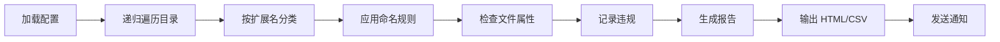
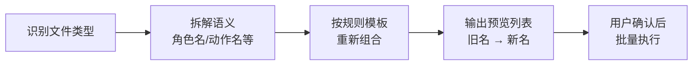
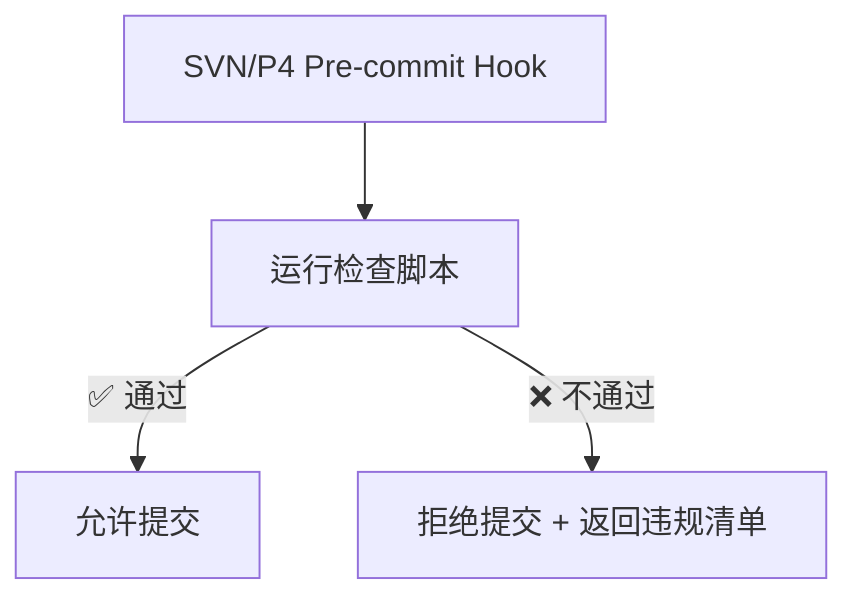

<div style="display: flex; align-items: flex-start; gap: 24px;">
<div style="flex: 0 0 260px; position: sticky; top: 24px; padding: 16px; background-color: rgba(255,255,255,0.03); border-radius: 8px; border: 1px solid rgba(255,255,255,0.08); font-size: 14px;">
<div style="font-weight: bold; margin-bottom: 12px; font-size: 16px;">📑 目录导航</div>

**🛠️ [工具概述](#1-工具概述)**

**📏 [正则规则库](#2-正则规则库)**

**📂 [多级目录扫描](#3-多级目录扫描方案)**

**📊 [违规报告格式](#4-违规报告格式)**

**🔄 [一键重命名功能](#5-一键重命名功能)**

**⚙️ [集成方案](#6-集成方案)**
&emsp;├ CI/CD 集成
&emsp;└ 定时巡检

**📎 [附录：常见错误 Top 10](#附录常见命名错误-top-10)**
</div>
<div style="flex: 1; min-width: 0;">

# 资产合规性检查工具

> **适用阶段**：量产期 | **优先级**：高 | **负责人**：孙七
>
> 本文档描述美术资产命名批量检查工具的设计思路、正则规则库、多级目录扫描方案与违规报告格式。

---

## 1. 工具概述

### 1.1 功能定位

一款面向 APM/TA 的命令行 + GUI 工具，用于自动化扫描美术资产目录，检查命名规范、文件格式、尺寸规格等合规性问题。

### 1.2 核心功能

| 功能 | 说明 |
|:---:|:---:|
| **命名检查** | 基于正则规则库，批量扫描文件名是否符合规范 |
| **格式检查** | 检查文件扩展名是否在白名单内 |
| **尺寸检查** | 检查贴图尺寸是否为 2 的幂次方 |
| **重复检测** | 检测同名/相似名文件 |
| **违规报告** | 生成 HTML/CSV 格式的违规报告 |
| **一键重命名** | 根据规则建议的正确名称批量重命名（需确认） |

---

## 2. 正则规则库

### 2.1 通用命名规则

```python
NAMING_RULES = {
    "StaticMesh": {
        "pattern": r"^SM_[A-Z][a-zA-Z0-9]+(_[A-Za-z0-9]+)*\.fbx$",
        "example": "SM_Scene_Rock_A.fbx",
        "description": "静态网格: SM_模块_描述_变体.fbx"
    },
    "SkeletalMesh": {
        "pattern": r"^SK_[A-Z][a-zA-Z0-9]+(_[A-Za-z0-9]+)*\.fbx$",
        "example": "SK_Hero_Luna.fbx",
        "description": "骨骼网格: SK_类型_角色名.fbx"
    },
    "Animation": {
        "pattern": r"^AN_[A-Z][a-zA-Z0-9]+_[A-Za-z0-9]+(_v\d{2})?\.fbx$",
        "example": "AN_Luna_Idle_01.fbx",
        "description": "动画: AN_角色_动作_变体.fbx"
    },
    "Texture": {
        "pattern": r"^T_[A-Z][a-zA-Z0-9]+(_[A-Za-z0-9]+)*_(D|N|M|R|AO|E|MRA|Mask|Op|H)\.(tga|png|exr)$",
        "example": "T_Luna_Body_D.tga",
        "description": "贴图: T_对象_部位_通道.tga/png"
    },
    "VFX": {
        "pattern": r"^VFX_[A-Z][a-zA-Z0-9]+(_[A-Za-z0-9]+)*(_\d{2})?\.(prefab|mat)$",
        "example": "VFX_Skill_FireBall_01.prefab",
        "description": "特效: VFX_分类_名称_序号.prefab"
    },
    "UI_Image": {
        "pattern": r"^UI_[A-Z][a-zA-Z0-9]+(_[A-Za-z0-9]+)*\.png$",
        "example": "UI_Battle_HpBar.png",
        "description": "UI图片: UI_功能_描述.png"
    },
    "Sound": {
        "pattern": r"^SND_[A-Z][a-zA-Z0-9]+(_[A-Za-z0-9]+)*(_\d{2})?\.(wav|ogg|mp3)$",
        "example": "SND_Hit_Sword_01.wav",
        "description": "音效: SND_分类_描述_序号.wav"
    }
}
```

### 2.2 违规判定规则

| 规则 ID | 严重度 | 检查项 | 说明 |
|:---:|:---:|:---:|:---:|
| N001 | 🔴 Error | 包含中文字符 | 文件名禁止中文 |
| N002 | 🔴 Error | 包含空格 | 用下划线代替 |
| N003 | 🔴 Error | 包含特殊字符 | 仅允许字母/数字/下划线/点 |
| N004 | 🟡 Warning | 前缀不匹配 | 不符合资产类型前缀规则 |
| N005 | 🟡 Warning | 缺少通道后缀 | 贴图缺少 _D/_N/_MRA 后缀 |
| N006 | 🟢 Info | 命名建议 | 可优化但非必须 |

---

## 3. 多级目录扫描方案

### 3.1 扫描配置

```yaml
# scan_config.yaml
scan_roots:
  - path: "/ArtAssets/Character"
    rules: ["StaticMesh", "SkeletalMesh", "Animation", "Texture"]
  - path: "/ArtAssets/Scene"
    rules: ["StaticMesh", "Texture"]
  - path: "/ArtAssets/UI"
    rules: ["UI_Image"]
  - path: "/ArtAssets/VFX"
    rules: ["VFX", "Texture"]

exclude_dirs:
  - "Temp"
  - "Archive"
  - ".svn"
  - ".git"

exclude_patterns:
  - "*.meta"
  - "*.DS_Store"
  - "Thumbs.db"

texture_check:
  max_size: 2048
  require_power_of_two: true
  allowed_formats: ["tga", "png", "exr"]
```

### 3.2 扫描流程



---

## 4. 违规报告格式

### 4.1 HTML 报告示例

| 项目 | 数据 |
|:---:|:---:|
| **报告标题** | 美术资产合规性检查报告 |
| **检查时间** | 2026-04-07 14:30 |
| **扫描目录** | `/ArtAssets/Character/` |
| **扫描文件** | **1,284** 个 |
| **违规文件** | **47** 个 (**3.7%**) |
| 🔴 Error | **12** 条 |
| 🟡 Warning | **28** 条 |
| 🟢 Info | **7** 条 |

**🔴 Error 示例**：

| 文件路径 | 违反规则 | 建议修正 |
|:---:|:---:|:---:|
| `/Character/Hero/新角色_最终版.fbx` | N001 - 包含中文字符 | `SK_Hero_NewChar.fbx` |
| `/Character/Hero/Luna (copy).fbx` | N002 - 包含空格和括号 | `SK_Hero_Luna.fbx` |

### 4.2 CSV 导出格式

| 文件路径 | 文件名 | 规则ID | 严重度 | 问题描述 | 建议名称 |
|:---:|:---:|:---:|:---:|:---:|:---:|
| /Character/Hero/ | 新角色.fbx | N001 | Error | 包含中文 | SK_Hero_NewChar.fbx |
| /Character/Hero/ | Luna (copy).fbx | N002 | Error | 包含空格 | SK_Hero_Luna.fbx |

---

## 5. 一键重命名功能

### 5.1 安全策略

| 策略 | 说明 |
|:---:|:---:|
| **预览模式** | 默认只预览变更，不实际执行 |
| **确认机制** | 每批次需用户确认后执行 |
| **备份** | 重命名前自动备份原文件名到日志 |
| **回滚** | 提供 undo 脚本可一键回滚 |
| **锁定保护** | 已被 SVN/P4 锁定的文件跳过 |

### 5.2 重命名建议逻辑



---

## 6. 集成方案

### 6.1 CI/CD 集成



> ⚠️ **核心红线**：Pre-commit 检查中 **🔴 Error 级别违规**必须拦截提交，🟡 Warning 级别允许提交但生成告警。

### 6.2 定时巡检

| 频率 | 范围 | 输出 |
|:---:|:---:|:---:|
| 每日 | 当天新增/修改文件 | 即时告警 |
| 每周 | 全量扫描 | 周报 |
| 版本前 | 全量 + 深度检查 | 详细报告 |

---

## 附录：常见命名错误 Top 10

| # | 错误类型 | 占比 | 示例 |
|:---:|:---:|:---:|:---:|
| 1 | 包含中文 | 35% | `新角色.fbx` |
| 2 | 缺少类型前缀 | 20% | `Luna_Body.fbx` |
| 3 | 包含空格 | 15% | `Luna Body.fbx` |
| 4 | 贴图缺少通道后缀 | 10% | `Luna_Body.tga` |
| 5 | 使用连字符 | 5% | `Luna-Body.fbx` |
| 6 | 全小写 | 5% | `sm_rock_a.fbx` |
| 7 | 数字开头 | 3% | `01_Luna.fbx` |
| 8 | 过长文件名 | 3% | 超过 50 字符 |
| 9 | 扩展名大写 | 2% | `Luna.FBX` |
| 10 | 版本号格式错 | 2% | `Luna_V2.fbx` → `Luna_v02.fbx` |

</div>
</div>
