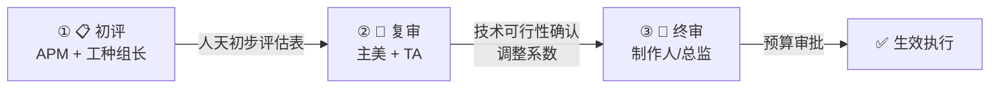

📑 目录导航

**📋 [按工种基准人天表](#1️⃣-按工种分类的基准人天表)**
&emsp;├ 角色原画 / 3D 建模
&emsp;├ 场景建模 / UI 设计
&emsp;└ 特效 / 动画

**📊 [复杂度评估标准](#2️⃣-复杂度评估标准)**
&emsp;├ 评估维度打分表
&emsp;└ 总分对照

**⚠️ [风险系数加成](#3️⃣-风险系数加成)**

**💰 [报价公式模板](#4️⃣-报价公式模板)**

**🔍 [评审与校准机制](#5️⃣-评审与校准机制)**

**📋 [实际案例](#6️⃣-实际案例角色全流程人天拆解)**

**🚨 [典型问题](#典型问题)**

**📌 [Do / Don't 示例](#dodont-示例)**

**📎 [附录：快速估价卡片](#-附录快速估价参考卡片)**

# 📐 美术外包工作量评估标准 (人天模型)

> **适用阶段**：量产期 | **优先级**：高 | **负责人**：周八
>
> 本文档建立按工种和资产复杂度的标准人天评估模型，包含报价基准、风险系数与实战案例。

---

## 1️⃣ 按工种分类的基准人天表

### 🎨 1.1 角色原画

> **[原画]** 复杂度越高，修改风险越大。

| 🎯 复杂度 | 📖 定义 | ⏱️ 基准人天 | 💡 参考案例 |
|:---:|:---:|:---:|:---:|
| **S** | 主角级，全身设计含多套武器/配饰，需三视图 + 表情设计 + 皮肤设计 | **8~12d** | MOBA 主角英雄 |
| **A** | 重要 NPC/精英怪，全身设计含武器 | **5~7d** | Boss 角色 |
| **B** | 普通角色，半身或全身，较少配件 | **3~4d** | 普通 NPC |
| **C** | 头像/半身像/简单变体/换色 | **1~2d** | 头像图标 |

### 🧊 1.2 角色 3D 建模

> **[3D角色]** 全流程包含：高模雕刻→拓扑→UV→贴图→绑定→蒙皮。

| 🎯 复杂度 | 📖 定义 | ⏱️ 基准人天 | 📦 包含工作 |
|:---:|:---:|:---:|:---:|
| **S** | 高模+低模+贴图+绑定，复杂装饰，15k+ Tris | **15~20d** | 高模雕刻→拓扑→UV→贴图→绑定→蒙皮 |
| **A** | 中等复杂度，10k~15k Tris | **10~14d** | 同上，复杂度降低 |
| **B** | 简单角色/NPC，5k~10k Tris | **6~9d** | 可复用骨骼 |
| **C** | 换皮/换色/小变体 | **2~4d** | 基于已有模型修改 |

### 🏞️ 1.3 场景建模

> **[场景]** 大型场景可拆分为多个模块并行制作。

| 🎯 复杂度 | 📖 定义 | ⏱️ 基准人天 | 💡 参考案例 |
|:---:|:---:|:---:|:---:|
| **S** | 大型场景，含室内外，高美术完成度 | **20~30d** | RPG 主城 |
| **A** | 中型战斗关卡/副本 | **12~18d** | MOBA 地图 |
| **B** | 小型场景/单一房间 | **6~10d** | 对话场景 |
| **C** | 场景道具/模块化组件 | **1~3d** | 箱子、路灯 |

### 🖼️ 1.4 UI 设计

> **[UI]** 含动效设计的界面复杂度显著提升。

| 🎯 复杂度 | 📖 定义 | ⏱️ 基准人天 | 💡 参考案例 |
|:---:|:---:|:---:|:---:|
| **S** | 核心界面（主界面/战斗HUD），含动效设计 | **5~8d** | 主界面全套 |
| **A** | 次级界面（商城/背包/设置） | **3~5d** | 商城界面 |
| **B** | 弹窗/对话框/提示框 | **1~2d** | 确认弹窗 |
| **C** | 图标批量（≤20 个） | **2~4d** | 道具图标 |

### ✨ 1.5 特效

> **[VFX]** 多阶段表演特效的工作量远高于简单粒子。

| 🎯 复杂度 | 📖 定义 | ⏱️ 基准人天 | 💡 参考案例 |
|:---:|:---:|:---:|:---:|
| **S** | 大招/全屏特效，含多阶段表演 | **5~8d** | 英雄大招 |
| **A** | 普通技能特效，含命中反馈 | **3~4d** | 普通攻击特效 |
| **B** | 简单特效（Buff 光环/脚印/环境粒子） | **1~2d** | 治疗光环 |
| **C** | 变体/换色 | **0.5~1d** | 颜色替换 |

### 🎬 1.6 动画

> **[动画]** 全套角色动画集的周期较长，需提前排期。

| 🎯 复杂度 | 📖 定义 | ⏱️ 基准人天 | 💡 参考案例 |
|:---:|:---:|:---:|:---:|
| **S** | 完整角色动画集（待机+移动+攻击+技能+死亡） | **12~18d** | 新英雄全套 |
| **A** | 单套技能动画（含预备+释放+恢复） | **4~6d** | 新技能动画 |
| **B** | 单个动画片段 | **1~3d** | 交互动作 |
| **C** | 动画修改/微调 | **0.5~1d** | 速度调整 |

---

## 2️⃣ 复杂度评估标准

### 📊 2.1 评估维度打分表

> **[核心]** 五维度加权打分法，量化评估复杂度。

| 📊 维度 | ⚖️ 权重 | 🔴 S (4分) | 🟠 A (3分) | 🟡 B (2分) | 🟢 C (1分) |
|:---:|:---:|:---:|:---:|:---:|:---:|
| **结构复杂度** | 30% | 多部件/可拆卸 | 中等部件 | 简单结构 | 单体/变体 |
| **细节密度** | 25% | 大量装饰/纹理 | 中等细节 | 少量细节 | 极简 |
| **技术难度** | 20% | 特殊 Shader/绑定 | 标准流程 | 简化流程 | 批量复制 |
| **参考明确度** | 15% | 无参考/纯创作 | 有概念图 | 有详细三视图 | 有原型可参照 |
| **修改概率** | 10% | 极高（首次风格探索） | 高 | 中 | 低 |

### 🎯 2.2 总分对照

| 📊 总分 | 🎯 复杂度等级 |
|:---:|:---:|
| 3.5~4.0 | **S** |
| 2.5~3.4 | **A** |
| 1.5~2.4 | **B** |
| 1.0~1.4 | **C** |

---

## 3️⃣ 风险系数加成

> **[P0]** 风险系数可叠加，但有上限 `min(连乘, 2.0)`。

| ⚠️ 风险因素 | 📊 加成系数 | 📝 说明 |
|:---:|:---:|:---:|
| 🆕 **首次合作 CP** | ×1.20 | 磨合成本，预期返工率高 |
| 🌏 **跨时区沟通** | ×1.10 | 沟通延迟，反馈周期拉长 |
| 🔄 **风格未锁定** | ×1.30 | 需求可能反复，预留探索空间 |
| ⏰ **紧急赶工** | ×1.25 | 加班费 + 质量风险 |
| 🆕 **新品类/新技术** | ×1.15 | 学习曲线成本 |
| 📋 **修改轮次多** (>3轮) | ×1.10/轮 | 每多一轮加 10% |

> 🚨 **核心红线**：风险系数**可叠加**，但有上限：`最终风险系数 = min(各风险系数连乘, 2.0)`
>
> **[示范]**：首次合作 (1.2) × 风格未锁定 (1.3) = **1.56**

---

## 4️⃣ 报价公式模板

### 💡 4.1 基础公式

> 💡 **总价 = 基准人天 × 日单价 × 复杂度系数 × 风险系数**

### 📊 4.2 复杂度系数对照

| 🎯 等级 | 📊 复杂度系数 |
|:---:|:---:|
| S | **1.5** |
| A | **1.2** |
| B | **1.0** |
| C | **0.8** |

### 💲 4.3 日单价参考 (2026)

> **[高频]** 以下为 2026 年市场参考基线。

| 🎨 工种 | 🇨🇳 国内一线 CP | 🇨🇳 国内二线 CP | 🌍 海外 CP |
|:---:|:---:|:---:|:---:|
| 角色原画 | ¥1,800~2,500/天 | ¥1,200~1,800/天 | $250~400/天 |
| 角色建模 | ¥1,500~2,200/天 | ¥1,000~1,500/天 | $200~350/天 |
| 场景建模 | ¥1,300~2,000/天 | ¥900~1,300/天 | $180~300/天 |
| UI 设计 | ¥1,200~1,800/天 | ¥800~1,200/天 | $150~280/天 |
| 特效 | ¥1,500~2,200/天 | ¥1,000~1,500/天 | $200~350/天 |
| 动画 | ¥1,500~2,200/天 | ¥1,000~1,500/天 | $200~350/天 |

> ⚠️ 以上为参考基线，实际报价需根据市场行情和 CP 资质调整。

### 🧮 4.4 计算示例

> **[示范]** 以下为完整报价计算过程。

| 📌 项目 | 📊 数值 |
|:---:|:---:|
| **需求** | 1 个 A 级复杂度角色建模（首次合作的 CP） |
| 基准人天 | 12d (A级角色建模中位数) |
| 日单价 | ¥1,500/天 (国内二线CP) |
| 复杂度系数 | 1.2 (A级) |
| 风险系数 | 1.2 (首次合作) |
| **总价** | **12 × 1,500 × 1.2 × 1.2 = ¥25,920** |

---

## 5️⃣ 评审与校准机制

### 🔍 5.1 三级评审流程

### 📊 5.2 历史数据校准

> **[量产必读]** 每季度末需进行评估准确率复盘。

> 💡 **准确率 = 1 - |实际人天 - 预估人天| / 预估人天**
>
> 🎯 **目标：准确率 ≥ 80%**

| 📊 偏差范围 | 🚦 评级 | ⚙️ 行动 |
|:---:|:---:|:---:|
| ≤ 10% | 🟢 优秀 | 维持当前模型 |
| 10%~20% | 🟡 良好 | 微调基准人天 |
| 20%~30% | 🟠 需改进 | 分析偏差原因，更新系数 |
| > 30% | 🔴 严重偏差 | 重建该工种评估模型 |

---

## 6️⃣ 实际案例：角色全流程人天拆解

### 📋 6.1 案例背景

> **[示范]** 以下为一个完整的外包角色全流程评估案例。

| 📌 项目 | 📖 信息 |
|:---:|:---:|
| **资产** | MOBA 手游新英雄「夜叉」—— A 级复杂度 |
| **CP** | 合作过 2 次的国内一线 CP |
| **要求** | 原画→建模→贴图→绑定→基础动画 |

### ⏱️ 6.2 人天拆解

| 📍 阶段 | ⚙️ 工作内容 | ⏱️ 基准人天 | 📝 备注 |
|:---:|:---:|:---:|:---:|
| 原画设计 | 概念草图 × 3 → 定稿 → 三视图 → 表情 | 6d | 含 2 轮修改 |
| 高模雕刻 | ZBrush 高模 | 4d | — |
| 低模拓扑 | 拓扑 + UV 展开 | 3d | 目标 12k Tris |
| 贴图绘制 | PBR 贴图全套 (D/N/MRA/E) | 4d | — |
| 绑定蒙皮 | 骨骼绑定 + 蒙皮权重 | 3d | 使用标准骨架 |
| 基础动画 | 待机 + 跑步 + 3 技能 | 8d | 5 条动画 |
| **合计** | | **28d** | |

### 💰 6.3 报价计算

| 📌 项目 | 📊 数值 |
|:---:|:---:|
| 基准人天 | 28d |
| 日单价 | ¥2,000/天（一线CP） |
| 复杂度系数 | 1.2（A级） |
| 风险系数 | 1.0（合作过） |
| **总价** | **28 × 2,000 × 1.2 × 1.0 = ¥67,200** |

---

## 典型问题

### 🚨 问题一：评估偏差导致外包预算严重超支

> 🚨 **问题现象**
> 一批 5 个角色建模，预估总人天 60d，实际耗时 92d，偏差率 **53%**，预算超支 ¥48,000。

> 🔍 **产生原因**
> - APM 按 B 级复杂度评估，但实际需求为 A 级（角色有复杂配饰和可拆卸武器）
> - 未使用**五维度打分表**量化评估，凭"感觉"定级
> - 风险系数未叠加"首次合作 CP"的 ×1.2 加成

> 🛠️ **解决方案**
> 1. 回溯使用**五维度打分表**重新评估全部 5 个角色的复杂度
> 2. 与 CP 协商追加预算，按实际 A 级复杂度结算
> 3. 将此次偏差数据录入**历史校准库**，修正角色建模的基准人天

> 🛡️ **预防措施**
> - 所有评估必须使用**五维度打分表**，禁止"拍脑袋"定级
> - 每季度进行**评估准确率复盘**，偏差 > 20% 的工种重新校准
> - 首次合作 CP 强制叠加 ×1.2 风险系数

---

## Do/Don't 示例

### 📌 场景说明：外包角色建模报价评估

> APM 收到策划提交的 3 个新英雄建模需求，需要评估人天并生成报价单给 CP。

### ✅ 正确示范 Do

- 使用**五维度打分表**逐个评估每个角色复杂度（结构、细节、技术、参考、修改概率）
- 综合打分后确定等级：英雄 A 为 **S 级**（3.7 分），英雄 B/C 为 **A 级**（3.0 分）
- 查表填入**基准人天**：S 级 = 17d，A 级 = 12d × 2 = 24d
- 叠加风险系数：首次合作 CP → ×1.2，风格未锁定 → ×1.3，合计 ×1.56
- 生成报价单并提交**三级评审**（APM 初评 → 主美复审 → 制作人终审）

### ❌ 错误示范 Don't

- ❌ "这 3 个角色差不多都是 A 级吧" → 未量化评估，一刀切定级
- ❌ 未考虑风险系数 → 首次合作 CP 的磨合成本被忽略
- ❌ 报价只跟 1 家 CP → 没有竞价基线，可能被高报
- ❌ 评估完直接执行，未走三级评审 → 缺乏校验环节

---

## 📎 附录：快速估价参考卡片

| 📦 资产类型 | 🟢 C 级 | 🟡 B 级 | 🟠 A 级 | 🔴 S 级 |
|:---:|:---:|:---:|:---:|:---:|
| 角色（原画→建模→绑定） | ¥15k~25k | ¥30k~50k | ¥55k~80k | ¥90k~150k |
| 场景（含美化） | ¥8k~15k | ¥20k~40k | ¥50k~80k | ¥100k~200k |
| UI 界面（设计+切图） | ¥3k~8k | ¥8k~15k | ¥15k~25k | ¥25k~40k |
| 特效（单组） | ¥2k~4k | ¥5k~10k | ¥10k~18k | ¥18k~30k |
| 动画（全套） | ¥10k~20k | ¥20k~40k | ¥40k~65k | ¥70k~120k |

> ⚠️ 以上为 2026 年国内市场参考，实际报价需以具体需求和 CP 报价为准。

> ⚡ **APM 金句**：估价不是「拍脑袋」，而是「有公式、有历史、有校准」的科学决策。

