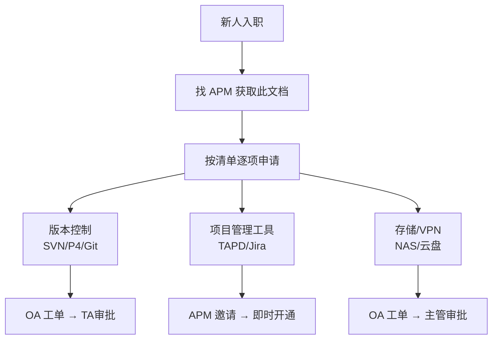

# 常用系统权限申请导航

> **适用阶段**：全阶段 | **优先级**：中 | **负责人**：周八
>
> 本文档汇总美术团队常用系统的权限申请方式、审批流程与常见问题。

---

## 1. 权限申请总览

| 系统 | 用途 | 申请方式 | 审批人 | 预计开通 |
|:---:|:---:|:---:|:---:|:---:|
| SVN 仓库 | 美术资产版本管理 | OA 工单 | TA Lead | 1~2 工作日 |
| Perforce (P4) | 美术资产版本管理 | OA 工单 | TA Lead | 1~2 工作日 |
| Git (GitLab) | 工具脚本管理 | IT Portal | 项目 Owner | 当天 |
| TAPD | 项目管理 | APM 邀请 | 项目管理员 | 即时 |
| Jira | 项目管理 | APM 邀请 | 项目管理员 | 即时 |
| 云盘/NAS | 美术资源共享 | OA 工单 | 部门主管 | 1 工作日 |
| VPN | 远程办公 | OA 工单 | IT 管理员 | 1~2 工作日 |
| 引擎 License | UE/Unity 授权 | TA 分配 | TA Lead | 当天 |
| DCC License | Maya/Max/ZBrush | IT 分配 | IT | 当天 |
| Wiki/Confluence | 知识库 | APM 邀请 | 空间管理员 | 即时 |

---

## 2. 版本控制权限

### 2.1 SVN 权限申请

| 步骤 | 操作 | 说明 |
|:---:|:---:|:---:|
| 1 | 提交 OA 工单 | 选择「IT服务-SVN权限申请」 |
| 2 | 填写仓库地址 | 如 `svn://art-server/ArtAssets` |
| 3 | 填写目录范围 | 如 `/Character/Hero/`（按需申请） |
| 4 | 选择权限级别 | 只读 / 读写 |
| 5 | 审批人 | TA Lead → 自动开通 |

**常见问题**：
- Q: 需要访问其他工种目录？→ 只读权限单独申请
- Q: 误操作删除了文件？→ 联系 TA 从版本历史恢复

### 2.2 Perforce 权限申请

| 步骤 | 操作 |
|:---:|:---:|
| 1 | 联系 TA 创建 P4 账号 |
| 2 | 安装 P4V 客户端 |
| 3 | 配置 Workspace 映射 |
| 4 | TA 配置目录级权限 |

### 2.3 Git (GitLab) 权限

| 步骤 | 操作 |
|:---:|:---:|
| 1 | 访问公司 GitLab，使用统一账号登录 |
| 2 | 找到目标项目 → 点击「Request Access」 |
| 3 | 项目 Owner 审批 |

---

## 3. 项目管理工具权限

### 3.1 TAPD

| 角色 | 权限 | 适用人员 |
|:---:|:---:|:---:|
| 管理员 | 完全控制 | APM |
| 成员 | 创建/编辑任务 | 美术组员 |
| 只读 | 查看 | 策划/QA |

**开通方式**：APM 在 TAPD 项目设置 → 成员管理 → 邀请

### 3.2 Jira

**开通方式**：APM 通过 Jira Admin 添加用户到项目

---

## 4. 存储与网络

### 4.1 云盘/NAS 权限

| 资源 | 用途 | 权限 |
|:---:|:---:|:---:|
| `\\nas\ArtShare\` | 美术资源共享盘 | 美术组读写 |
| `\\nas\Reference\` | 参考资料库 | 全项目只读 |
| `\\nas\Delivery\` | 外包交付目录 | APM + 对应组长 读写 |

### 4.2 VPN 权限

| VPN 类型 | 用途 | 申请条件 |
|:---:|:---:|:---:|
| 公司 VPN | 远程访问内网 | 正式员工 |
| 项目 VPN | 访问项目专用网络 | 项目成员 |

---

## 5. 权限变更与回收

> 🔴 **核心红线**：离职人员权限必须在**最后工作日当天**全部回收，不允许延迟处理。

### 5.1 权限变更场景

| 场景 | 操作 | 负责人 |
|:---:|:---:|:---:|
| 转岗到其他项目 | 回收旧权限 + 开通新权限 | APM |
| 离职 | 全部回收 | IT + APM |
| 晋升/职责变化 | 调整权限级别 | APM |
| 外包合作结束 | 回收外包人员权限 | APM + IT |

### 5.2 定期巡检

| 频率 | 检查内容 |
|:---:|:---:|
| 每季度 | 清理非活跃账号 |
| 项目结束 | 回收全部项目权限 |
| 人员变动时 | 即时调整 |

---

## 附录：权限申请快速导航卡

