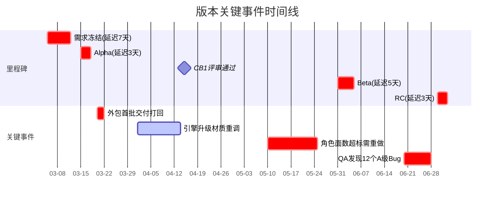

📑 目录导航

**📋 [复盘基本信息](#-1-复盘基本信息)**

**🎯 [版本目标回顾](#-2-版本目标回顾)**
&emsp;├ 目标达成率
&emsp;└ 排期准确率

**📅 [时间线梳理](#-3-时间线梳理)**

**✨ [做得好的](#-4-做得好的-what-went-well)**

**🚨 [需要改进的](#-5-需要改进的-what-went-wrong)**

**✅ [Action Items](#-6-action-items)**

**📊 [数据统计](#-7-数据统计)**

**💎 [经验沉淀](#-8-经验沉淀)**

**📅 [附录：复盘会 Agenda](#-附录复盘会议-agenda)**

# 🔄 版本研发复盘 (Post-mortem) 模板

> 🏷️ **适用阶段**：测试期 | ⚡ **优先级**：高 | 👤 **负责人**：周八
>
> 本文档提供版本结束后的结构化复盘模板，包含时间线梳理、根因分析(5-Why)、Action Item 追踪与经验沉淀。

---

## 📋 1. 复盘基本信息

| 字段 | 内容 |
|:---:|:---:|
| 🎮 **版本名称** | |
| 📅 **版本周期** | YYYY-MM-DD ~ YYYY-MM-DD |
| 📅 **复盘日期** | YYYY-MM-DD |
| 🎤 **主持人** | APM - 周八 |
| 👥 **参与人** | (列出全部参与者) |
| ✍️ **记录人** | |

> 💡 **复盘原则**：**对事不对人**。复盘目的是发现系统性问题并改进流程，而非追责个人。

---

## 🎯 2. 版本目标回顾

### 📊 2.1 目标达成率

| 🎯 目标 | 📅 计划 | ✅ 实际 | 📈 达成率 | 📝 说明 |
|:---:|:---:|:---:|:---:|:---:|
| 角色完成数 | 10 | 8 | 80% | 2 个延至下版 |
| 场景完成数 | 5 | 5 | 100% | ✅ |
| UI 界面数 | 20 | 18 | 90% | 2 个低优先级延后 |
| 特效完成 | 30 组 | 25 组 | 83% | |
| 美术 Bug 清零 | S:0 A:0 | S:0 A:1 | 95% | 1 个 A 级在修 |

### ⏱️ 2.2 排期准确率

| 🎨 工种 | 📅 计划人天 | ✅ 实际人天 | 📊 偏差 | 🎯 准确率 |
|:---:|:---:|:---:|:---:|:---:|
| 角色 | 120d | 135d | +15d | 87.5% |
| 场景 | 80d | 78d | -2d | 97.5% |
| UI | 60d | 65d | +5d | 91.7% |
| 特效 | 50d | 58d | +8d | 84% |
| 动画 | 45d | 48d | +3d | 93.3% |

---

## 📅 3. 时间线梳理

### 🏁 3.1 里程碑执行对比

| 🏁 里程碑 | 📅 计划日期 | ✅ 实际日期 | 📊 偏差 | 🔍 原因 |
|:---:|:---:|:---:|:---:|:---:|
| Alpha | 03-15 | 03-18 | +3d | 核心角色延期 |
| CB1 评审 | 04-15 | 04-15 | 准时 | ✅ |
| Beta | 05-31 | 06-05 | +5d | 场景优化返工 |
| RC | 06-30 | 07-03 | +3d | 受 Beta 延期影响 |

### 📈 3.2 关键事件时间线

---

## ✨ 4. 做得好的 (What Went Well)

| # | 🌟 亮点 | 📝 具体表现 | 🔄 可推广 |
|:---:|:---:|:---:|:---:|
| 1 | UI 团队效率高 | 按时交付，一次通过率 85% | ✅ UI 需求模板推广 |
| 2 | 命名检查工具 | 自动化检查减少 30% 人工检查 | ✅ 全工种推广 |
| 3 | 每周走查制度 | 提前发现问题，避免后期爆雷 | ✅ 固化流程 |

---

## 🚨 5. 需要改进的 (What Went Wrong)

### 📋 5.1 问题清单

| # | 🐛 问题 | 💥 影响 | 🚦 严重度 |
|:---:|:---:|:---:|:---:|
| 1 | 策划需求冻结延迟 7 天 | 角色排期整体后移 | 🔴 高 |
| 2 | 外包首批交付质量差 | 返工 + 排期紧张 | 🔴 高 |
| 3 | 角色面数超标未早期发现 | 后期重做 3 个角色 | 🟠 中高 |
| 4 | 引擎升级影响评估不足 | 材质重调 2 周 | 🟡 中 |

### 🔍 5.2 根因分析 (5-Why 方法)

#### 🚨 问题 1：策划需求冻结延迟

> 🚨 **问题现象**
> 策划需求冻结延迟 7 天，角色排期整体后移，Alpha 延期 3 天。

> 🔍 **产生原因**
> - 策划内部对角色设定方案有分歧
> - 制作人中途因竞品上线加入新设计方向
> - **根因**：预研流程缺少竞品分析环节

> 🛠️ **解决方案**
> 在预研 Checklist 中增加**竞品分析必选项**

> 🛡️ **预防措施**
> - 预研期输出《竞品分析报告》作为方案锁定的前置条件
> - 需求冻结前必须完成制作人签字确认

#### 🚨 问题 2：外包质量差

> 🚨 **问题现象**
> 外包 CP 首批交付风格偏差大、面数超标，4/5 个角色被打回。

> 🔍 **产生原因**
> - 只给了参考图和口头说明，缺乏详细风格指南
> - **根因**：外包启动前缺少标准化的风格指南交付物

> 🛠️ **解决方案**
> 外包启动前必须提供《风格指南》文档并列入排期

> 🛡️ **预防措施**
> - 首件样品机制 — CP 先做 1 个标杆件，通过后再批量
> - 合同增加"首批样品不通过可解约"条款

---

## ✅ 6. Action Items

| # | 📌 改进项 | 👤 负责人 | 📅 截止日期 | 🚦 优先级 | 📊 状态 |
|:---:|:---:|:---:|:---:|:---:|:---:|
| 1 | 预研 Checklist 增加竞品分析 | 周八 | 下版本预研前 | 🔴 高 | ⬜ 待做 |
| 2 | 制作外包风格指南模板 | 主美-李四 | 2 周内 | 🔴 高 | ⬜ 待做 |
| 3 | 建立资产面数自动检查 CI | 孙七(TA) | 1 月内 | 🟡 中 | ⬜ 待做 |
| 4 | 引擎升级前增加影响评估会 | 孙七(TA) | 固化流程 | 🟡 中 | ⬜ 待做 |
| 5 | 外包验收增加首件样品机制 | 周八 | 下次外包 | 🔴 高 | ⬜ 待做 |

---

## 📊 7. 数据统计

### 🎨 7.1 资产产出统计

| 🎨 工种 | 📅 计划 | ✅ 完成 | 📈 完成率 | 🤝 外包占比 |
|:---:|:---:|:---:|:---:|:---:|
| 角色 | 10 | 8 | 80% | 50% |
| 场景 | 5 | 5 | 100% | 20% |
| UI | 20 | 18 | 90% | 0% |
| 特效 | 30 | 25 | 83% | 0% |
| 动画 | 20 | 18 | 90% | 30% |

### 💰 7.2 成本统计

| 💰 项目 | 📅 预算 | ✅ 实际 | 📊 偏差率 |
|:---:|:---:|:---:|:---:|
| 内部人力 | ¥500k | ¥520k | +4% |
| 外包费用 | ¥250k | ¥285k | +14% |
| **合计** | **¥750k** | **¥805k** | **+7.3%** |

---

## 💎 8. 经验沉淀

### 📄 8.1 形成的文档/规范

| 📄 输出物 | 📊 状态 |
|:---:|:---:|
| 预研阶段 Checklist (含竞品分析) | ⬜ 待编写 |
| 外包风格指南模板 | ⬜ 待编写 |
| 资产面数自动检查脚本 | ⬜ 待开发 |
| 引擎升级影响评估 SOP | ⬜ 待编写 |

### ⚡ 8.2 经验金句

> ⚡ "口头沟通不是文档，外包永远需要比你想象的更详细的规范。"

> ⚡ "自动化检查永远比人工 Review 靠谱。"

> ⚡ "预研多花 1 周，量产少踩 1 个月的坑。"

---

## 📅 附录：复盘会议 Agenda

| ⏰ 时间 | 📌 环节 | ⏱️ 时长 | 📝 说明 |
|:---:|:---:|:---:|:---:|
| 14:00 | 🎤 开场 & 规则说明 | 5min | 安全发言、对事不对人 |
| 14:05 | 🎯 目标回顾 | 10min | 达成率数据 |
| 14:15 | 📅 时间线梳理 | 15min | 关键事件回顾 |
| 14:30 | ✨ What Went Well | 15min | 亮点分享 |
| 14:45 | 🚨 What Went Wrong | 20min | 问题讨论 |
| 15:05 | 🔍 5-Why 根因分析 | 15min | Top 3 问题深挖 |
| 15:20 | ✅ Action Items | 10min | 确认改进项 |
| 15:30 | 👋 结束 | — | — |

