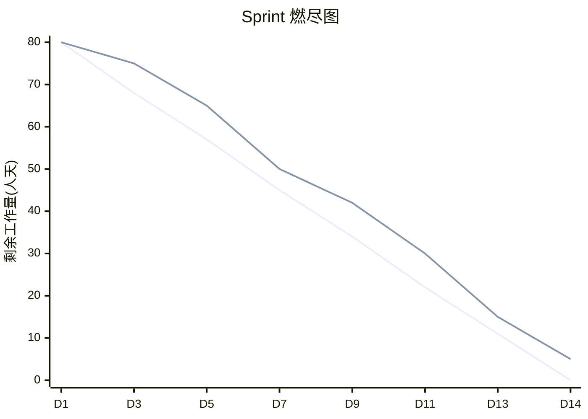
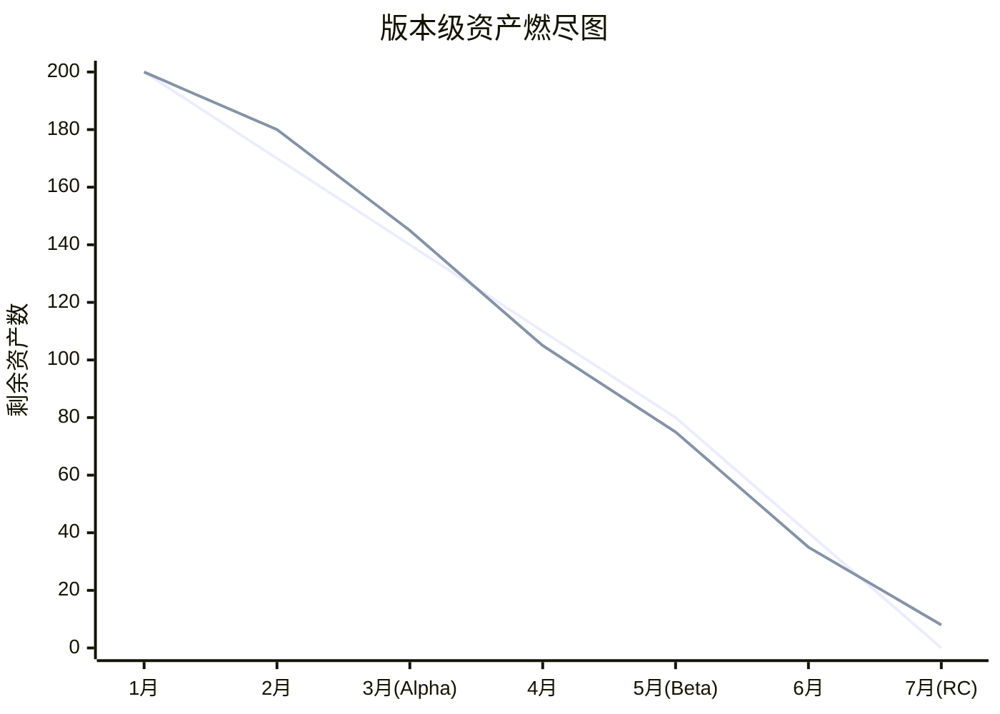

# 进度可视化工具

> 🏷️ **适用**: 全阶段通用 | 👤 **维护**: APM组 · 周八 | 📅 2026-05-26（v2.0 升级）

> ⏱️ **本文定位**：「可视化搭建手册」 —— 教你**怎么搭建看板、选什么工具、如何配置**
>
> 🚫 **本文不涉及**：排期方法论（排期策略看 → [📅 美术排期与里程碑管理](art-scheduling.md)）、效能指标定义（指标体系看 → [📊 美术效能度量体系](art-efficiency-metrics.md)）、风险全生命周期管理（风险登记看 → [📋 项目风险登记册](risk-log.md)）
>
> 🎯 **核心价值**：让 APM 在 **30 分钟内**搭出一套可用的进度看板

> **📑 目录导航**
>
> 1. [可视化工具矩阵与选型](#1-可视化工具矩阵与选型)
> 2. [甘特图设计](#2-甘特图设计)
> 3. [燃尽图设计](#3-燃尽图设计)
> 4. [风险预警热力图](#4-风险预警热力图)
> 5. [里程碑达成率看板](#5-里程碑达成率看板)
> 6. [数据看板整合](#6-数据看板整合)
> 7. [数据自动化采集方案](#7-数据自动化采集方案) 🆕
> 8. [数据校验与准确性保障 SOP](#8-数据校验与准确性保障-sop) 🆕
> 9. [看板落地推动方法论](#9-看板落地推动方法论) 🆕
> 10. [典型问题](#10-典型问题)
> 11. [Do / Don't 示例](#11-do--dont-示例)
> 12. [附录：各工具实操配置速查](#附录各工具实操配置速查) 🆕
> 13. [关联文档导航](#关联文档导航) 🆕

---

## 1. 可视化工具矩阵与选型

### 1.1 功能对比矩阵

| 工具 | 甘特图 | 燃尽图 | 看板 | 热力图 | 自动预警 | API/自动化 | 外包协作 | 成本 |
|:---:|:---:|:---:|:---:|:---:|:---:|:---:|:---:|:---:|
| **TAPD** | ✅ | ✅ | ✅ | ❌ | ✅ | ✅ OpenAPI | ⚠️ 需邀请 | 免费 |
| **Jira + Tempo** | ✅ | ✅ | ✅ | ⚠️ 插件 | ✅ | ✅ Webhook + REST | ✅ | 付费 |
| **飞书多维表格** | ✅ | ⚠️ 需配置 | ✅ | ❌ | ❌ | ✅ 开放平台 | ✅ 链接分享 | 免费 |
| **Excel/WPS** | ✅ 手动 | ✅ 手动 | ❌ | ✅ 手动 | ❌ | ❌ | ❌ | 免费 |
| **Monday.com** | ✅ | ✅ | ✅ | ❌ | ✅ | ✅ GraphQL | ✅ | 付费 |
| **自研看板** | ✅ | ✅ | ✅ | ✅ | ✅ | 全自定义 | ✅ | 开发成本高 |

### 1.2 场景化选型建议

| 团队情况 | 推荐方案 | 理由 |
|:---:|:---:|:---:|
| 腾讯系 / 已使用企微 | **TAPD** | 零成本、与企微深度集成、消息自动推送 |
| 大团队(30+人) / 多项目并行 | **Jira + Tempo** | 工时统计精准、跨项目看板、报表丰富 |
| 中小团队 / 快速搭建 / 外包协作 | **飞书多维表格** | 5分钟出看板、链接分享不需外包注册 |
| 预算紧 / 需离线 / 临时兜底 | **Excel/WPS** | 万能但纯手动，适合过渡期 |
| 有前端开发资源 / 数据定制需求 | **自研看板** | 最灵活，但维护成本高 |

### 1.3 选型决策流程

```
是否已有在用的项目管理工具？
├── 是 → 直接用该工具的看板/甘特功能（不重复搭建）
└── 否 → 团队规模？
    ├── ≤ 15 人 → 飞书多维表格（快速启动）
    ├── 15~50 人 → TAPD（免费+功能全）
    └── > 50 人 / 多项目 → Jira + Tempo（企业级）
```

> ⚠️ **核心原则**：**只用一套工具**。多套工具并存 = 没有工具（因为没人维护全部）。

---

## 2. 甘特图设计

### 2.1 甘特图信息架构

| 维度 | 映射 | 说明 |
|:---:|:---:|:---:|
| **行** | 任务/资产 | 每行一个任务 |
| **列** | 时间轴（天/周） | 横轴表示时间 |
| **颜色** | 状态 | 🔵 进行中 / ✅ 已完成 / 🟡 延期 / 🔴 阻塞 |
| **连线** | 前后依赖关系 | 体现任务间的串行依赖 |

### 2.2 美术甘特图模板

| 任务 | 负责人 | W1 | W2 | W3 | W4 | W5 | W6 | 状态 |
|:---:|:---:|:---:|:---:|:---:|:---:|:---:|:---:|:---:|
| 角色原画-Luna | 张三 | ██ | ██ | ░░ | | | | ✅ 完成 |
| 角色建模-Luna | 李四 | | ░░ | ██ | ██ | ██ | | 🔵 进行中 |
| 角色贴图-Luna | 王五 | | | | ░░ | ██ | ██ | ⬜ 未开始 |
| 角色绑定-Luna | 赵六 | | | | | ░░ | ██ | ⬜ 未开始 |
| 场景-主城 | 孙七 | ██ | ██ | ██ | ██ | ██ | ░░ | 🟡 延期 |
| UI-主界面 | 钱八 | ██ | ██ | ██ | ░░ | | | 🔵 进行中 |

> 💡 **图例说明**：`██` = 计划工期 | `░░` = Buffer/依赖等待 | 🔴 = 延期部分

### 2.3 APM 使用要点

- 每周更新一次甘特图
- 关键路径用红色高亮
- 里程碑用 ▲ 菱形标记
- 延期任务自动标红

---

## 3. 燃尽图设计

> 🔗 **边界说明**：本节讲「燃尽图怎么搭建、数据源从哪来、模板怎么用」。燃尽图的**解读方法和异常诊断**请参阅 👉 [📅 美术排期与里程碑管理 · §4 燃尽图跟踪指南](art-scheduling.md)

### 3.1 Sprint 燃尽图



> ⚠️ **预警规则**：当实际线**持续 3 天偏离理想线 > 20%** 时，APM 需启动赶工/裁剪方案。

### 3.2 版本级燃尽图

追踪整个版本的资产完成进度：



### 3.3 按工种燃尽

| 工种 | 总任务 | 已完成 | 剩余 | 完成率 | 趋势 |
|:---:|:---:|:---:|:---:|:---:|:---:|
| 角色 | 35 | 22 | 13 | 63% | 📈 正常 |
| 场景 | 20 | 8 | 12 | 40% | 📉 落后 |
| UI | 40 | 30 | 10 | 75% | 📈 超前 |
| 特效 | 25 | 12 | 13 | 48% | ⚠️ 注意 |
| 动画 | 30 | 15 | 15 | 50% | 📈 正常 |

---

## 4. 风险预警热力图

> 🔗 **边界说明**：本节讲「热力图怎么搭建和展示」。风险的**登记规范、评分标准和全生命周期管理**请参阅 👉 [📋 项目风险登记册](risk-log.md)；排期维度的预警触发与SOP请参阅 👉 [📅 美术排期与里程碑管理 · §5 风险预警机制](art-scheduling.md)

### 4.1 热力图设计

**风险热力图矩阵**（影响度 × 紧急度）：

| 影响度 ↓ \ 紧急度 → | 低 | 中 | 高 |
|:---:|:---:|:---:|:---:|
| **高** | 🟡 场景LOD | 🟠 外包延期 | 🔴 角色面数超标 |
| **中** | 🟢 UI适配 | 🟡 特效性能 | 🟠 排期冲突 |
| **低** | ⚪ 命名规范 | 🟢 工具Bug | 🟡 审核积压 |

> 💡 **使用方法**：每周更新热力图数据，**🔴 红色区域**必须有对应处理方案，**🟠 橙色区域**需在当前 Sprint 跟踪。

### 4.2 风险指标数据源

| 风险指标 | 数据来源 | 阈值 |
|:---:|:---:|:---:|
| 进度偏差 | TAPD/Jira 任务完成率 | > 20% 为高风险 |
| 外包延期率 | 外包交付跟踪表 | > 15% 为高风险 |
| Bug 密度 | Bug 管理系统 | > 2.0 Bug/任务 为高 |
| 审核积压 | 看板"待审核"列 | > 10 为预警 |
| 变更频率 | 变更记录 | > 3 次/周 为高 |

---

## 5. 里程碑达成率看板

### 5.1 看板布局

> 📊 **里程碑达成率看板 — Alpha (2026-04-15)**

| 工种 | 进度 | 达成率 | 状态 |
|:---:|:---:|:---:|:---:|
| 角色 | ████████████░░░░ | **78%** (14/18) | 📈 |
| 场景 | ██████████░░░░░░ | **62%** (5/8) | ⚠️ 落后 |
| UI | ████████████████ | **100%** (12/12) | ✅ 达标 |
| 特效 | ██████████░░░░░░ | **65%** (13/20) | ⚠️ 落后 |
| 动画 | ████████████░░░░ | **80%** (16/20) | 📈 |

| 指标 | 数值 |
|:---:|:---:|
| **总体达成率** | **77%** |
| **目标** | **≥ 80%** |
| **状态** | 🟡 需加速 |

> 🔴 **阻塞项**：
> - 场景主城灯光方案待策划确认
> - 外包角色 3 个延期交付

### 5.2 达成率计算公式

> **基础公式**：
> 
> `达成率 = 已完成且验收通过的资产数 / 该里程碑计划资产总数 × 100%`

> **加权公式**：
> 
> `加权达成率 = Σ(资产权重 × 完成状态) / Σ(资产权重)`
>
> | 优先级 | 权重 |
> |:---:|:---:|
> | **P0** | 3 |
> | **P1** | 2 |
> | **P2** | 1 |

---

## 6. 数据看板整合

> 🔗 **边界说明**：本节讲「进度类看板」的配置和组合方式。如果需要搭建**效能度量看板**（ADEI指标、一次通过率、Sprint完成率等），请参阅 👉 [📊 美术效能度量体系](art-efficiency-metrics.md)

### 6.1 APM 日常看板（推荐配置）

| 区域 | 展示内容 | 更新频率 |
|:---:|:---:|:---:|
| 左上 | Sprint 燃尽图 | 每日 |
| 右上 | 里程碑达成率 | 每日 |
| 左下 | 风险热力图 | 每周 |
| 右下 | 工种完成率柱状图 | 每日 |

### 6.2 向上汇报看板

| 信息 | 形式 | 频率 |
|:---:|:---:|:---:|
| 里程碑整体进度 | 进度条 | 每周 |
| Top 3 风险 | 红黄绿标记 | 每周 |
| 预算消耗 | 饼图 | 每月 |
| 外包达交率 | 趋势线 | 每月 |

---

## 7. 数据自动化采集方案

> 🎯 **目标**：让看板数据「自动流入」，APM 不再手动填表。

### 7.1 自动化采集架构

```
┌──────────────────────────────────────────────────────┐
│                   数据源层                             │
│  TAPD任务 │ Jira工单 │ Git提交 │ 飞书审批 │ 外包表    │
└───────┬───────┬───────┬───────┬───────┬──────────────┘
        │       │       │       │       │
        ▼       ▼       ▼       ▼       ▼
┌──────────────────────────────────────────────────────┐
│                 采集/同步层                            │
│  OpenAPI定时拉取 │ Webhook实时推送 │ 定时脚本同步      │
└───────────────────────────┬──────────────────────────┘
                            │
                            ▼
┌──────────────────────────────────────────────────────┐
│                 看板展示层                             │
│  燃尽图 │ 甘特图 │ 达成率看板 │ 风险热力图            │
└──────────────────────────────────────────────────────┘
```

### 7.2 各工具自动化方案

| 工具 | 采集方式 | 刷新频率 | 配置难度 | 说明 |
|:---:|:---:|:---:|:---:|:---:|
| **TAPD** | OpenAPI + 企微机器人 | 每小时 | ⭐⭐ | 可自动推送日报到群 |
| **Jira** | Webhook + Automation | 实时 | ⭐⭐⭐ | 状态变更即触发 |
| **飞书多维表格** | 开放平台 API + 自动化流程 | 每日 | ⭐⭐ | 多维表格自带自动化节点 |
| **Excel** | Power Query + VBA 宏 | 手动/每日 | ⭐⭐⭐ | 需配合共享 OneDrive |
| **Git** | CI/CD Hook → 自动统计提交 | 实时 | ⭐⭐ | 统计合入频率/贡献量 |

### 7.3 推荐自动化流程（以 TAPD 为例）

```
每日 10:00 定时触发
    → TAPD OpenAPI 拉取「当前Sprint全部任务状态」
    → 计算燃尽图数据点（剩余任务数）
    → 计算各工种达成率
    → 检测偏离阈值（> 20% 则标红）
    → 推送日报到企微群
    → 如触发预警 → @APM + 主美
```

> 💡 **投入产出比**：搭建自动化管道约需 **2~4 小时**一次性投入，之后每天节省 **30~60 分钟**手动更新时间。

---

## 8. 数据校验与准确性保障 SOP

> 🎯 **核心原则**：看板数据的可信度 = 看板的生命线。数据失真一次，信任崩塌难以恢复。

### 8.1 数据失真的常见原因

| 失真类型 | 表现 | 根因 | 占比 |
|:---:|:---:|:---:|:---:|
| **虚假完成** | 任务标「完成」但未验收 | 完成标准不统一 | ~40% |
| **状态滞后** | 实际已做但忘记更新状态 | 更新成本高/无激励 | ~30% |
| **权重缺失** | P0 和 P2 一视同仁 | 未配置权重 | ~20% |
| **僵尸任务** | 已取消但未关闭 | 无人清理 | ~10% |

### 8.2 校验 SOP（每周一次 + 里程碑前加频）

| 步骤 | 操作 | 频率 | 责任人 |
|:---:|:---:|:---:|:---:|
| 1️⃣ 抽检 | 随机抽查 5~10 个"已完成"任务，确认是否真正验收通过 | 每周 | APM |
| 2️⃣ 对账 | 将看板数据 vs 实际交付产出做一次对比 | 每周 | APM + TA |
| 3️⃣ 清洗 | 关闭僵尸任务、修正状态滞后、标记阻塞项 | 每周 | APM |
| 4️⃣ 双轨展示 | 同时展示「名义完成率」和「验收完成率」 | 每日 | 看板自动 |
| 5️⃣ 加频 | 里程碑前 2 周 → 每日抽检 3 个任务 | 里程碑前 | APM |

### 8.3 完成标准统一定义

> 📌 **任务状态不是"我觉得做完了"，而是满足以下标准才能标完成**：

| 状态 | 定义 | 谁有权标记 |
|:---:|:---:|:---:|
| ⬜ **未开始** | 任务创建但未动工 | 自动 |
| 🔵 **进行中** | 已开始制作 | 美术本人 |
| 🟡 **待审核** | 制作完成，等待审核 | 美术本人 |
| ✅ **已完成** | **审核通过 + 入库成功** | QA/TA/主美 |
| 🔴 **阻塞** | 因外部依赖无法继续 | 任何人 |

> ⚠️ **关键**：只有 **QA/TA/主美** 有权将任务标为"已完成"。美术自己只能标到"待审核"。这是消除虚假完成的根本手段。

---

## 9. 看板落地推动方法论

> 💬 **核心洞察**：搭看板容易（30 分钟），让团队**真正用起来**才是难点（需要 2~4 周养成习惯）。

### 9.1 看板推动四阶段

| 阶段 | 周期 | 核心动作 | 成功标志 |
|:---:|:---:|:---:|:---:|
| 🏗️ **搭建期** | 第 1 周 | 选工具、搭看板、配自动化 | 看板上线，数据可刷新 |
| 📣 **推广期** | 第 2 周 | 写使用指南、周会演示、一对一教 | 全员知道看板在哪、怎么看 |
| 🔁 **嵌入期** | 第 3~4 周 | 强制嵌入工作流（周会第一项看看板） | 周会上有人主动引用数据 |
| 🚀 **自驱期** | 第 5 周+ | 团队自发看板、提出优化建议 | APM 不提醒也有人看 |

### 9.2 嵌入工作流的具体手段

| 手段 | 操作 | 效果 |
|:---:|:---:|:---:|
| **周会锚点** | 周会议程第一项 = 看板数据通读（5 分钟） | 强制每周至少看一次 |
| **日站会引用** | Standup 时看板投屏，"红的说一下" | 让数据成为讨论基础 |
| **预警推送** | 偏差 > 20% 自动 @相关人 | 被动触达，无需主动打开 |
| **周报模板** | 周报必须附看板截图 + 数据变化说明 | 倒逼数据更新 |
| **制作人开会** | 向上汇报用看板数据，不接受"口头感觉" | 自上而下推动数据文化 |

### 9.3 常见推动阻力与应对

| 阻力 | 团队说 | APM 应对 |
|:---:|:---:|:---:|
| 懒得更新 | "太麻烦了" | 降低更新成本 → 自动化采集（见第 7 节） |
| 不信数据 | "看板不准" | 提高数据质量 → 校验 SOP（见第 8 节） |
| 不觉得有用 | "我不需要看板" | 制造使用场景 → 嵌入周会/预警推送 |
| 信息过载 | "太多了看不懂" | 精简 → 只放 4 个核心模块（3 秒原则） |

---

## 10. 典型问题

### 10.1 进度数据失真导致决策失误

> 🚨 **案例 1：进度数据失真——甘特图 85% 实际达成不到 60%**
>
> 🔴 **[高频]**
>
> 🎬 **典型场景还原**
> 甘特图显示项目总进度 85%，但实际到里程碑节点时大量资产仍未交付，达成率不到 60%。
>
> 🔍 **问题根因拆解**
> - 任务状态由美术自行更新，存在大量「已完成但未验收」的虚假完成
> - 甘特图只统计了任务数量，未区分权重（P0 和 P2 任务一视同仁）
> - 无人定期校验看板数据与实际产出的一致性
>
> 💡 **APM 破局思路**
> - 引入**加权达成率**公式，P0 任务权重 = 3，P2 = 1
> - 所有任务的「完成」状态需经 **QA/TA 验收确认**后才能关闭
> - APM 每周做一次「数据抽检」：随机抽查 5 个已完成任务的实际交付状态
> - 制定看板数据更新 SOP，明确什么状态对应什么操作
> - 里程碑前 2 周增加每日抽检频率
> - 在周报中同时展示「名义完成率」和「验收完成率」

### 10.2 花时间做了看板却没人看

> 🚨 **案例 2：看板无人问津——决策仍靠「感觉」**
>
> 🔴 **[高频]**
>
> 🎬 **典型场景还原**
> APM 花大力气搭建了风险热力图 + 燃尽图，但团队周会上无人关注看板数据，决策仍靠「感觉」。
>
> 🔍 **问题根因拆解**
> - 看板数据更新不及时，大家觉得不准
> - 看板信息过多，核心数据淹没在噪声中
> - 未在决策流程中嵌入看板使用环节
>
> 💡 **APM 破局思路**
> - **精简看板**：日常只展示 4 个核心模块（燃尽图 + 达成率 + Top 3 风险 + 阻塞项）
> - **每日更新**：数据延迟 ≤ 1 天，确保可信度
> - **嵌入流程**：周会议程第一项固定为「看看板、读数据」，用数据开场
> - 自动化数据采集（TAPD API / Jira Webhook）减少手动维护成本
> - 看板设计遵循「3 秒原则」：核心信息 3 秒内可读取
> - 培养团队数据意识，每月分享一个「用数据发现问题」的案例

---

## 11. Do / Don't 示例

> 📌 **场景说明**
>
> APM 为当前版本搭建进度可视化看板并推动团队使用。
>
> ✅ **Do（正确示范）**
>
> - 选择与团队已有习惯匹配的工具（团队用 TAPD → 用 TAPD 看板，不另起炉灶）
> - 看板只放 **4~6 个核心图表**，核心信息 3 秒可读
> - 数据每日自动/半自动更新，保持时效性
> - 周会第一项用看板数据开场，引导团队养成「看数据做决策」的习惯
> - 里程碑前 2 周切换为每日更新 + 每日 Standup 看板同步
>
> ❌ **Don't（错误示范）**
>
> - 同时搭了 3 套看板（TAPD + Excel + 飞书），维护不过来全部过时
> - 看板塞了 20 个图表，信息过载，核心数据被淹没
> - 搭好看板后不更新，两周后数据全部失真
> - 周会上看板只是「摆设」，讨论时回到口头估进度
> - 从不做数据校验，任务标「完成」但实际未验收

---

## 附录：各工具实操配置速查

### A. Excel/WPS 快速搭建（30 分钟方案）

如果暂时没有 TAPD/Jira，可用 Excel 快速搭建：

| Sheet | 内容 | 图表 | 搭建要点 |
|:---:|:---:|:---:|:---:|
| Sheet1: 任务清单 | 全部任务列表 + 状态 + 日期 | 数据源 | 字段参照 [art-scheduling §2.2 任务卡片](art-scheduling.md) |
| Sheet2: 甘特图 | 条件格式着色 | 甘特视图 | 用条件格式 + 日期公式自动着色 |
| Sheet3: 燃尽图 | 每日剩余统计 | 折线图 | COUNTIF 统计"未完成"数量 |
| Sheet4: 达成率 | 按工种汇总 | 堆叠柱状图 | SUMPRODUCT 加权公式 |
| Sheet5: 风险登记 | 风险清单 + 评级 | 散点图（热力） | X轴=紧急度，Y轴=影响度 |

### B. TAPD 看板配置要点

| 配置项 | 操作 | 说明 |
|:---:|:---:|:---:|
| 迭代看板 | 项目设置 → 看板 → 新建迭代看板 | 对应 Sprint 看板 |
| 燃尽图 | 迭代详情 → 统计 → 燃尽图 | 自动生成，无需配置 |
| 自定义字段 | 工作项设置 → 添加"工种""优先级""复杂度" | 支撑按工种筛选 |
| 企微推送 | 应用设置 → 通知 → 企微机器人 Webhook | 状态变更自动推群 |
| API 取数 | 开放平台 → 创建应用 → 获取 Access Token | 用于自动化日报脚本 |

### C. Jira + Tempo 配置要点

| 配置项 | 操作 | 说明 |
|:---:|:---:|:---:|
| 看板 | 创建 Scrum Board → 配置列映射 | 列 = 未开始/进行中/待审核/完成 |
| 燃尽图 | Board → Reports → Burndown | Sprint 级自动生成 |
| Tempo 工时 | Tempo → Timesheets → 关联 Issue | 可做「预估 vs 实际」对比 |
| Automation | Project → Automation → 创建规则 | 状态变更 → 发 Slack/邮件 |
| Dashboard | 创建 Dashboard → 添加 Gadget | 拼装自定义看板 |

### D. 飞书多维表格配置要点

| 配置项 | 操作 | 说明 |
|:---:|:---:|:---:|
| 表格结构 | 新建多维表格 → 字段设计 | 建议字段：任务名/负责人/工种/状态/开始日/结束日/优先级 |
| 甘特视图 | 视图 → 新建甘特视图 | 自动按日期展示 |
| 看板视图 | 视图 → 新建看板视图 → 按"状态"分组 | Kanban 风格 |
| 自动化 | 高级设置 → 自动化 → 状态变更触发通知 | 通知到飞书群 |
| 外包分享 | 分享 → 生成链接 → 设置"可查看" | 外包无需注册飞书即可查看 |

---

## 关联文档导航

> 以下文档与本文形成知识网络，建议按需扩展阅读：

| 关联主题 | 推荐文档 | 何时阅读 |
|:---:|:---:|:---:|
| 排期方法论 | 👉 [📅 美术排期与里程碑管理](art-scheduling.md) | 需要了解排期策略、燃尽图解读、预警SOP |
| 效能度量 | 👉 [📊 美术效能度量体系](art-efficiency-metrics.md) | 需要搭建效能看板、定义 KPI 指标 |
| 风险管理 | 👉 [📋 项目风险登记册](risk-log.md) | 需要了解风险评分标准和登记规范 |
| 延期决策 | 👉 [⏰ 项目延期应对决策](delay-response-decision.md) | 看板预警触发后如何做决策 |
| 外包管理 | 👉 [🏭 外包全流程管理](cp-outsource.md) | 看板中外包进度数据从哪来 |
| 跨部门协作 | 👉 [🤝 跨部门协作破局手册](cross-dept-collab.md) | 推动看板落地遇到跨部门阻力时 |
| 复盘模板 | 👉 [🔄 版本复盘模板](postmortem-template.md) | 用看板数据做Sprint复盘时 |

---

> ⚡ **APM 金句**：「看板不是用来看的装饰品——它是用来驱动决策的武器。3 秒读到关键数据，30 秒做出下一步判断。」
