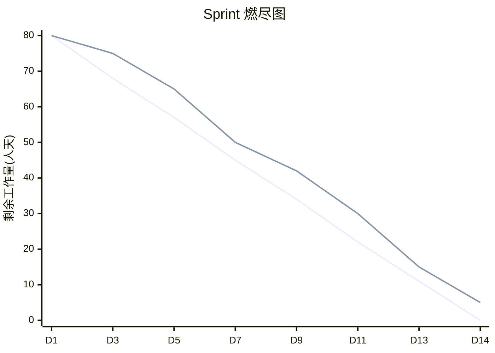
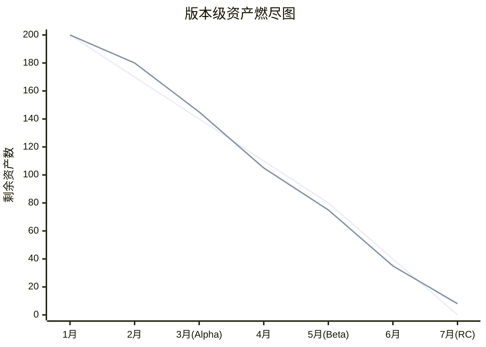

# 进度可视化工具

> **适用阶段**：全阶段 | **优先级**：高 | **负责人**：周八
>
> 本文档介绍美术资产产出进度追踪的可视化工具方案，包含甘特图、燃尽图、风险热力图与里程碑看板。

> **📑 目录导航**
>
> 1. [可视化工具矩阵](#1-可视化工具矩阵)
> 2. [甘特图设计](#2-甘特图设计)
> 3. [燃尽图设计](#3-燃尽图设计)
> 4. [风险预警热力图](#4-风险预警热力图)
> 5. [里程碑达成率看板](#5-里程碑达成率看板)
> 6. [数据看板整合](#6-数据看板整合)
> 7. [典型问题](#7-典型问题)
> 8. [Do / Don't 示例](#8-do--dont-示例)
> 9. [附录：Excel 模板速配](#附录excel-模板速配方案)

---

## 1. 可视化工具矩阵

### 1.1 工具选型

| 工具 | 甘特图 | 燃尽图 | 看板 | 热力图 | 学习成本 | 推荐指数 |
|:---:|:---:|:---:|:---:|:---:|:---:|:---:|
| **TAPD** | ✅ | ✅ | ✅ | ❌ | 低 | ⭐⭐⭐⭐⭐ |
| **Jira + Tempo** | ✅ | ✅ | ✅ | ⚠️ | 中 | ⭐⭐⭐⭐ |
| **飞书多维表格** | ✅ | ⚠️ | ✅ | ❌ | 低 | ⭐⭐⭐⭐ |
| **Excel/WPS** | ✅ | ✅ | ❌ | ✅ | 低 | ⭐⭐⭐ |
| **Monday.com** | ✅ | ✅ | ✅ | ❌ | 中 | ⭐⭐⭐ |
| **自研看板** | ✅ | ✅ | ✅ | ✅ | 高 | ⭐⭐⭐⭐ |

---

## 2. 甘特图设计

### 2.1 甘特图信息架构

| 维度 | 映射 | 说明 |
|:---:|:---:|:---:|
| **行** | 任务/资产 | 每行一个任务 |
| **列** | 时间轴（天/周） | 横轴表示时间 |
| **颜色** | 状态 | 🔵 进行中 / ✅ 已完成 / 🟡 延期 / 🔴 阻塞 |
| **连线** | 前后依赖关系 | 体现任务间的串行依赖 |

### 2.2 美术甘特图模板

| 任务 | 负责人 | W1 | W2 | W3 | W4 | W5 | W6 | 状态 |
|:---:|:---:|:---:|:---:|:---:|:---:|:---:|:---:|:---:|
| 角色原画-Luna | 张三 | ██ | ██ | ░░ | | | | ✅ 完成 |
| 角色建模-Luna | 李四 | | ░░ | ██ | ██ | ██ | | 🔵 进行中 |
| 角色贴图-Luna | 王五 | | | | ░░ | ██ | ██ | ⬜ 未开始 |
| 角色绑定-Luna | 赵六 | | | | | ░░ | ██ | ⬜ 未开始 |
| 场景-主城 | 孙七 | ██ | ██ | ██ | ██ | ██ | ░░ | 🟡 延期 |
| UI-主界面 | 钱八 | ██ | ██ | ██ | ░░ | | | 🔵 进行中 |

> 💡 **图例说明**：`██` = 计划工期 | `░░` = Buffer/依赖等待 | 🔴 = 延期部分

### 2.3 APM 使用要点

- 每周更新一次甘特图
- 关键路径用红色高亮
- 里程碑用 ▲ 菱形标记
- 延期任务自动标红

---

## 3. 燃尽图设计

### 3.1 Sprint 燃尽图

> ⚠️ **预警规则**：当实际线**持续 3 天偏离理想线 > 20%** 时，APM 需启动赶工/裁剪方案。

### 3.2 版本级燃尽图

追踪整个版本的资产完成进度：

### 3.3 按工种燃尽

| 工种 | 总任务 | 已完成 | 剩余 | 完成率 | 趋势 |
|:---:|:---:|:---:|:---:|:---:|:---:|
| 角色 | 35 | 22 | 13 | 63% | 📈 正常 |
| 场景 | 20 | 8 | 12 | 40% | 📉 落后 |
| UI | 40 | 30 | 10 | 75% | 📈 超前 |
| 特效 | 25 | 12 | 13 | 48% | ⚠️ 注意 |
| 动画 | 30 | 15 | 15 | 50% | 📈 正常 |

---

## 4. 风险预警热力图

### 4.1 热力图设计

**风险热力图矩阵**（影响度 × 紧急度）：

| 影响度 ↓ \ 紧急度 → | 低 | 中 | 高 |
|:---:|:---:|:---:|:---:|
| **高** | 🟡 场景LOD | 🟠 外包延期 | 🔴 角色面数超标 |
| **中** | 🟢 UI适配 | 🟡 特效性能 | 🟠 排期冲突 |
| **低** | ⚪ 命名规范 | 🟢 工具Bug | 🟡 审核积压 |

> 💡 **使用方法**：每周更新热力图数据，**🔴 红色区域**必须有对应处理方案，**🟠 橙色区域**需在当前 Sprint 跟踪。

### 4.2 风险指标数据源

| 风险指标 | 数据来源 | 阈值 |
|:---:|:---:|:---:|
| 进度偏差 | TAPD/Jira 任务完成率 | > 20% 为高风险 |
| 外包延期率 | 外包交付跟踪表 | > 15% 为高风险 |
| Bug 密度 | Bug 管理系统 | > 2.0 Bug/任务 为高 |
| 审核积压 | 看板"待审核"列 | > 10 为预警 |
| 变更频率 | 变更记录 | > 3 次/周 为高 |

---

## 5. 里程碑达成率看板

### 5.1 看板布局

> 📊 **里程碑达成率看板 — Alpha (2026-04-15)**

| 工种 | 进度 | 达成率 | 状态 |
|:---:|:---:|:---:|:---:|
| 角色 | ████████████░░░░ | **78%** (14/18) | 📈 |
| 场景 | ██████████░░░░░░ | **62%** (5/8) | ⚠️ 落后 |
| UI | ████████████████ | **100%** (12/12) | ✅ 达标 |
| 特效 | ██████████░░░░░░ | **65%** (13/20) | ⚠️ 落后 |
| 动画 | ████████████░░░░ | **80%** (16/20) | 📈 |

| 指标 | 数值 |
|:---:|:---:|
| **总体达成率** | **77%** |
| **目标** | **≥ 80%** |
| **状态** | 🟡 需加速 |

> 🔴 **阻塞项**：
> - 场景主城灯光方案待策划确认
> - 外包角色 3 个延期交付

### 5.2 达成率计算公式

> **基础公式**：
> 
> `达成率 = 已完成且验收通过的资产数 / 该里程碑计划资产总数 × 100%`

> **加权公式**：
> 
> `加权达成率 = Σ(资产权重 × 完成状态) / Σ(资产权重)`
>
> | 优先级 | 权重 |
> |:---:|:---:|
> | **P0** | 3 |
> | **P1** | 2 |
> | **P2** | 1 |

---

## 6. 数据看板整合

### 6.1 APM 日常看板（推荐配置）

| 区域 | 展示内容 | 更新频率 |
|:---:|:---:|:---:|
| 左上 | Sprint 燃尽图 | 每日 |
| 右上 | 里程碑达成率 | 每日 |
| 左下 | 风险热力图 | 每周 |
| 右下 | 工种完成率柱状图 | 每日 |

### 6.2 向上汇报看板

| 信息 | 形式 | 频率 |
|:---:|:---:|:---:|
| 里程碑整体进度 | 进度条 | 每周 |
| Top 3 风险 | 红黄绿标记 | 每周 |
| 预算消耗 | 饼图 | 每月 |
| 外包达交率 | 趋势线 | 每月 |

---

## 7. 典型问题

### 7.1 进度数据失真导致决策失误

> 🚨 **案例 1：进度数据失真——甘特图 85% 实际达成不到 60%**
>
> 🔴 **[高频]**
>
> 🎬 **典型场景还原**
> 甘特图显示项目总进度 85%，但实际到里程碑节点时大量资产仍未交付，达成率不到 60%。
>
> 🔍 **问题根因拆解**
> - 任务状态由美术自行更新，存在大量「已完成但未验收」的虚假完成
> - 甘特图只统计了任务数量，未区分权重（P0 和 P2 任务一视同仁）
> - 无人定期校验看板数据与实际产出的一致性
>
> 💡 **APM 破局思路**
> - 引入**加权达成率**公式，P0 任务权重 = 3，P2 = 1
> - 所有任务的「完成」状态需经 **QA/TA 验收确认**后才能关闭
> - APM 每周做一次「数据抽检」：随机抽查 5 个已完成任务的实际交付状态
> - 制定看板数据更新 SOP，明确什么状态对应什么操作
> - 里程碑前 2 周增加每日抽检频率
> - 在周报中同时展示「名义完成率」和「验收完成率」

### 7.2 花时间做了看板却没人看

> 🚨 **案例 2：看板无人问津——决策仍靠「感觉」**
>
> 🔴 **[高频]**
>
> 🎬 **典型场景还原**
> APM 花大力气搭建了风险热力图 + 燃尽图，但团队周会上无人关注看板数据，决策仍靠「感觉」。
>
> 🔍 **问题根因拆解**
> - 看板数据更新不及时，大家觉得不准
> - 看板信息过多，核心数据淹没在噪声中
> - 未在决策流程中嵌入看板使用环节
>
> 💡 **APM 破局思路**
> - **精简看板**：日常只展示 4 个核心模块（燃尽图 + 达成率 + Top 3 风险 + 阻塞项）
> - **每日更新**：数据延迟 ≤ 1 天，确保可信度
> - **嵌入流程**：周会议程第一项固定为「看看板、读数据」，用数据开场
> - 自动化数据采集（TAPD API / Jira Webhook）减少手动维护成本
> - 看板设计遵循「3 秒原则」：核心信息 3 秒内可读取
> - 培养团队数据意识，每月分享一个「用数据发现问题」的案例

---

## 8. Do / Don't 示例

> 📌 **场景说明**
>
> APM 为当前版本搭建进度可视化看板并推动团队使用。
>
> ✅ **Do（正确示范）**
>
> - 选择与团队已有习惯匹配的工具（团队用 TAPD → 用 TAPD 看板，不另起炉灶）
> - 看板只放 **4~6 个核心图表**，核心信息 3 秒可读
> - 数据每日自动/半自动更新，保持时效性
> - 周会第一项用看板数据开场，引导团队养成「看数据做决策」的习惯
> - 里程碑前 2 周切换为每日更新 + 每日 Standup 看板同步
>
> ❌ **Don't（错误示范）**
>
> - 同时搭了 3 套看板（TAPD + Excel + 飞书），维护不过来全部过时
> - 看板塞了 20 个图表，信息过载，核心数据被淹没
> - 搭好看板后不更新，两周后数据全部失真
> - 周会上看板只是「摆设」，讨论时回到口头估进度
> - 从不做数据校验，任务标「完成」但实际未验收

---

## 附录：Excel 模板速配方案

如果暂时没有 TAPD/Jira，可用 Excel 快速搭建：

| Sheet | 内容 | 图表 |
|:---:|:---:|:---:|
| Sheet1: 任务清单 | 全部任务列表 + 状态 + 日期 | 数据源 |
| Sheet2: 甘特图 | 条件格式着色 | 甘特视图 |
| Sheet3: 燃尽图 | 每日剩余统计 | 折线图 |
| Sheet4: 达成率 | 按工种汇总 | 堆叠柱状图 |
| Sheet5: 风险登记 | 风险清单 + 评级 | 散点图（热力） |
