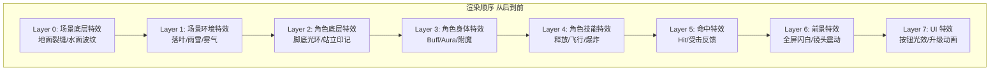
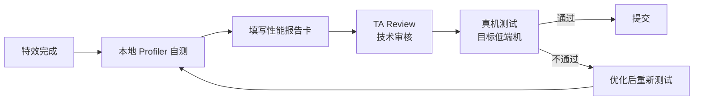

# 特效性能红线与层级规范

> **适用阶段**：预研期 | **优先级**：高 | **负责人**：孙七
>
> 本文档定义粒子特效的 Drawcall、粒子数量、Overdraw、层级管理规范与移动端性能预算，是特效制作的核心红线标准。

---

## 1. 移动端特效性能预算表

### 1.1 机型分档标准

| 档位 | 代表机型 | GPU 算力参考 | 目标帧率 |
|------|---------|-------------|---------|
| 🔴 **高端** | iPhone 15 Pro, 骁龙 8 Gen3 | Mali-G720 / A17 Pro | **60 FPS** |
| 🟡 **中端** | iPhone 13, 骁龙 870 | Mali-G78 / A15 | **30~60 FPS** |
| 🟢 **低端** | iPhone 11, 骁龙 765G | Mali-G57 / A13 | **30 FPS** |

### 1.2 单个特效红线指标

| 指标 | 高端 | 中端 | 低端 | 说明 |
|------|------|------|------|------|
| **Drawcall** | ≤ 12 | ≤ 8 | ≤ 5 | 单个特效的最大 DC 数 |
| **粒子数量** | ≤ 500 | ≤ 200 | ≤ 100 | 单个特效同时存活的最大粒子数 |
| **Overdraw** | ≤ 6x | ≤ 4x | ≤ 3x | 屏幕像素平均重绘次数 |
| **GPU 填充率** | ≤ 8M px/帧 | ≤ 4M px/帧 | ≤ 2M px/帧 | 半透明区域填充像素总量 |
| **贴图内存** | ≤ 4MB | ≤ 2MB | ≤ 1MB | 单个特效使用的贴图总内存 |

> 🚨 **核心红线**：中端机为基准红线。任何特效在中端机上超过上述指标，**必须优化后才能提交**。

### 1.3 全屏特效总预算

| 指标 | 高端 | 中端 | 低端 |
|------|------|------|------|
| **同屏总 Drawcall** (特效部分) | ≤ 80 | ≤ 50 | ≤ 30 |
| **同屏总粒子** | ≤ 3000 | ≤ 1500 | ≤ 800 |
| **特效 GPU 时间** | ≤ 4ms | ≤ 6ms | ≤ 8ms |

---

## 2. 特效层级管理规范

### 2.1 渲染层级定义

### 2.2 层级优先级与裁剪策略

| 层级 | 优先级 | 低端机裁剪策略 |
|------|--------|---------------|
| Layer 7: UI 特效 | ⭐⭐⭐⭐⭐ | 不裁剪，但简化粒子数 |
| Layer 4: 技能特效 | ⭐⭐⭐⭐⭐ | 降低粒子数 **50%**，贴图降级 |
| Layer 5: 命中特效 | ⭐⭐⭐⭐ | 缩短生命周期 |
| Layer 3: Buff 特效 | ⭐⭐⭐ | 降级为简化版 |
| Layer 1: 环境特效 | ⭐⭐ | 关闭或大幅简化 |
| Layer 0: 底层特效 | ⭐ | 可完全关闭 |

### 2.3 LOD 分级特效方案

> 💡 **注意**：每个特效需制作 **3 个 LOD 版本**，确保全机型覆盖。

| LOD | 适用 | 粒子数 | 贴图精度 | 发射频率 |
|-----|------|--------|---------|---------|
| **LOD0** | 高端机 / 近景 | 100% | 原始尺寸 | 100% |
| **LOD1** | 中端机 / 中景 | 50% | 降一级 | 70% |
| **LOD2** | 低端机 / 远景 | 25% | 降两级 | 40% |

---

## 3. 贴图规范

### 3.1 特效贴图尺寸上限

| 贴图类型 | 最大尺寸 | 推荐尺寸 | 说明 |
|---------|---------|---------|------|
| 技能主贴图 | 256×256 | **128×128** | 大招可放宽至 512 |
| 噪声图 | 256×256 | **128×128** | 建议通道复用 |
| 扰动图 | 128×128 | **64×64** | Distortion Map |
| 溶解图 | 256×256 | **128×128** | Dissolve Mask |
| 序列帧 | 512×512 (Atlas) | **256×256** | 单帧 64×64 |
| Ramp/渐变色 | 256×1 | **128×1** | 一维渐变条 |

### 3.2 压缩格式要求

| 平台 | 格式 | 说明 |
|------|------|------|
| Android | **ASTC 6×6** | 特效常用，质量与体积平衡 |
| iOS | **ASTC 4×4** | 苹果原生支持，质量好 |
| PC | **BC7 / DXT5** | 含 Alpha 时用 BC7 |

### 3.3 通道复用策略

| 通道 | 用途 | 说明 |
|------|------|------|
| **R 通道** | 主纹理/形状 Mask | 控制特效基本形状 |
| **G 通道** | 噪声/扰动 | 用于动态效果 |
| **B 通道** | 溶解/消融 Mask | 控制消散方向 |
| **A 通道** | 整体透明度 | 控制可见性 |

> 💡 通过通道复用，**4 张贴图 → 1 张贴图**，贴图内存减少 **75%**，Drawcall 不变。

---

## 4. 性能自测工具与方法

### 4.1 Unreal Engine

| 工具 | 用途 | 快捷键/命令 |
|------|------|-----------|
| **GPU Visualizer** | GPU 每帧耗时分析 | `ProfileGPU` |
| **Stat Particles** | 粒子系统统计 | `stat particles` |
| **Shader Complexity** | Overdraw 可视化 | 视口 → 光照模式 → Shader Complexity |
| **RenderDoc** | GPU 帧捕获分析 | 外部工具 |
| **Stat SceneRendering** | Drawcall 统计 | `stat scenerendering` |

### 4.2 Unity

| 工具 | 用途 |
|------|------|
| **Frame Debugger** | 逐 Drawcall 查看渲染顺序 |
| **Profiler → GPU** | GPU 帧时间分析 |
| **Overdraw 视图** | Scene → Overdraw 模式 |
| **Memory Profiler** | 贴图内存占用 |

### 4.3 移动端真机测试

| 工具 | 平台 | 关注指标 |
|------|------|---------|
| **Xcode Instruments (GPU)** | iOS | 帧时间、填充率 |
| **Snapdragon Profiler** | Android (骁龙) | GPU Utilization |
| **Mali Offline Compiler** | Android (Mali) | Shader 周期数 |
| **PerfDog** | 全平台 | FPS、CPU/GPU 温度、功耗 |

---

## 5. 常见性能雷区

> 🚨 **避坑指南**：以下是特效制作中最常见的性能陷阱，每一项都可能导致帧率暴跌。

### 5.1 🔴 Alpha 叠加过多

| 项目 | 说明 |
|------|------|
| **现象** | 多层半透明粒子叠加导致 Overdraw 飙升 |
| **案例** | 火焰特效用 20 层半透明粒子叠加，Overdraw 达 **15x+** |
| **解法** | 减少粒子层数，用贴图细节代替粒子数量；使用 **Additive** 混合代替 Alpha Blend；远距离自动降低粒子数量 |

### 5.2 🔴 大面积半透明

| 项目 | 说明 |
|------|------|
| **现象** | 全屏大面积半透明面片导致 GPU 填充率爆炸 |
| **案例** | 全屏技能特效用一张全屏半透明面片 |
| **解法** | 限制半透明面片最大不超过屏幕 **1/4**；使用 Mask 裁切透明区域；全屏效果优先用 **Post-Process** 实现 |

### 5.3 🟡 未合批的粒子系统

| 项目 | 说明 |
|------|------|
| **现象** | 相同材质的粒子未合批，Drawcall 翻倍 |
| **解法** | 相同材质的粒子使用同一个发射器；启用 **GPU Instancing**；合并相同贴图到 Atlas |

### 5.4 🟡 不必要的灯光交互

| 项目 | 说明 |
|------|------|
| **现象** | 特效粒子接受场景灯光影响，增加 Shader 开销 |
| **解法** | 特效默认设置为 **Unlit**；仅在特殊需求下开启灯光影响 |

### 5.5 🟡 序列帧贴图过大

| 项目 | 说明 |
|------|------|
| **现象** | 64 帧序列帧打成 4096×4096 的 Atlas |
| **解法** | 控制序列帧总帧数 ≤ **16 帧**；单帧尺寸 ≤ **64×64**；Atlas 总大小 ≤ **512×512** |

---

## 6. 优化 Checklist（发版前必查）

### 6.1 逐项核对清单

| # | 检查项 | 红线标准 | 状态 |
|---|--------|---------|------|
| 1 | 单个特效 Drawcall | ≤ 目标档位上限 | ☐ |
| 2 | 单个特效粒子数 | ≤ 目标档位上限 | ☐ |
| 3 | Overdraw | ≤ 目标档位上限 | ☐ |
| 4 | 贴图尺寸 | 无超标贴图 | ☐ |
| 5 | 贴图压缩格式 | ASTC/BC7 正确 | ☐ |
| 6 | 通道复用 | 已实施 | ☐ |
| 7 | LOD 版本 | LOD0/1/2 齐全 | ☐ |
| 8 | 真机帧率 | 目标机型达标 | ☐ |
| 9 | 发热测试 | 连续战斗 10 分钟不过热 | ☐ |
| 10 | 内存占用 | 特效贴图总内存 ≤ 预算 | ☐ |
| 11 | 半透明面片面积 | 无全屏半透明 | ☐ |
| 12 | Shader 复杂度 | 无过于复杂的自定义 Shader | ☐ |

### 6.2 检查流程

---

## 附录：性能优化速查

| 问题 | 优化方向 |
|------|---------|
| **Drawcall 高** | 合批、减少发射器数、GPU Instancing |
| **Overdraw 高** | 减层数、缩面积、用 Mask 裁切、Additive 混合 |
| **粒子数多** | 降频率、缩生命周期、LOD 裁剪 |
| **贴图内存大** | 压缩格式、通道复用、降尺寸 |
| **Shader 慢** | 简化计算、避免分支、预烘焙查找表 |
